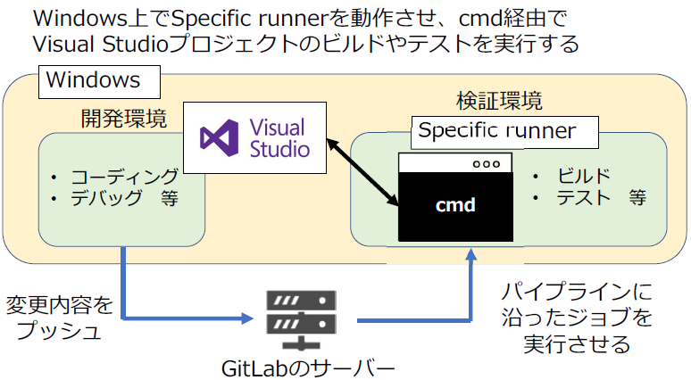
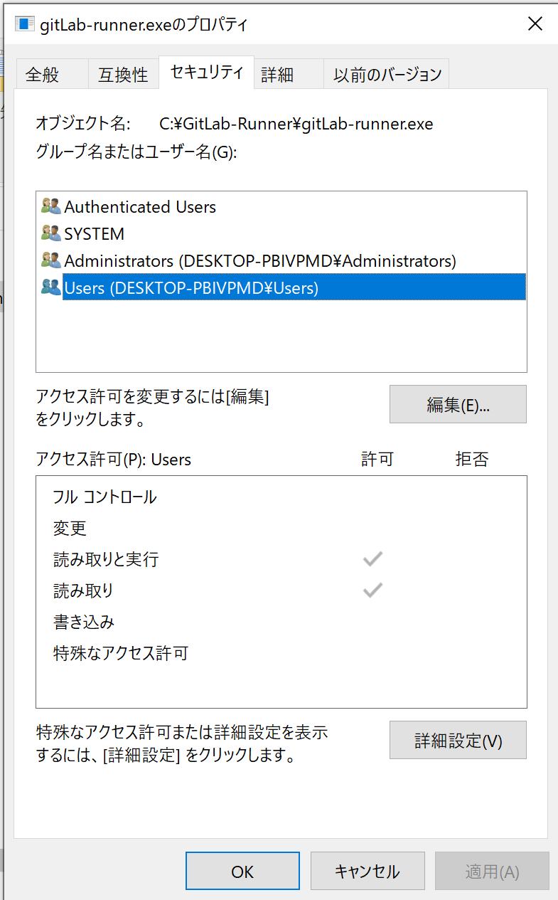
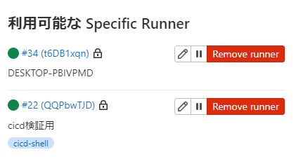
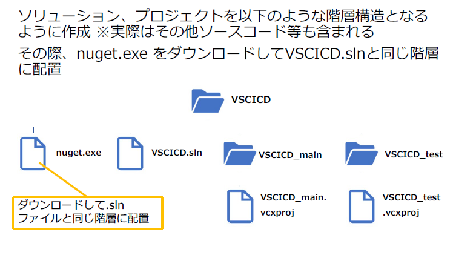
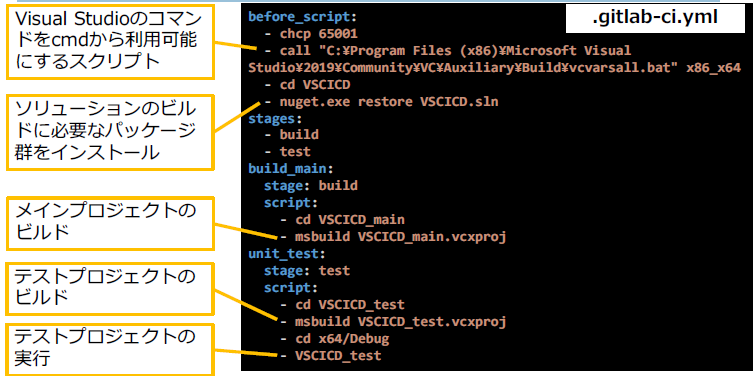

# Visual Studioを用いたCI/CD




1. Runnerをインストールするフォルダを作成

   ```
   C:¥> mkdir GitLab-Runner
   ```

2. Windows用Specific Runnerをダウンロード

   https://gitlab-runner-downloads.s3.amazonaws.com/latest/binaries/gitlab-runnerwindows-amd64.exe

3. 先ほど作成したフォルダに移動させ分かりやすい名前にリネーム
  (今回は"C:¥GitLab-Runner¥gitlab-runner.exe"とする)

4. GitLab-Runnerフォルダおよびgitlab-runner.exeに関して、一般ユーザに書き込み権限を与えていないか確認

  

5. cmdからRunnerの登録を行う

```cmd
C:\GitLab-Runner> .\gitLab-runner.exe register
////
Configuration (with the authentication token) was saved in "C:\\GitLab-Runner\\config.toml"
```

【runner登録時の設定項目】
GitLab instance URL: GitLabリポジトリのsettings > CICD > runnersに記載されている値
registration token: GitLabリポジトリのsettings CICD >runnersに記載されている値
description: 空欄（適当な値を設定してもよい）
tags: 空欄（適当な値を設定してもよい）
executer: shell

6. runnerのインストール&起動(管理者権限で実行すること)

   ```
   C:¥GitLab-Runner> .¥gitlab-runner.exe install
   C:¥GitLab-Runner> .¥gitlab-runner.exe start
   ```

   

7. runnerの登録確認

   

## Visual Studio プロジェクトの作成

Visual Studioには、プロジェクトとソリューションという概念が
存在する

* プロジェクト:プログラムの生成に必要なファイルをまとめたもの
* ソリューション:複数のプロジェクトをまとめて管理するもの

今回はCI/CDの動作確認を行うため以下のソリューションとプロジェクトを作成


参考：プロジェクトとソリューションの概要
https://docs.microsoft.com/ja-jp/visualstudio/get-started/tutorial-projectssolutions?
view=vs-2022



nuget.exeのダウンロードリンク
https://dist.nuget.org/win-x86-commandline/latest/nuget.exe

## .gitlab-ci.ymlの作成

以下の通り.gitlab-ci.ymlを記述し、runnerから
メインプロジェクトのビルドとテストプロジェクトの実行を行う

```yaml
before_script:
  - chcp 65001
  - call "C:\Program Files (x86)\Microsoft Visual Studio\2019\Community\VC\Auxiliary\Build\vcvarsall.bat" x86_x64
  - cd VSCICD
  - nuget.exe restore VSCICD.sln
stages:
  - build
  - test
build_main:
  stage: build
  script:
    - cd VSCICD_main
    - msbuild VSCICD_main.vcxproj
unit_test:
  stage: test
  script:
    - cd VSCICD_test
    - msbuild VSCICD_test.vcxproj
    - cd x64/Debug
    - VSCICD_test
```



chcpは文字コードの設定（65001はUTF-8)

## パイプラインの実行

作成したプロジェクトと.gitlab-ci.ymlをpushすると、パイプラインが実行される