# C言語基礎

* 特徴：メモリを意識しながら記載する必要がある

  

* Visual Studio

  * チームエクスプローラーからxxxx.slnを開くことでソリューションエクスプローラーでの読み込みが可能

    

  * フォルダビュー：作業フォルダに含まれているファイルやフォルダを確認する

  * ソリューションビュー：ソリューション内のプロジェクトを確認することができる。ビルドはここから。

  * コードの実行

    

  * プロジェクトの作成

    * プロジェクトとソリューションを新規作成

      

    * プロジェクトのテンプレートを設定する

      

  * プロジェクトの名前を設定する

    

  * ソースファイルやヘッダーファイルを追加することでプログラムを実行可能
    * stdio.hなどのインポート用のファイル（ヘッダファイルはプロジェクトのどこに格納されているか）
  
      
  
  * .exeファイルはプロジェクト単位にできるという理解でよいか？確認。
  
    
  
  * exeファイルを実行すると文字化けする（後ほど確認して詳細記載）
  
    → powershellの文字コードが日本語に対応していなかった。powershell上で以下コマンドを実施することで文字化けが解消した。
  
    ```powershell
    chcp 932
    ```
  
    

## 2.変数

* 数値：int

* 文字：char

* 宣言だけでなく一緒に初期化を(初期化忘れのバグ防止につながる)

  ```c
  int day = 1;
  ```

* char型の代入にはシングルクオートを付けること（ダブルだとエラーになる）

  ```c
  char alpabet = 'A';
  ```

* 命名規則と制限

  

* 変数の型

  * 型ごとの最大最小（limits.h, float.h)

    ```c
    #define _CRT_SECURE_NO_WARNINGS
    #include <stdio.h>
    #include <stdlib.h>
    #include <limits.h>
    #include <float.h>
    
    int main(void) {
    	/* char */
    	printf("charの最大値 = %d\n", CHAR_MAX);
    	printf("charの最小値 = %d\n", CHAR_MIN);
    	printf("unsigned char の最大値 = %d\n\n", UCHAR_MAX);
    
    	/* short int */
    	printf("short int の最小値 = %d\n", SHRT_MIN);
    	printf("short int の最大値 = %d\n", SHRT_MAX);
    	printf("usinged short int の最大値 = %u\n\n", USHRT_MAX);
    
    	/* int */
    	printf("int の最小値 = %d\n", INT_MIN);
    	printf("int の最大値 = %d\n", INT_MAX);
    	printf("usigned int の最大値 = %u\n\n", UINT_MAX);
    
    	/* long */
    	printf("long の最小値 = %ld\n", LONG_MIN);
    	printf("long の最大値 = %ld\n", LONG_MAX);
    	printf("usigned long の最大値 = %lu\n", ULONG_MAX);
    
    	/* float型の最小値と最大値 */
    	printf("FLT_MIN = %e\n", -FLT_MAX);
    	printf("FLT_MAX = %e\n", FLT_MAX);
    
    	/* double型の最小値と最大値 */
    	printf("DBL_MIN = %e\n", -DBL_MAX);
    	printf("DBL_MAX = %e\n", DBL_MAX);
    
    #ifdef LDBL_MAX/* LDBL_MAXが定義されている場合のみ表示 */
    	/* long double型の最小値と最大値 */
    	printf("LDBL_MIN = %Le\n", -LDBL_MAX);
    	printf("LDBL_MAX = %Le\n", LDBL_MAX);
    #endif
    
    	return 0;
    }
    ```

  * 実行結果

    ```
    charの最大値 = 127
    charの最小値 = -128
    unsigned char の最大値 = 255
    
    short int の最小値 = -32768
    short int の最大値 = 32767
    usinged short int の最大値 = 65535
    
    int の最小値 = -2147483648
    int の最大値 = 2147483647
    usigned int の最大値 = 4294967295
    
    long の最小値 = -2147483648
    long の最大値 = 2147483647
    usigned long の最大値 = 4294967295
    FLT_MIN = -3.402823e+38
    FLT_MAX = 3.402823e+38
    DBL_MIN = -1.797693e+308
    DBL_MAX = 1.797693e+308
    LDBL_MIN = -1.797693e+308
    LDBL_MAX = 1.797693e+308
    ```

    

## 3.標準入出力

* [参考サイト](https://qiita.com/angel_p_57/items/03582181
  e9f7a69f8168[)

* 標準入力

  * キーボードからの入力
  * scanf関数などを利用する

* 標準出力

  * ディスプレイへの出力
  * printf関数などを利用する

* 変換指定子

  ```c
  printf("Hello! Cworld! 今日は研修%d日目です。", day);
  ```

  

  * 文字リテラルをprintfする場合

    ```c
    #define _CRT_SECURE_NO_WARNINGS
    #include <stdio.h>
    #include <stdlib.h>
    
    int main()
    {
    	char alphabet = 105;
    	printf("%c", alphabet);
    
    	return 0;
    }
    ```

    


* 標準入力scanf関数

  ```c
  scanf( "%d" , &day );
  // 複数同時入力
  scanf("%d %d %d",&i,&j,&k);
  ```

  

  * ありがちなミス

    1. scanf関数は出力関数ではないことに注意→文字を一緒に出力したりはできない。scanf( "%d\n", &day)みたいに書いても期待した動作とはならない。

    2. 変数に**&を付け忘れる**

       

* scanf、printf以外の標準入出力

  * getchar関数
    * 1文字ずつ入力
  * putchar関数
    * 1文字ずつ出力

## 4.演算子

* インクリメント、デクリメント

  * 前置インクリメントと後置インクリメント

    

* 比較演算子

  * 正しい場合（真）は１，（偽）は０を返す

* 論理演算子

  ```c
  #define _CRT_SECURE_NO_WARNINGS
  #include <stdio.h>
  #include <stdlib.h>
  
  /* ===========================================================
   * 演習
   *
   * ===========================================================*/
  int main()
  {
  	int compVal = 0;
  	int a = 10;
  	int b = 20;
  
  	// 1(真)
  	compVal = (10 == a++) && (21 == ++b);
  	printf("compVal = %d\n", compVal);
  	a = 10;
  	b = 20;
  
  	// 0(偽)
  	compVal = (11 == a++) && (21 == ++b);
  	printf("compVal = %d\n", compVal);
  	a = 10;
  	b = 20;
  
  	// 0(偽)
  	compVal = (10 == ++a) && (20 == b++);
  	printf("compVal = %d\n", compVal);
  	a = 10;
  	b = 20;
  
  	// 1(真)
  	compVal = (11 == ++a) && (20 == b++);
  	printf("compVal = %d\n", compVal);
  
  	return 0;
  }
  ```

  

* 演算子の優先順位

  * 見やすいコードにするため()を付ける

    ```c
    a + (b * c)
    ```

  * ()の優先度が一番高い

    

    

  * キャスト演算子

    * 暗黙の型変換

      サイズが小さい方から大きい型への代入は自動的にキャストが行われる

    * 明示的な型変換を行うことが大事

  * P72の記載についてメモ

    a/ 9,0はcastしなくてもfloatになる

  * 演習4.2についてできなかったので復習含めて記載

    ```c
    #define _CRT_SECURE_NO_WARNINGS
    #include <stdio.h>
    #include <stdlib.h>
    
    int main()
    {
    	int a = 0;
    	int b = 0;
    	
    	printf("二つの整数を入力してください\n");
    	printf("整数a : ");
    	scanf("%d", &a);
    	printf("整数b : ");
    	scanf("%d", &b);
        
    	double f = (double) a / b * 100;
    	printf("aの値はbの%lf%%です", f);
    	return 0;
    
    }
    ```

    


## 5.制御構造

* 順次
* 条件分岐
  * if文さえ知っていればswitchは知らなくてもどうにかなる
  * switch分は比較対象が1つであることがわかりやすい。
* 繰り返し処理

##　6.配列

* 配列

  ```c
  int array[3] = {10, 20, 30};
  ```

  * 宣言の場合は、要素数に変数は利用できないことに注意。宣言後は変数名を利用できる。
  * 暗黙の0の初期化。例えば要素数を4として、3つしか定義しなかった場合は暗黙で0がはいる。文字の場合は「\0」（NULL文字）

* 文字列

  * c言語での文字列はchar型の配列となる。

    ```c
    char str[] = {'a', 'b', 'c', 'd', '\0'};
    ```

    * \0：NULL文字
    * 文字列の宣言をする際に配列の最後にNULL文字が必ず必要となる。つまりN文字の文字列を格納するためにはすくなくともN+1の文字分の大きさが必要になるということ

  * 文字列の宣言の例

    ```c
    char str1[5] = "abcd";
    char str2[] = "abcd";
    char str3[5] = {'a', 'b', 'c', 'd'};
    char str4[5] = {'a', 'b', 'c', 'd', '\0'};
    char str5[] = {'a', 'b', 'c', 'd', '\0'};
    ```

  * 文字リテラルと文字列リテラル

    * 文字リテラル

      * ''でくくった文字（1文字）

      * 数値に置き換えられる

    * 文字列リテラル

      * ""でくくった文字の並び
      * 終わりには自動的にNULL文字が付加される
      * 途中にNULL文字が入ることもある（この場合文字列ではない)

    * 文字列

      * NULL文字以外の文字が並び、最後がNULL文字で終わる
      * char型の配列を使うことが多い

  * 文字列の長さ

    ```c
    char str[] = "C Language Programming";
    printf("%d¥n", sizeof(str));
    ```

    * あくまでも配列のメモリサイズであることに留意
    * NULL文字を含めた文字数が表示されることに注意

  * 文字リテラルの暗号化解読（シーザー暗号）

    ```c
    #define _CRT_SECURE_NO_WARNINGS
    #include <stdio.h>
    #include <stdlib.h>
    
    /* ===========================================================
     * 演習
     * 13文字分だけずれているアルファベットの文字列を、
     * 元の文字列に戻してください。
     * ===========================================================*/
    int main()
    {
    	char str[] = "P Cebtenzzvat Ynathntr!";
    	int x = 0;
    	int y = 0;
    
    	for (int i = 0; i < sizeof(str); i++) {
    	
    		
    		x = (int)str[i];
    
    		if (65 <= x && x <= 90) {
    			
    			x = (int)str[i] - 13;
    
    			if (x < 65) {
    				y = 65 - x;
    				x = 90 - y + 1;
    			}
    			
    			printf("%c", x);
    
    		}
    		else if (97 <= x && x <= 122) {
    
    			x = (int)str[i] - 13;
    
    			if (x < 97) {
    				y = 97 - x;
    				x = 122 - y + 1;
    			}
    
    			printf("%c", x);
    
    		}
    		else {
    
    			x = (int)str[i];
    			printf("%c", x);
    		}
    	}
    
        return 0;
    }
    ```

    

* 二次元配列

  ```c
  int main() {
  	char str[3][8] ={ "hoge", "fuga", "hoga" };
  	printf("%s¥n", str[0]); //hoge
  	printf("%s¥n", str[1]); //fuga
  	printf("%s¥n", str[2]); //hoga
  }
  ```

  * 九九表のサンプルコード

    ```c
    #define _CRT_SECURE_NO_WARNINGS
    #include <stdio.h>
    #include <stdlib.h>
    
    /* ===========================================================
     * 演習
     * 二次元配列を使って九九表を作成し、表示してください。
     * ===========================================================*/
    int main()
    {
    	int num[9][9];
    	int result = 0;
    	int temp = 0;
    
    	for (int i = 1; i < 10; i++) {
    		for (int j = 1; j < 10; j++) {
    			num[i-1][j-1] = i * j;
    			result = i * j;
    		}
    	}
    
    	for (int i = 0; i < 9; i++) {
    		for (int j = 0; j < 9; j++) {
    			printf("%3d", num[i][j]);			
    		}
    		printf("\n");
    	}
    	return 0;
    }
    ```

    

## 7.関数

* 基礎

  ```c
  /* ===========================================================
   * 演習
   * 高さと底辺を引数として平行四辺形の面積を返す関数を実装してください。
   *
   * ===========================================================*/
  
  
  int main() {
  	int x = 0;
  	int y = 0;
  	int result = 0;
  
  	printf("高さを入力してください:");
  	scanf("%d", &x);
  	printf("底辺を入力してください:");
  	scanf("%d", &y);
  
  	/*ここで関数を呼び出し、resultに値を代入してください*/
  	result = func(x, y);
  
  	printf("面積は%dです。\n", result);
  
  	return 0;
  }
  
  int func(int x, int y) {
  	int result = 0;
  	result = x * y;
  	return result;
  }
  ```

  * プロトタイプ宣言

    ```c
    int func (int, int );
    ```

    https://monozukuri-c.com/langc-funclist-prototype/

  * 関数の引数の渡し方は値渡しである。呼び出し元と呼び出し先は変数の共有が不可能

  

* 再帰関数

  * 階乗

    ```c
    #define _CRT_SECURE_NO_WARNINGS
    #include <stdio.h>
    #include <stdlib.h>
    
    /* ===========================================================
     * 演習
     * 正の整数の階乗を計算してください。
     * 再帰関数を使う場合と使わない場合の2種類の関数を用意してください。
     * ===========================================================*/
    
    //	再帰呼び出しをしない版
    int factorial(int num) {
    	int result = 1;
    	for (int i = 1; i <= num; i++) {
    		//printf("%d", i);
    		result = result * i;
    
    	}
    	return result;
    }
    
    //	再帰呼び出しをする版
    
    int factorial_recursive(int num) {
    
    	if ( num > 1) {
    		return num * factorial_recursive(num - 1);
    	}
    	else {
    		return 1;
    	}
    		
    }
    
    
    int main()
    {
    //	再帰呼び出しをしない版の関数呼び出し
    //	factorial()
    //	結果を表示
    
    	int num = 0;
    	int result1 = 0;
    	int result2 = 0;
    
    	while (1) {
    		scanf("%d", &num);
    
    		if (num == -1) {
    			break;
    		}
    
    		result1 = factorial(num);
    		printf("factorial(%d)=%d\n", num, result1);
    
    		//	再帰呼び出しをする版の関数呼び出し
    		//	factorial_recursive()
    		//	結果を表示
    
    		result2 = factorial_recursive(num);
    		printf("factorial_recursive(%d)=%d\n", num, result2);
    
    	}
    	return 0;
    }
    ```

    

  * Ex7.3を実施すること

  * フィボナッチ数列

    ```C
    * ===========================================================
     * 演習
     * N番目のフィボナッチ数を求めてください。
     * 再帰関数を使う場合と使わない場合の2種類の関数を用意してください。
     * ===========================================================*/
    // 再帰呼び出しをしない版
    int fib(int num)
    {
    
    	int fib[100];
    
    	for (int i = 0; i <= num; i++) {
    
    		if (i == 0 || i == 1) {
    			fib[i] = 1;
    		}
    		else {
    			fib[i] = fib[i-1] + fib[i-2];
    		}
    	}
    
    	return fib[num-1];
    
    }
    // 再帰呼び出しをする版
    int fib_recursive(int num)
    {
    
    	int fib[100];
    
    	if (num == 1 || num == 2) {
    		return 1;
    	}
    	else {
    
    		fib[num] = fib_recursive(num - 1) + fib_recursive(num - 2);
    		return fib[num];
    	}
    }
    
    int main()
    {
    	int n = 0;
    
    	printf("Input number > ");
    	scanf("%d", &n);
    
    	printf("%d\n", fib(n));
    	printf("%d\n", fib_recursive(n));
    
    	return 0;
    }
    
    ```

    

  * Ex7.4を実施すること

  

## 補足：デバッグ方法

* デバッグ：プログラムのバグの原因を特定し、修正すること
* デバッガー：デバッグを実行するツールであり、バグを特定するための
  様々な機能を備える
* デバッギー：デバッグ対象のプログラムのこと

* 変数ウォッチ
  * ローカル変数ウィンドウ
  * ウォッチウィンドウ
    * 変数の値変更が可能
* 各種ビューワー（ウィンドウがなければ「デバック→ウィンドウ」にそれぞれ有）
  * モジュール
    * DLL：C言語のライブラリのビルドファイル
  * メモリ
  * 逆アセンブリ
  * レジスタ

## DebugビルドとReleaseビルド

* 
* リンク方式
  * 静的リンク：オブジェクトファイルにライブラリを埋め込む。マルウェアはこっちが多い。
  * 動的リンク：実行時にライブラリコードを読み込む。.dllファイルから読み込むためライブラリファイルがない場合ソースが動かない。

## 8.メモリ

* メモリ

  * CPUは1byte(8bit)単位でメモリを認識する
  * メモリの世界は16進数で表現される

* sizeof

  * sizeof(型)で型が宣言時に確保するメモリのサイズを取得

    ```c
    #include <stdio.h>
    
    int main()
    {
        printf("char   = %dbyte\n", sizeof(char));
        printf("short  = %dbyte\n", sizeof(short));
        printf("int    = %dbyte\n", sizeof(int));
    
        return 0;
    }
    ```

    ```c
    char   = 1byte
    short  = 2byte
    int    = 4byte
    ```

  * sizeof(変数)/sizeof(型)で配列の数を算出できる

    ```c
    int a[1000];
    printf("%d\n", sizeof(a)/sizeof(int))
    ```

    * こちらが推奨

      ```c
      printf("%d\n", sizeof(a)/sizeof(a[0]))
      ```

      

* 変数のサイズ

* メモリと番地

  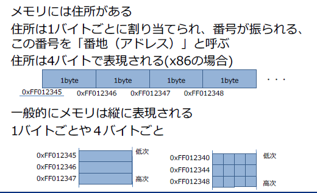

* 変数確保のイメージ

### エンディアン

* エンディアンは複数のバイトを並べる順序の種類

* int型の変数は4バイトの領域を確保するが、4つのバイトがどのように並んでいるか確認する。

  ```c
  #define _CRT_SECURE_NO_WARNINGS
  #include <stdio.h>
  
  int main() {
  	int var_int = 0x11223344;
  
  	printf("var_int のアドレス:%p\n", &var_int);
  	// charは1バイトなので最初の1バイト分のアドレスとそれに紐づく値を表示する
  	printf("アドレス %p の値:%x\n", (char*)(&var_int), *(char*)(&var_int));
  	printf("アドレス %p の値:%x\n", (char*)(&var_int) + 1, *((char*)(&var_int) + 1));
  	printf("アドレス %p の値:%x\n", (char*)(&var_int) + 2, *((char*)(&var_int) + 2));
  	printf("アドレス %p の値:%x\n", (char*)(&var_int) + 3, *((char*)(&var_int) + 3));
  
  }
  ```

  実行結果

  ```c
  var_int のアドレス:00EFFA18
  アドレス 00EFFA18 の値:44　//最初のアドレスには44が格納
  アドレス 00EFFA19 の値:33
  アドレス 00EFFA1A の値:22
  アドレス 00EFFA1B の値:11
  ```

  * 16進数で11223344という4バイトのデータを、バイトごとに上位から「11 22 33 44」のように並べる順序はビックエンディアン、下位側から「44 33 22 11」のように並べる順序はリトルエンディアンという

  * 結果よりインテルのx86_64はリトルエンディアンであることがわかる

    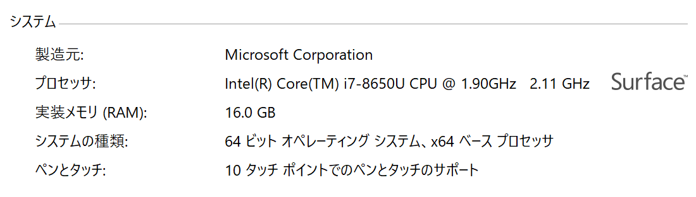

    * https://e-words.jp/w/x86.html

* Visual Studio上でアドレスが動的に変化してしまう場合は以下設定を行う

  C/C++ → 最適化→ 最適化
  →無効
  C/C++ → コード生成→ セキュリティチェック
  →無効
  リンカー→ 詳細設定→ ランダム化されたベースアドレス
  →いいえ

* Ex9.1

  ```c
  #define _CRT_SECURE_NO_WARNINGS
  #include <stdio.h>
  #include <stdlib.h>
  
  /* ===========================================================
   * 演習
   * 変数のアドレスを直接指定することで値を書き換えられることを確認して下さい。
   * ===========================================================*/
  int main()
  {
  	int p = 100;
  
  	// 変数pのアドレスを表示
  	printf("p address = 0x%p\n", &p);
  
  	// 変更前の変数pの表示
  	printf("p = %d\n", p);
  
  	// 変数pのアドレスを直接指定して書き換え
  	*(int *)0x0019FEDC = 9999;
  
  	// 変更後の変数pの表示
  	printf("p = %d\n", p);
  
  	return 0;
  }
  ```

  

  * プログラム実行前

  ```
  p address = 0x0019FEDC
  p = 100
  p = 100
  ```

  * プログラム実行後

  ```
  p address = 0x0019FEDC
  p = 100
  p = 9999
  ```

  

## 9.ポインタ

* 変数とアドレス

  * %fでアドレスを表示
  * ポインタを使用するためには、宣言後有効なアドレスを設定する必要がある

* ポインタ

  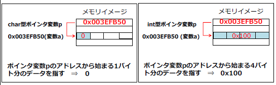 

  * ポインタ宣言時に型も併せて宣言する。ポインタが参照する変数もポインタの型に影響を受けるため注意が必要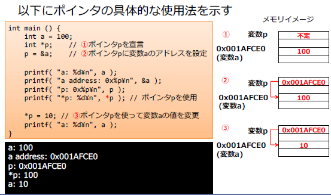

  * ポインタを使用するには以下の段階を踏む必要がある

    * 宣言
    * アドレス(値)の設定
    *  使用	

    ```c
    int *p;
    int a;
    p = &a;
    *p = 100; //a=100と同じ
    ```

    * *pの\*を間接参照演算子と呼ぶ

    ```c
    #define _CRT_SECURE_NO_WARNINGS
    #include <stdio.h>
    #include <stdlib.h>
    
    /* ===========================================================
     * 演習
     * 変数の値をポインタを用いて変更してください。
     * ===========================================================*/
    int main()
    {
    	int a = 100;
    	int *p;		//int型のポインタを宣言
    	p = &a;		//pに変数aのアドレスを代入
    	*p = 1000;	//間接参照演算子*を利用してaに1000を代入
    
    	printf("a=%d", a);
    
    	return 0;
    }
    ```

    

* ポインタと関数 アドレス渡し

  ```c
  /* ===========================================================
   * 演習
   * 二つの整数を入れ替えるIntSwap関数を作成してください。
   * この演習では、IntSwap関数の引数の宣言と、テストプログラムから
   * IntSwap関数を呼び出すか所まで実装してください。
   * ===========================================================*/
  void IntSwap(int *num1_add, int *num2_add)
  {
  	int temp = 0;
  	temp = *num1_add;
  	*num1_add = *num2_add;
  	*num2_add = temp;
  }
  
  int main()
  {
  	int num1 = 100;
  	int num2 = 129;
  
  	printf("num1 = %d\n", num1);
  	printf("num2 = %d\n", num2);
  
  	/*** ここでIntSwap関数を呼び出して、整数の入れ替えを行う ***/
  	IntSwap(&num1, &num2);
  
  	printf("num1 = %d\n", num1);
  	printf("num2 = %d\n", num2);
  
  	return 0;
  }
  
  ```

  

* 配列とアドレス

  * 配列はメモリ上で要素の型が要素数分連続して確保される

    * 添え字を使用しない配列名はその配列の先頭アドレスを返す

      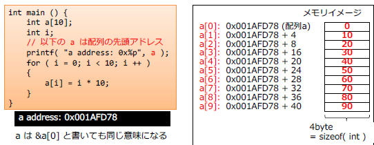

  * int型の配列であれば先頭アドレスから4byteずつメモリ確保される

  * ポインタは配列のアドレスを格納して使用することもできる

    ```c
    #define _CRT_SECURE_NO_WARNINGS
    #include <stdio.h>
    #include <stdlib.h>
    
    int main() {
    	int a[7] = { 0, 1, 2, 3, 4, 5, 6 };
    	int* p; //ポインタ宣言
    	p = a;  //ポインタpに配列aのアドレスを設定
    
    	printf("&p=%p\n", &p);
    	printf("p=%p\n", p);
    	printf("&a=%p\n", &a);
    	printf("a=%p\n", a);
    	printf("*a=%d\n", *a);
    	printf("*a+1=%d\n", *a + 1);
    	printf("*a+4=%d\n", *a + 4);
    	printf("*p=%d\n", *p);
    
    }
    ```

    結果

    ```c
    &p=0057FBC0
    p=0057FBCC
    &a=0057FBCC
    a=0057FBCC
    *a=0
    *a+1=1
    *a+4=4
    *p=0
    ```

    * pもaも同様のアドレスを変数に保持している。ただしpはポインタであり、変数の中身はアドレス。aはあくまでも配列で&aで先頭のアドレスを指示している。ポインタなのか、配列の先頭なのかをキチンと区別すること

  * 実行例

    ```c
    /* ===========================================================
     * 演習
     * ポインタを使い、配列の各要素のアドレスを出力してください。
     * ===========================================================*/
    int main()
    {
    	char moji[5];
    	char *moji_p = moji;
    	int num[5];
    	int *num_p = num;
    	double dub[5];
    	double *dub_p = dub;
    
    	for (int i = 0; i < 5; i++) {
    		// printf("char[%d] addr[%p]\n", i, &moji_p[i]);
    		// printf("char[%d] addr[%p]\n", i, &moji[i]);
            /* ポインタの型サイズ*5 */
    		// printf("char[%d] addr[%p]\n", i, (moji_p + i));
            /* インクリメント */
    		printf("char[%d] addr[%p]\n", i, moji_p++);
    	}
    
    	printf("\n");
    
    	for (int i = 0; i < 5; i++) {
    		printf("int[%d] addr[%p]\n", i, &num_p[i]);
    	}
    
    	printf("\n");
    
    	for (int i = 0; i < 5; i++) {
    		printf("double[%d] addr[%p]\n", i, &dub_p[i]);
    	}
    	return 0;
    }
    ```

    ```
    char[0] addr[009AFED0]
    char[1] addr[009AFED1]
    char[2] addr[009AFED2]
    char[3] addr[009AFED3]
    char[4] addr[009AFED4]
    
    int[0] addr[009AFEA8]
    int[1] addr[009AFEAC]
    int[2] addr[009AFEB0]
    int[3] addr[009AFEB4]
    int[4] addr[009AFEB8]
    
    double[0] addr[009AFE6C]
    double[1] addr[009AFE74]
    double[2] addr[009AFE7C]
    double[3] addr[009AFE84]
    double[4] addr[009AFE8C]
    ```

  * 文字列とポインタ

    * ポインタに直接文字列リテラルを代入した場合の動作についてC言語は定義していない。

* ダブルポインタ

  * **qのような形で宣言することでダブルポインタの宣言ができる。ポインタを格納するための型を宣言するために\*をもう1つつけて宣言する。

    ```c
    /* ===========================================================
     * 演習
     * 変数aのアドレスを変数pに、変数pのアドレスを変数qにそれぞれ格納してください。
     * ===========================================================*/
    int main()
    {
    	int a = 100;
    	int *p;
    	int **q; // int* *q, int** qどれも同じ意味
    	p = &a;
    	q = &p;
    
    
    	// 実装後、以下のコメントアウトを外して実行すること
    	
    	printf("a:%d\n", a);
    	printf("&a: 0x%p\n", &a);
    	printf("p: 0x%p\n", p);
    	printf("*p: %d\n", *p);
    	printf("&p: 0x%p\n", &p);
    	printf("q: 0x%p\n", q);
    	printf("*q: 0x%p\n", *q);
    	printf("**q: %d\n", **q);
    
    	return 0;
    }
    ```

    * *ダブルポインタのｑにおいて\*qはpのアドレスを表す*
    * 配列同士の入れ替え（絵をかかないと厳しい）

    ```c
    #define _CRT_SECURE_NO_WARNINGS
    #include <stdio.h>
    #include <stdlib.h>
    
    /* ===========================================================
     * 演習
     * 二つの文字列を入れ替えるStrSwap関数を作成してください。
     * この関数では、文字列のポインタを入れ替えて、実際の文字列が格納されている
     * メモリ領域は変更しないようにしてください。
     * この演習では、StrSwap関数の引数の宣言と、テストプログラムから
     * StrSwap関数を呼び出すか所まで実装してください。
     * ===========================================================*/
    void StrSwap(char **a, char **b )
    {	
    	printf("%p\n", *a);
    	printf("%p\n", *b);
    	char *temp;
    	temp = *b;
    	*b = *a;
    	*a = temp;
    }
    
    int main()
    {
    	char *str1 = "Hello";
    	char *str2 = "Good morning";
    
    	printf("%p\n", str1);
    	printf("%p\n", &str1);
    	printf("%p\n", str2);
    	printf("%p\n", &str1);
    
    	printf("str1 = %s\n", str1);
    	printf("str2 = %s\n", str2);
    
    	/*** ここでStrSwap関数を呼び出して、文字列の入れ替えを行う ***/
    	StrSwap(&str1, &str2);
    
    	printf("str1 = %s\n", str1);
    	printf("str2 = %s\n", str2);
    
    	return 0;
    }
    
    ```

    実行結果

    ```
    00507B38  //str1ポインタの変数に記載されたアドレス
    0113F854　//str1ポインタ自身のアドレス
    00507C04　//str2ポインタの変数に記載されたアドレス
    0113F854　//str2ポインタ自身のアドレス
    str1 = Hello
    str2 = Good morning
    00507B38  //str1ポインタの変数に記載されたアドレス
    00507C04  //str2ポインタの変数に記載されたアドレス
    str1 = Good morning
    str2 = Hello
    ```

    * 【ポイント】ダブルポインタの場合例えばダブルポインタがqだとすると、*qはポインタが参照する変数の**アドレス**となる。

    

    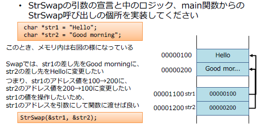

  * Ex9.10を復習すること

    ```c
    #define _CRT_SECURE_NO_WARNINGS
    #include <stdio.h>
    #include <stdlib.h>
    
    /* ===========================================================
     * 演習
     * 0～6の数字を入力すると、対応する曜日が出るプログラムを作成してください。
     * ===========================================================*/
    int main()
    {
    	int num = 0;
    	char* weekly[7];
    
    	weekly[0] = "Sunday";
    	weekly[1] = "Monday";
    	weekly[2] = "Tuesday";
    	weekly[3] = "Wednesday";
    	weekly[4] = "Thursday";
    	weekly[5] = "Fryday";
    	weekly[6] = "Saturday";
    
    	while (1) {
    		scanf("%d", &num);
    		if (1 <= num && num <= 6) {
    			printf("%s\n", weekly[num]);
    		}
    		else {
    			printf("1~6までの整数を入力してください\n");
    		}
    		if (num == -1) {
    			break;
    		}
    	}
    	return 0;
    }
    ```

    * charはあくまでも1要素であることに注意
    * char weekly[7] とすると7文字の配列を用意することになってしまう。

  * Exam2.2を復習すること

    ```c
    #define _CRT_SECURE_NO_WARNINGS
    #include <stdio.h>
    #include <stdlib.h>
    
    /* ===========================================================
     * 演習
     * 3次行列の足し算を行うプログラムを作成してください。
     * ===========================================================*/
    
    void MatrixAddition(int *result, int *matrixA, int *matrixB)
    {
    	int* a;
    	int* b;
    	int *res;
    
    	//それぞれの配列のアドレスをポインタに代入
    	a = matrixA;
    	b = matrixB;
    	res = result;
    
    	printf("a=%p\n", a);
    	printf("b=%p\n", b);
    	printf("res=%p\n", res);
    
    	for (int i = 0; i < 9; i++) {
    
    		//「*ポインタ」で間接参照演算子で直接配列の値を参照している
    		*res = *a + *b;
    		
    		//「ポインタ++」で次の配列への移動が可能
    		res++;
    		a++;
    		b++;
    
    	}
    
    }
    
    int main()
    {
    	int matrixA[3][3] = { 0 };
    	int matrixB[3][3] = { 0 };
    	int result[3][3] = { 0 };
    	int i = 0;
    	int j = 0;
    
    	printf("1番目の行列を入力してください\n");
    	for (i = 0; i < 3; i++) {
    		scanf("%d %d %d", &matrixA[i][0], &matrixA[i][1], &matrixA[i][2]);
    	}
    
    	printf("2番目の行列を入力してください\n");
    	for (i = 0; i < 3; i++) {
    		scanf("%d %d %d", &matrixB[i][0], &matrixB[i][1], &matrixB[i][2]);
    	}
    
    	printf("&matrixA=%p\n", &matrixA);
    	printf("&matrixB=%p\n", &matrixB);
    	printf("&result=%p\n", &result);
    
    	MatrixAddition(&result, &matrixA, &matrixB);
    
    	printf("答え\n");
    	for (i = 0; i < 3; i++) {
    		printf("[ ");
    		for (j = 0; j < 3; j++) {
    			printf("%4d", result[i][j]);
    		}
    		printf(" ]\n");
    	}
    
    	return 0;
    }
    ```

    * 講師からの模範解答

      ```c
      #define _CRT_SECURE_NO_WARNINGS
      #include <stdio.h>
      #include <stdlib.h>
      
      /* ===========================================================
       * 演習
       * 3次行列の足し算を行うプログラムを作成してください。
       * ===========================================================*/
      
      void MatrixAddition(int (*result)[3], int (*A)[3], int (*B)[3])
      {
      	for (int i = 0; i < 3; i++) {
      		for (int j = 0; j < 3; j++) {
      			(*result)[j] = (*A)[j] + (*B)[j];
      		}
      		result++;
      		A++;
      		B++;
      	}
      }
      
      int main()
      {
      	int matrixA[3][3] = { 0 };
      	int matrixB[3][3] = { 0 };
      	int result[3][3] = { 0 };
      	int i = 0;
      	int j = 0;
      
      	printf("1番目の行列を入力してください\n");
      	for (i = 0; i < 3; i++) {
      		scanf("%d %d %d", &matrixA[i][0], &matrixA[i][1], &matrixA[i][2]);
      	}
      
      	printf("2番目の行列を入力してください\n");
      	for (i = 0; i < 3; i++) {
      		scanf("%d %d %d", &matrixB[i][0], &matrixB[i][1], &matrixB[i][2]);
      	}
      
      	MatrixAddition(result, matrixA, matrixB); // MatrixAddition(&result[0], &matrixA[0], &matrixB[0]); と同じ
      
      	printf("答え\n");
      	for (i = 0; i < 3; i++) {
      		printf("[ ");
      		for (j = 0; j < 3; j++) {
      			printf("%4d", result[i][j]);
      		}
      		printf(" ]\n");
      	}
      
      	return 0;
      }
      ```

      

  * 補足　変数のアドレス難しいので復習

  * 以下のp1~p3はすべて同じ値（アドレス）となるが、意味が異なる（変数の型が異なっている）

    ``` c
    int table[9][9] = { 0 };
    int *p1 = &table[0][0];
    int (*p2)[9] = &table[ 0 ] //tableと書いた場合はこれと同じ
    int (*p3)[9][9] = &table;
    ```

    * p1はint型のポインタという意味

      * p1++でint1つ分のアドレスが加算される

    * p2はint型の9個の配列ポインタという意味

      * p2++で、int型の9個の配列分のアドレスが加算される

    * p3はint型の9個の配列の9個の配列ポインタという意味

      * p3++で、int型の9個の配列の9個の配列分(int型が81個分)のアドレスが加算される

    * （）の使い方についての解説

      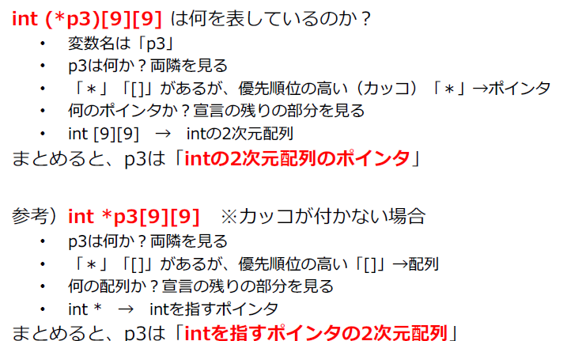

    * 配列のポインタとポインタの配列

      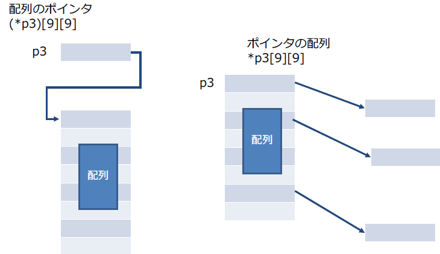

## 補足：変数/関数のアドレス

```c
#include <stdio.h>
int sub1(int hiki_a, int hiki_b);
int sub2(int hiki_a, int hiki_b);

int main() {
	int local_a = 0x11223344;
	int local_b = 456;
	int ret;

	printf("ここはmain\n");
	printf("ret    のアドレス:%p\n", &ret);
	printf("local_bのアドレス:%p\n", &local_b);
	printf("local_aのアドレス:%p\n", &local_a);

	printf("main関数のアドレス：%p\n", main);
	printf("sub1関数のアドレス：%p\n", sub1);
	printf("sub2関数のアドレス：%p\n", sub2);

	ret = sub1(local_a, local_b);
	sub2(ret, local_a);
}


int sub1(int hiki_a, int hiki_b) {
	int local_a = hiki_a + hiki_b;
	int local_b = hiki_a - hiki_b;

	printf("ここはsub1\n");
	printf("local_bのアドレス:%p\n", &local_b);
	printf("local_aのアドレス:%p\n", &local_a);
	printf("hiki_a のアドレス:%p\n", &hiki_a);
	printf("hiki_b のアドレス:%p\n", &hiki_b);

//	printf("sukima1 の値:%x\n", *(int*)0x19FF0c);
//	printf("sukima2 の値:%x\n", *(int*)0x19FF10);

	sub2(local_a, local_b);
	return local_a;
}

int sub2(int hiki_a, int hiki_b) {
	int local_a = hiki_a + hiki_b;
	int local_b = hiki_a - hiki_b;

	printf("ここはsub2\n");
	printf("local_bのアドレス:%p\n", &local_b);
	printf("local_aのアドレス:%p\n", &local_a);
	printf("hiki_a のアドレス:%p\n", &hiki_a);
	printf("hiki_b のアドレス:%p\n", &hiki_b);

//	printf("sukima1 の値:%x\n", *(int*)0x19FEF4);
//	printf("sukima2 の値:%x\n", *(int*)0x19FEF8);
//	printf("sukima1 の値:%x\n", *(int*)0x19FF0c);
//	printf("sukima2 の値:%x\n", *(int*)0x19FF10);

	return local_a;
}


```

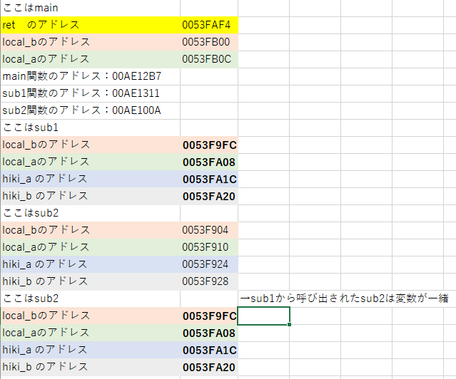

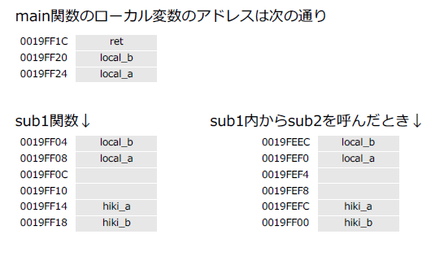

* それぞれの関数で、引数とローカル変数はすべてint型→4バイト

* sub2→sub1→mainの順に高次のアドレスになっている

* アドレスを指定した値の表示方法

  ```c
  //int*でポインタを宣言し、アドレス代入したのち*間接参照演算子で値を参照という流れ
  *(int*)0x19FF0c
  ```

* 変数だけでなくプログラムも必ずメモリ上に格納される


## 10.変数のスコープ

* スコープ：変数の有効範囲
* ローカル変数
  * 関数の中で宣言した変数
  * 当該関数の中からしかアクセスできない

* グローバル変数

  * プログラムのどの関数からでもアクセスできる変数

  * どの関数にも含まれない位置に書かれた変数はグローバル変数となる

  * 自動的に0で初期化される

  * スコープがプログラム全域に及び、メモリ領域を確保し続けるため乱用しない方がよい

    ```c
    int global = 12;
    void func(void){
    int local = 1;
    global++;
    printf("%d¥n", global);
    }
    int main(){
    int local = 3;
    global = 3;
    func();
    return 0;
    }
    ```

### 変数の記憶クラス指定子

* auto指定子
  * 記憶クラスの指定を省略するとauto変数になる
  * 宣言されたブロックから処理が抜けると、自動的に消される変数
* static指定子
  * ブロックから処理が抜けても値を保持し続ける変数
  * グローバル変数の場合はほかのソースファイルからアクセスできない

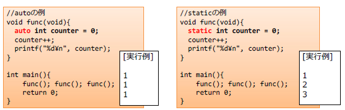

* extern指定子：別のファイルで宣言されていることを示す
* register指定子
  * 高速にアクセスできるようにコンパイラに要求を出す
  * 必ずコンパイラが従う保証はない
  * 一般にはレジスタに変数の値が格納される（レジスタに関してはプログラムはなぜ動くのかを参照）

### 型修飾子

* const修飾子
  * 初期化はできるが、それ以降、値の代入をすることができなくなる
  * 定数を表現するために利用する
  
* volatile修飾子

  * コンパイラに対して最適化を行わないように通知する

  * 通常、コンパイラは、実行速度を速めるために複数の命令をまとめるなどして最適化する

  * この修飾子が付加された変数は最適化の対象とならない

    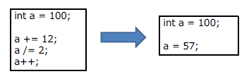

* 変数クラスのまとめ

  * スコープ

    * グローバル、ローカル

  * 記憶クラス

    * auto, static, extern ,register　//省略するとauto

  * 型修飾

    * なし、const、volatile    // 省略するとなし

  * 符号

    * signed, unsigned　　　//省略するとsigned

  * 型

    * int, char, double, long, ・・・・

      

* Ex10.1について復習すること。配列のアドレスの考え方が理解できていないと思う。

  * 正解のコード。自分で再度トライしたけどできなかった。涙

    難しく考えすぎたかな。

  ```c
  #define _CRT_SECURE_NO_WARNINGS
  #include <stdio.h>
  #include <stdlib.h>
  /* ===========================================================
   * 演習
   *
   *プログラムを修正し正しく動くように修正してください
   * ===========================================================*/
  
  void getText(char *text) {
  	
  	printf("文字を入力してください:");
  	// text = "入力文字列"と同義
  	scanf("%s", text);
  }
  
  int main() {
  	char text[100] = { 0 };
  
  	getText(text);
  
  	printf("あなたの入力した文字は「%s」です。", text);
  
  	return 0;
  }
  ```

  

## 11.動的なメモリ割り当て

* スタック領域とヒープ領域
* malloc関数とfree関数

## 12.構造体

* typedef
* 単方向リスト

## 13.プリプロセッサ

## 14.ファイル入出力

## 15.標準Cライブラリ

* string.h
* ctype.h
* math.h
* stdlib.h

