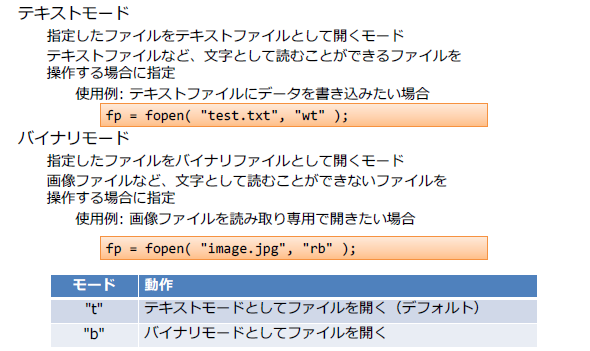
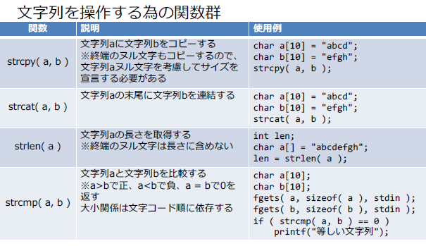
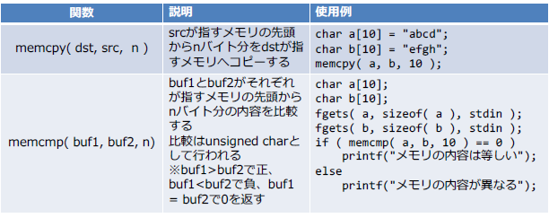
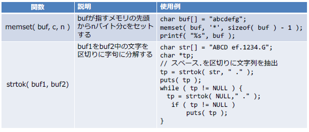
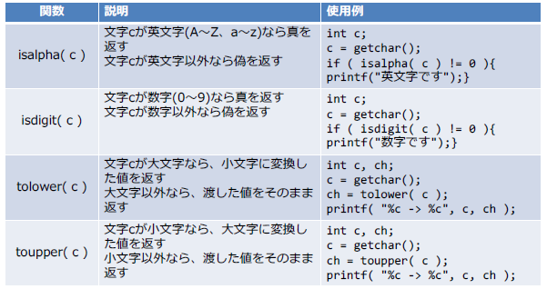
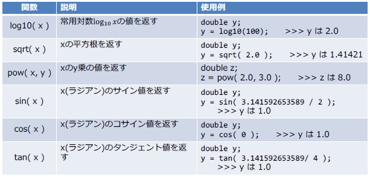
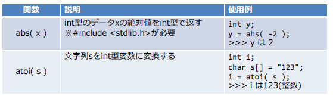

# ファイル入出力

## 14.ファイル入出力

* ファイル構造体のポインタ宣言

  ファイル入出力を行うためには、最初にファイル構造体
  のポインタを宣言する

  - ファイル構造体のポインタ宣言を行うためには、
    stdio.hをインクルードする必要がある

    ```c
    #include <stdio.h>
    :
    :
    FILE *fp;
    ```

    

* ファイルの読み込み

  fopen関数を使う

  ```c
  FILE *fp;
  fp = fopen( "ファイルパス", "オープンモード" );
  ```

  

  

* ファイルの書き込み

  プログラムからファイルに文字列を1行書き込むには
  **fputs**関数や**fprintf**関数を使う
  ファイルに1文字書き込むには**fputc**関数を使う

  * fputc関数：ファイルに1文字書き込む

    ```c
    FILE *fp;
    char c = 'A';
    fp = fopen( "ファイル名", "オープンモード" );
    fputc( c, fp ); //Aをファイルに出力
    ```

  * fprintf関数：ファイルに文字列を書き込むプログラム

    ```c
    int main() {
        FILE *wfp; // ファイル構造体のポインタを宣言
        char str[256]; // ファイルの内容を一時的に保存するメモリ領域
        wfp = fopen( "write.txt", "w" ); // 書き込み専用でwrite.txtを開く
        if ( wfp == NULL ) {
        return -1; // ファイルオープンに失敗した場合即終了
        }
        // 行の先頭でCtrl-Z Enterを押すと終了する
        while ( fgets( str, sizeof( str ), stdin ) != NULL ) {
        // strに格納された最大256文字の文字列をwrite.txtに書き込む
        fprintf( wfp, "%s", str );
        }
        fclose( wfp ); // write.txtを閉じる
        return 0;
    }
    ```

    * 上記プログラムは標準入力の内容をファイルに書き込むプログラムである。stdinは標準入力

* 演習問題

  ```c
  #define _CRT_SECURE_NO_WARNINGS
  #include <stdio.h>
  #include <stdlib.h>
  
  /* ===========================================================
   * 演習
   * テキストファイルの各行に行番号を付けて別ファイルに出力する
   * ===========================================================*/
  #define INFILE "input.txt"
  #define OUTFILE "output.txt"
  int main()
  {
  	
  	/*input.txt読み込み処理*/
  
  	//FILE* fp;		// ファイル構造体のポインタを宣言
  	char str[256];	// ファイルの内容を一時的に保存するメモリ領域
  	FILE* fp_r = fopen(INFILE, "r");	//読み込み専用でinput.txtを開く
  	FILE* fp_w = fopen(OUTFILE, "w");	//書き込み専用でoutput.txtを開く
  	int lineno = 0;
  
  	if (fp_r == NULL || fp_w == NULL) {
  		return -1;
  	}
  
  	while (fgets(str, sizeof(str), fp_r)) {
  		fprintf(fp_w, "%d: %s", lineno, str);
  		lineno++;
  	}
  
  	fclose(fp_r);
  	fclose(fp_w);
  
  
  	return 0;
  }
  ```

  

## 15.標準Cライブラリ

* string.h

  

  

  

* ctype.h

  

* math.h

  

* stdlib.h

  