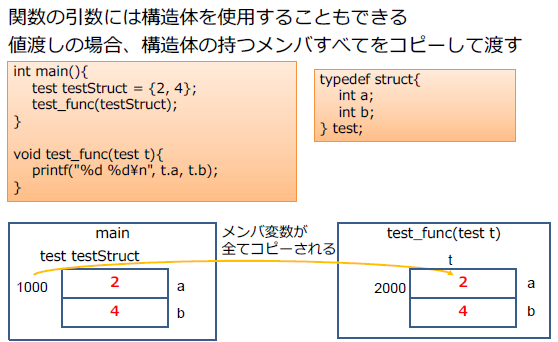

# malloc,struct

## 11.動的なメモリ割り当て

* スタック領域とヒープ領域

  * スタック領域：関数内で定義されたローカル変数のメモリ領域。関数を抜けた直後に開放される。
  * ヒープ領域：動的メモリはこちらに割り当て。**プログラマ自身が解放しないといけない**

* malloc関数とfree関数

  * mallocで動的メモリ割り当て

    ```c
    void *malloc( size_t size )
    ```

    ※ここでのvoidはどんな方でも入れれるという意味

    * stdlib.hの関数

    * 戻り値
  
      * NULL：確保失敗
      * NULL以外：確保されたヒープ領域の先頭のアドレス
  
    * 使用例(使用時に本来の目的の型でキャストする)
  
      ```c
      (char *)malloc(sizeof(char)*100);
      ```
  
      
  
  * freeで解放
  
    ```c
    void free( void *memblock )
    ```
  
    * stdlib.hの関数
    * 戻り値：なし
  
  * サンプル
  
    ```c
    int main() {
        int *x = NULL;
        x = (int *)malloc(sizeof(int) * 3);
        if (NULL == x) {
        printf("メモリ確保に失敗しました¥n");
        return 0;
        }
        
        *x = 123;
        *(x + 1) = 456;
        *(x + 2) = 789;
        for (int i = 0; i < 3; i++)
        printf("%d¥n", *(x + i));
        
        free(x);
        
        return 0;
    }
    ```
  
    
  
  * 演習問題
  
    ```c
    #define _CRT_SECURE_NO_WARNINGS
    #include <stdio.h>
    #include <stdlib.h>
    #include <string.h>
    
    /* ===========================================================
     * 演習
     * mallocで確保したメモリに、scanfで文字列を入力し、
     * メモリに保存された文字列を表示する
     * ===========================================================*/
    int main(void)
    {
    	char* str;
        //動的メモリの割り当て
    	str = (char*)malloc(sizeof(char) * 512);
    	//NULLチェック
    	if (NULL == str) return 1;
    	//メモリ初期化
    	memset(str, '\0', 512 * sizeof(char));
    
    	printf("文字列を入力してください：");
    	scanf("%511s", str);
    	printf("%s", str);
    
    	//メモリの解放
    	free(str);
    
    	return 0;
    }
    ```
  
    演習問題（Ex.11.2)
  
    ```c
    #define _CRT_SECURE_NO_WARNINGS
    #include <stdio.h>
    #include <stdlib.h>
    
    /* ===========================================================
     * 演習
     * 入力された大きさだけのヒープ領域を確保するコードを作成してください。
     * ヒープ領域に作成した配列に０番目の要素に０を、1番目の要素に１を
     * 順番に数字を格納する関数dynamic_int_arrayを作成してください。
     * ===========================================================*/
    int* dynamic_int_array(int s) {
    	
    	//ポインタ宣言
    	int* p;
    	p = (int*)malloc(sizeof(int) * s);
    	if (p == NULL) return NULL;
    	for (int i = 0; i < s; i++) {
    		p[i] = i;
    	}
    	return p;
    }
    
    int main()
    {
    	int* p;
    	int num;	//入力用
    
    	printf("大きさを入力してください：");
    	scanf("%d", &num);
    
    	// dynamic_int_array関数呼び出し
    	p = dynamic_int_array(num);
    
    	for (int i = 0; i < num; i++) {
    		printf("arr %d = %d\n", i, p[i]);
    	}
    
    	// メモリの解放
    	free(p);
    
    	return 0;
    }
    ```
  
    * Ex11.3 演習
  
      ```c
      #define _CRT_SECURE_NO_WARNINGS
      #include <stdio.h>
      #include <stdlib.h>
      
      /* ===========================================================
       * 演習
       * mallocを用いて二次元配列を作成し、各要素には列番号+行番号の
       * 値を代入し表示する。
       * ===========================================================*/
      int main()
      {
      
      	int n;	//行
      	int m;	//列
      
      	//ダブルポインタで、n個のポインタ領域をmallocで確保する
      	int** a;
      	scanf("%d %d", &n, &m);
      
      	//メモリ領域の確保
      	a = (int**)malloc(sizeof(int*) * n);
      
      	if (a == NULL) {
      		return - 1;
      	}
      
      	//2次元配列用のメモリ確保
      	for (int i = 0; i < n; i++) {
      
      		a[i] = (int*)malloc(sizeof(int) * m);
      
      		if (a[i] == NULL) {
      
      			for (int j = 0; j < i; i++) {
      				free(a[j]);
      			}
      
      			free(a);
      			return -1;
      
      		}
      	}
      	
      	//値の代入・表示
      
      	for (int i = 0; i < n; i++) {
      	
      		for (int j = 0; j < m; j++) {
      			a[i][j] = i + j;
      			printf("%d ", a[i][j]);
      		}
      		
      		printf("\n");
      	
      	}
      
      	for (int i = 0; i < n; i++) free(a[i]);
      
      	free(a);
      
      	return 0;
      
      }
      ```
  
      
  
      * 動的な値は宣言等に使用できないため、以下のようなコードはエラーとなる。
  
        ```c
        int (*a)[n]=(int(*)[n])malloc(sizeof(int)*n*m);
        ```
  
        ※ nが固定値（3などの整数リテラル、または#difineで定義した文字列などの場合）
  
        
  
        
  
        * http://www.nurs.or.jp/~sug/soft/tora/tora10.htm
          このようなデータ構造を「ディスプレイ」と呼ぶ。

## 12.構造体

* Ex12.1

  * 自分なりの回答

  ```c
  #define _CRT_SECURE_NO_WARNINGS
  #include <stdio.h>
  #include <stdlib.h>
  
  /* ===========================================================
   * 演習
   * person構造体を作成し、その構造体に値を入力してください。
   * ===========================================================*/
  int main()
  {
  	struct person {
  		
  		char name[20];
  		int age;
  		
  	};
  
  	char name[20] = { '\0' };
  	int age;
  	
  	printf("名前を入力してください > ");
  	scanf("%s", name);
  	
  
  	printf("年齢を入力してください > ");
  	scanf("%d", &age);
  
  	struct person person1 = { '\0', 0 };
  
  	int i = 0;
  	
  	while (name[i] != '\0') {
  		person1.name[i] = name[i];
  		i++;
  	}
  	
  	person1.age = age;
  
  	printf("%s: age= %d", person1.name, person1.age);
  
  	return 0;
  }
  ```

  * 解答

    ```c
    person {
    char name[20];
    int age;
    };
    int main(){
    struct person p = {0};
    printf( "名前を入力してください> " );
    scanf( "%s", p.name );
    printf( "年齢を入力してください> " );
    scanf( "%d", &p.age );
    printf( "%s: age = %d¥n", p.name, p.age );
    return 0;
    }
    ```

    

* typedef

  * 型に別名を付けるためのキーワード

    * 構造体を利用する場合、typedefを共に使うことが多い

      ```c
      typedef int* intPtr_t;
      ```

    * 構造体の大きさもsizeof演算子で取得可能であるがCPUの都合で空白のメモリもあるため、メンバの合計バイト数ではない点に注意

    * 関数の引数には構造体を使用することもできる。値渡しの場合構造体の持つメンバーすべてをコピーして渡す。

      

    * 構造体へのポインタを引数にすることも可能
      参照を行うにはアロー演算子('->')を利用する

      

    * Ex12.2.c 演習問題

      * 自分の回答

        ```c
        #define _CRT_SECURE_NO_WARNINGS
        #include <stdio.h>
        #include <stdlib.h>
        
        /* ===========================================================
         * 演習
         * student構造体を作成し、その構造体に値を入力してください。
         * update関数で身長が180未満であれば180cmに修正し、表示してください。
         * ===========================================================*/
        // 構造体を定義
        typedef struct {
        	char name[20];
        	int height;
        }Student;
        
        void update(Student* a) {
        
        	if (a->height < 180) {
        		a->height = 180;
        	}
        
        }
        
        int main()
        {
        	//構造体の宣言
        	Student a = {'\0', 0};
        
        	printf("名前：");
        	scanf("%s", a.name);
        
        	printf("身長：");
        	scanf("%d", &a.height);
        
        	update(&a);
        
        	printf("名前 = %s\n身長 = %d", a.name, a.height);
        
        	return 0;
        }
        ```

        

* 単方向リスト

  * 単体リストは、データを格納する「要素」と「ポインタ」を組みにした「セル」と呼ばれる単位で、データの順序を管理する連結リスト構造

    ポインタには、次のセルのアドレスが格納されている

    ```c
    typedef struct{
    int value; // 要素
    Cell *nextCell; // 次のセルへのポインタ
    } Cell; //セル
    ```

  * 単方向リストのプログラム

    ```c
    #define _CRT_SECURE_NO_WARNINGS
    #include <stdio.h>
    #include <stdlib.h>
    
    /* ===========================================================
     * 演習
     * 単方向リストの末尾に新しいノードを追加する、AppendCellToList関数を作成してください。
     * ===========================================================*/
    
    
    // 単方向リストの構造体の定義
    // 型名 struct_Cellに別名 Cellを定義
    typedef struct _Cell Cell;
    struct  _Cell
    {
    	int value; // int型:セルの値を格納
    	Cell* nextCell; // 構造体への自己参照型
    };
    
    
    //-------------------------------------------------------------------------
    // Function:   単方向リストの各セルの要素を出力する
    // Description:
    //      指定された単方向リストの各セルの要素を出力する
    // Return:
    //      なし
    //-------------------------------------------------------------------------
    void PrintList(Cell* list) {
    	Cell* now;
    	for (now = list->nextCell; now != NULL; now = now->nextCell) {
    		printf("%d\n", now->value);
    	}
    }
    
    
    //-------------------------------------------------------------------------
    // Function:   単方向リストの最後にデータを追加する
    // Description:
    //      指定された単方向リストの最後にデータを追加する
    // Return:
    //      なし
    //-------------------------------------------------------------------------
    void AppendCellToList(Cell* firstCellInList, int value) { /* !!! main() での呼ばれ方を参考に引数を定義してください !!! */
    	
    	//次のセルを作成
    	Cell* newCell;
    
    	//メモリを確保
    	newCell = (Cell*)malloc(sizeof(Cell));
    
    	//初期化
    	newCell->value = value;
    	newCell->nextCell = NULL;
    
    	//現在のセルを定義
    	Cell* currentCell;
    
    	//現在のセルの初期化
    	currentCell = firstCellInList;
    
    	//currentCellとnewCellを連結する
    	//currentCellのnextCellがNULLになるまでアドレスをnextCellに移動し続ける
    	while (currentCell->nextCell != NULL) {
    		currentCell = currentCell->nextCell;
    	}
    
    	currentCell->nextCell = newCell;
    }
    
    
    int main() {
    	Cell firstCell;
    	firstCell.nextCell = NULL;
    
    	// 単方向リストの最後にセルを追加
    	AppendCellToList(&firstCell, 1);
    	AppendCellToList(&firstCell, 2);
    	AppendCellToList(&firstCell, 3);
    	AppendCellToList(&firstCell, 4);
    	AppendCellToList(&firstCell, 5);
    
    	// 単方向リストの各セルの要素を表示
    	PrintList(&firstCell);
    
    	return 0;
    }
    ```

    


## 13.プリプロセッサ

ビルド時に文字列を整形・置換する処理を行うプログラム

* この処理のことをプリプロセスと呼ぶ
* プリプロセッサに対する命令をプリプロセッサ命令または
  ディレクティブと呼ぶ
* C言語のプリプロセッサ命令は「#」から始まる

### \#define

ある文字を別の文字に置換することを指示する命令

```c
#define TAX_RATE 0.10
int main(){
    unsigned int sum = 1231;
    double taxin
    = sum + (sum * TAX_RATE);
}	
```


### \#undef

それ以後defineで置換指示した命令を打ち消す命令

### \#ifdef~#else~#endif

ある文字列がdefineで定義されている場合に有効にする区間
を指示する命令

```c
#define DEBUG
int main(){
    int a;
    #ifdef DEBUG
    a = 100;
    printf("[debug info] a is %d¥n", a);
    #else
    a = 100;
    #endif
}
```


### \#include

ファイル読み込みの命令で、指定された別のファイルの内容に置換される

* <>：標準ライブラリのディレクトリを検索
* ""：相対パス

### マクロ

関数らしいものを無理やり作ることができる

```c
#define SUM(num1, num2) num1+num2
    int main(){
    return SUM(2,1);
}	
```


### サンプルコード

```c
#define _CRT_SECURE_NO_WARNINGS
#include <stdio.h>
#include <stdlib.h>

/* ===========================================================
 * 演習
 * IS_FLOATのdefineがあるかどうかによってfloat型かint型の数値を入力・出力してください。
 * ===========================================================*/

#define IS_FLOAT

int main( void )
{

	#ifdef IS_FLOAT

	float a = 0.0;

	while (a != -1.0) {

		printf("please enter number > ");

		scanf("%f", &a);

		printf("%f\n", a);

	}

	#else

	int a - 0;

	scanf("%d", &a);

	printf("%d\n", a);

	#endif
	

return 0;

}
```

