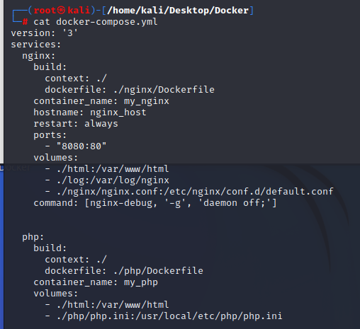

# Dockerの主なコマンド
- イメージの入手
```
docker pull イメージ名
```

- イメージ一覧表示
```
docker images
```

- イメージ削除
```
docker rmi イメージ名
```

- コンテナ起動
```
docker run --name <コンテナ名> -d -p <ローカル側ポート>:<コンテナ側ポート> <イメージ名>
```
-d:デタッチモード（バックグラウンドで動作させる）  
-p:ホストOSのポートが受信したパケットをコンテナのポートにフォーワード  

docker runは、  
  docker pull + docker build + docker start  
を1回で実施するコマンド  

例) nginxコンテナを起動する  
```
docker run --name my_nginx -d -p 8080:80 nginx
```

- コンテナ一覧表示
```
docker ps -a
```
※-aオプション：死んでいるコンテナも表示  

- コマンド実行
```
docker exec -t <CONTAINER ID> <Command>
```
-it: コンソールに結果を出力

例）起動中のコンテナ（コンテナID：be71722828)の上でbashシェル実行
```
docker exec -it be bash
root@be71722828:/# 
```

- コンテナログ表示
```
docker logs <CONTAINER NAME>
```
-t: タイムスタンプ付きのログを表示  
-f: リアルタイムにログを表示  
※ログは、/var/lib/docker/containers/コンテナID/コンテナID-json.logファイルに保存されている。

- コンテナ停止
```
docker stop コンテナIDまたはコンテナ名
```

- コンテナ削除
```
docker rm コンテナIDまたはコンテナ名
```

- dockerサービスの起動確認
```
systemctl status docker
systemctl start docker
```

## Dockerfile
コンテナの内容を「Dockerfile」内にコードとして記述できる  
[ベストプラクティス]  
https://docs.docker.jp/engine/articles/dockerfile_best-practice.html

  
RUN：イメージをビルドするときに実行するコマンド  
CMD：コンテナを起動する時に実行する既定のコマンドを指定  


## Dockerイメージ
Dockerfileをもとに、仮想環境の作成に必要な情報をパッケージ化したもの（ビルドファイル）  

## コンテナ
Dockerイメージをもとに作成される仮想環境  

## Dockerネットワーク

|bridge|host|none|
----|----|----
|Dockerのネットワークを構築し、ホストのインターフェースと接続して通信|ホストと同じインターフェースを利用して通信|インターフェースを利用しないため通信不可|

## マウント
1. バインドマウント(bind)
Dockerホストのファイルやディレクトリを**コンテナ上**にマウントする機能。バインドマウントを行うと、**コンテナの外にあるファイルを、コンテナの中から読み書き可能になる。**

コマンド例
```
$ docker run --name my_nginx -d -p 8080:80 -v /home/kali/Desktop/Docker/html/:/usr/share/nginx/html/:ro nginx
```
-v: -v <ホスト側のマウントしたいディレクトリ>:<コンテナ側のマウント先ディレクトリ>:<オプション>

2. ボリュームマウント（volume）
**Dockerが管理するデータ領域**をコンテナ上にマウントする機能  
バインドマウントとの違いは、バインドマウントが「Dockerが管理するデータ領域以外もマウント可能」であることに対し、ボリュームマウントは「Dockerが管理するデータ領域ないでのマウントのみ可能」という点である。

- ボリュームの作成
```
$ docker volume create <VOLUME NAME>
```
- ボリュームの確認
```
$ docker volume ls
```

- ボリュームマウント
```
# docker container run --rm -v <VOLUMENAME>:/mnt -it <Image> bash
```

-rm: コンテナの終了時に自動でコンテナをクリーンアップしファイルシステムを削除
-v: コンテナにデータボリュームを追加
-it: ターミナルでコンテナを実行（フォアグラウンド）

- ボリュームの削除
```
# docker volume rm <VOLUME NAME>
```

## Docker Compose
- 複数コンテナのDockerアプリを定義・実行するツール
- 複数コンテナを管理、運用するツールをオーケストレーションツールと呼び、代表的なものにKubernetes(k8s)がある。

- docker-compose.ymlで定義する主な内容
    - Dockerイメージをビルドするための情報（Dockerfile、イメージ名等）
    - コンテナを起動するための情報（ホストとの共有ディレクトリ設定や起動オプション等）
    - 使用するDockerネットワーク

- 公式ドキュメント(https://docs.docker.com/compose/compose-file/)
  ※versionによって記述方法も変わってくる

- サービスビルド
```
docker-compose build
```

- コンテナ起動
```
docker-compose up
```

- コンテナ停止
```
docker-compose down
```



