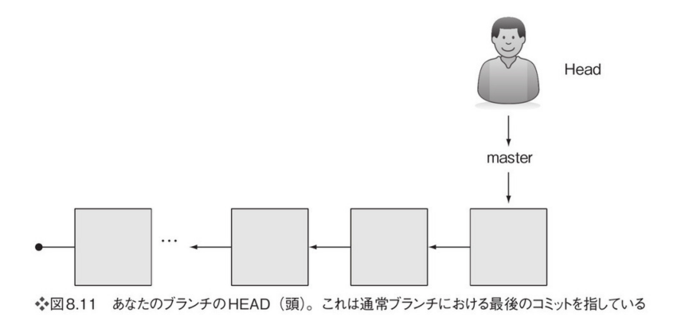

# リモートリポジトリを取得
```bash
git clone <リモートリポジトリのURL>
```

# 間違えて取得した場合の削除
```bash
rd /s <間違えてcloneしてきたディレクトリ>
```

# github反映までの流れ
```bash
git add ファイル名
git add .
git commit -m "コミットメッセージ"
git push -u origin main
```

# 状態確認
```bash
git status
git branch
```

# Gitのコンフィグ設定
```bash
git config --global user.name "Keisuke-Igarashi"
git config --global user.email "igarashi4948@gmial.com"
git config --global user.email "ke.igarashi@tech.nflabs.jp"
```

# .gitignoreファイル
- .gitgnoreというファイル名で、リポジトリの直下に配置する(.gitファイルがあるディレクトリ)

言語やフレームワークごとにテンプレあるので使う
'https://github.com/github/gitignore'
'https://www.toptal.com/developers/gitignore'

# .gitignoreの編集内容（venv)
```
# Environments
.venv
venv/
```


# ファイルのステージングの削除
```bash
git rm --cached <ファイル名>
git rm --cached ./venv/
```


# ローカルリポジトリからGitHubにリポジトリ作成するまでの手順

1. GitHub上でリポジトリを空作成する。
2. ローカルリポジトリ側でリモートを追加する。

```
git remote add origin <GitHubリポジトリのURL>
git remote show
```
これでoriginが追加されるのであとは他と一緒である。

# git log
* ログ履歴
* SHA1 IDで一意管理
```
git log
git log --oneline
git log --patch-with-stat #具体的に何が変更になったかまでみる
git log --oneline math.sh
```


ブランチの最後のコミットのSHA1 IDを表示
```
git rev-parse HEAD
git rev-parse main
```

# git branch
```
作成
git branch <ブランチ名>
名前変更
git branch -m <変更前ブランチ名> <変更後ブランチ名>
削除
git branch -d <ブランチ名>
```

## ブランチのマージ
反映させたい方に切り替え
```
git checkout 反映したいブランチ
git branch
```

反映したいブランチにほかのブランチの内容を反映
```
git merge <マージするブランチ名>
```

## git branch の分岐のさせ方
'https://qiita.com/shizen-shin/items/3437a6867e86dd452ab1'


# git checkout
過去にさかのぼる
```
git checkout <SHA1 ID>
```

# git tag
```
git tag <タグ名>　-m "<メッセージ>" <SHA ID>
```
```
git show <タグ名>
```

tagをつけることでコミットに名前をつけることができるので、  
pushとセットくらいの勢いでtag作成するプロジェクトもあるだろう。


# gitk

* GUIで確認
```
gitk
```

# git rebase

変更を残したままコミット履歴を削除する
rebase：ブランチの親を変える。ローカルブランチの開始地点を変更する。


# トラブルシュート

## git pull / git push できなくなったとき
```
(venv) PS C:\Users\nflabs-03\Documents\git\kentikuApp> git pull origin master
From https://github.com/Keisuke-Igarashi/kentikuApp
 * branch            master     -> FETCH_HEAD
fatal: refusing to merge unrelated histories

(venv) PS C:\Users\nflabs-03\Documents\git\kentikuApp> ｀ 
```

まずは
```
git log --oneline
git status
```
などで状況を確認すること。ヒントを書いてくれてる

git logでこんな感じになればpushできる。
```
83e756c (HEAD -> main) modified git.md
cf06eff (origin/main, origin/HEAD) modifeid 基礎.md
```