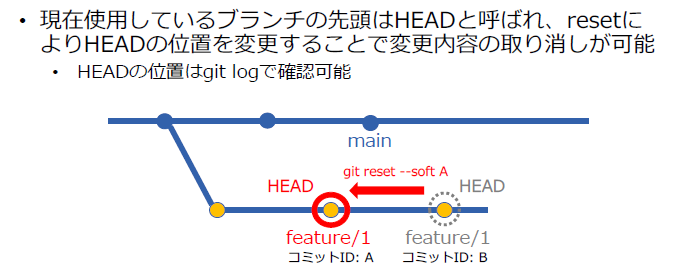
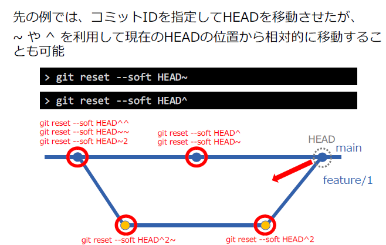
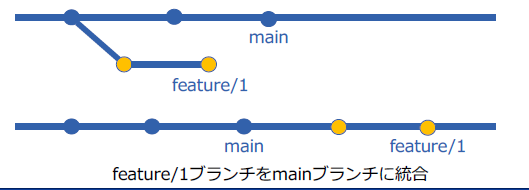
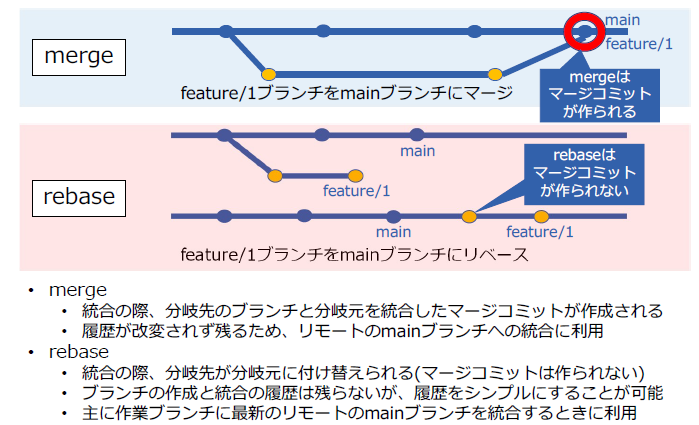
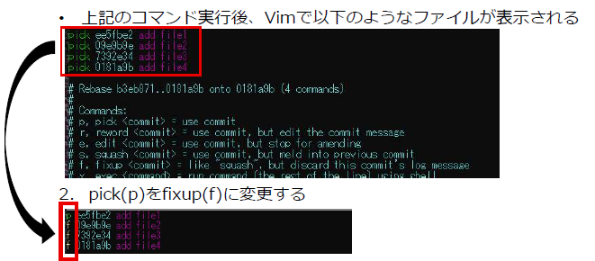
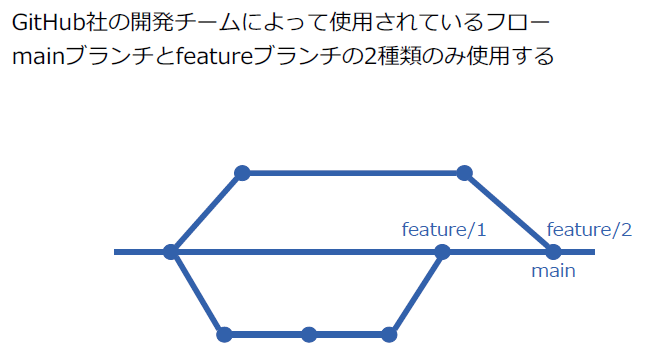
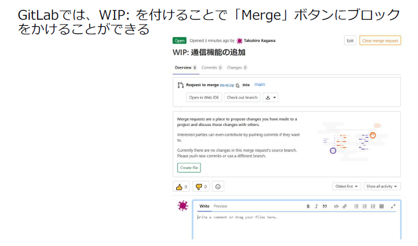
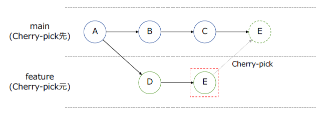
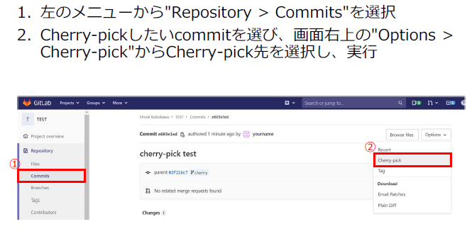

# Gitハンズオン（履歴の整理）

1. ファイルへの追記による差分の比較を行うため、ブランチとコミットを作成

  **diff：git addを行う前にどのファイルに変更があるかを確認**

  * リポジトリの中にあるファイルすべてを比較

    ```cmd
    git diff
    ```

  * 差分があるファイル名だけを表示

    ```powershell
    git diff -name-only
    # 以下も同様
    git status
    ```

  * 特定のファイルを比較する

    ```powershell
    git diff [ファイル名]
    ```

    

2. コミットの履歴を確認

   **log：コミット履歴の閲覧（バク発生により特定のバージョンに戻す必要があり、対象のコミットIDを確認したい場合**

3. ブランチの統合の準備として、別のブランチとコミットを作成

4. git mergeコマンドでブランチを統合

   **merge：それぞれのブランチで編集した内容を統合**

   →マージコミットが作られる

   ```cmd
   C:\Users\nflabs-03\Documents\git\git_practice\igarashi_keisuke>git checkout feature1
   Switched to branch 'feature1'
   
   C:\Users\nflabs-03\Documents\git\git_practice\igarashi_keisuke>git branch
   * feature1
     feature2
     master
   
   C:\Users\nflabs-03\Documents\git\git_practice\igarashi_keisuke>git merge feature2
   Merge made by the 'recursive' strategy.
    file3.txt | 1 +
    file4.txt | 1 +
    2 files changed, 2 insertions(+)
    create mode 100644 file3.txt
    create mode 100644 file4.txt
   ```

5. コミットした変更内容の取り消し

   **reset：HEADの移動**

   ```cmd
   git reset --soft [コミットID]
   ```

   

   resetの代表的なオプションとして、--soft、--mixed、--hardがあります。
   * --softでは、HEADのみを移動させる事でコミットの取り消しを行います。
     --mixedでは、HEADの移動に加えインデックスも更新する事で、コミットと
     addの取り消しを行います。オプションを指定しない場合、こちらのオプショ
     ンが使用されます。
     --hardでは、HEADの移動およびインデックスの更新に加え、作業ツリーも更
     新する事で、コミットやaddだけでなく現在の作業内容の取り消しも行います。
     なお、誤ってresetしてしまった場合は、「git reflog」で操作履歴から該当箇
     所を参照し、「git reset HEAD@{N}」(Nは履歴の番号)で取り消すことができ
     ます。

     ```cmd
     C:\Users\nflabs-03\Documents\git\git_practice\igarashi_keisuke>git log --oneline
     5ac1b4c (HEAD -> feature1) Merge branch 'feature2' into feature1
     3f623ca (feature2) add file4
     3ea2f25 add file3
     f7a6967 modified file2.txt
     7cdcae7 add file2
     5c2d3d2 add file1
     e60a1cd (origin/master, master) add README.md
     
     C:\Users\nflabs-03\Documents\git\git_practice\igarashi_keisuke>git reset --soft f7a6967
     
     C:\Users\nflabs-03\Documents\git\git_practice\igarashi_keisuke>git log --oneline
     f7a6967 (HEAD -> feature1) modified file2.txt
     7cdcae7 add file2
     5c2d3d2 add file1
     e60a1cd (origin/master, master) add README.md
     ```

     

6. git rebaseコマンドでブランチを統合

   **rebase：ブランチ/コミットの統合を行う機能**

   * 分岐先のブランチでの変更を、分岐元のブランチが一直線になるように統合する

   * ブランチを統合する場合

     ```cmd
     git rebase [ブランチ名]
     ```

   * コミットを統合する場合

     ```cmd
     git rebase -i [コミットID]
     ```

     

     

7. git rebaseコマンドで複数のコミットを統合

   ```cmd
   git rebase -i HEAD~4
   ```

   

## GitLabを用いた開発フロー

* プルリクエスト（GitHub) = マージリクエスト(Git Lab)

* fetch

  リモートリポジトリからローカルリポジトリに履歴を取り込む
  機能であるが、マージはしない

  利用例: 他の人がリモートに対して行ったコミットを、問題が
  ないか確認した上でマージをしたい場合

* 引数なしで実行するとoriginのリモートブランチをfetchする

  ```cmd
  git fetch
  ```

* リモートリポジトリ名とブランチ名をそれぞれ指定することができる

  ```cmd
  git fetch [リモートリポジトリ名] [ブランチ名]
  ```

  git pull = git fetch + git mergeとなっている。

GitHub FLOW



### GitHub Flow 6つのルール

1. mainブランチは常時デプロイ可能

2. mainブランチから説明的なブランチを作成する

3. 名前を付けたブランチに適宜pushする

4. いつでもプルリクエストを作る

   * マージを依頼する時だけでなく、他人の助けを求める時やコードを
     レビューしてほしい時にもプルリクエストを活用する

   * マージの依頼でなく、単に議論したい時に作るプルリクエストには、
     タイトルの先頭に[WIP] もしくはWIP: を付けるのが慣習(WIP：WorkInProgress)

     

5. マージはプルリクエストがレビューされた後だけ

6. レビューの後は直ちにデプロイする

## tag

タグ機能は、履歴の重要なポイントに印をつけることができるこの機能をリリースポイント(v 1.0.1など)としてよく使う

参考(コマンドライン): https://git-scm.com/docs/git-tag
参考(GitHub): https://docs.github.com/ja/desktop/contributing-andcollaborating-
using-github-desktop/managing-commits/managing-tags

## Cherry-pick

別ブランチから、全体ではなく特定のコミットのみを取り込みたい時に行う操作





## GitLab Issues

課題管理を行うための機能

* アイデアやタスクの進捗などをチーム内で共有することも可能
* 項目毎に以下の様な機能がある

