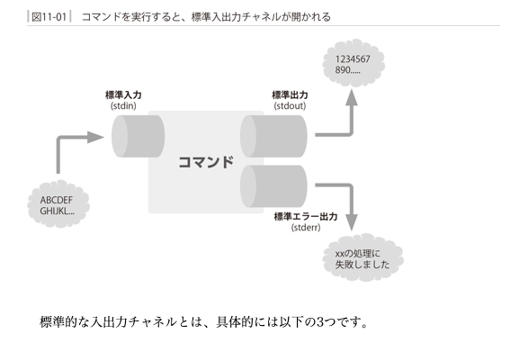

# **標準入力・標準出力・標準エラー出力**

* 参考文献：新しいLinuxの教科書P184~

* linuxではcatなどのコマンドが実行されると自動的に標準的な入出力チャンネルが開かれる



## リダイレクト

標準入力先を変更する機能のこと

* 入力リダイレクト('<')とファイル指定

    ```bash
    cat < /etc/crontab
    cat /etc/crontab
    ```

  * 動作は同じだが動きは違う。1行目は標準入力をそのまま標準出力に表示するというcatコマンド本来の動き。2行目はコマンドが利便性のために用意している「ファイル名が指定された場合にはその内容を対象とする」という動作を利用している。

  * 標準入力から受け取る仕組みの方が汎用性が高く、他のプログラムとの連携もしやすくなる。

* 標準出力のリダイレクト('>')

  * よく利用されるのはコマンドの実行結果を画面に表示するのではなくファイルに保存したい場合

    ```bash
    ls -l / > list.txt
    ```

    * 通常は標準出力へ出力するようになっているがファイルに出力するよう向きを変えている

* 標準エラー出力

  * 出力チャネルには標準エラー出力というものが用意されている
  * 通常標準エラー出力は標準出力と同じく、端末ディスプレイに繋がっているため、区別することはできない。ただ標準出力をファイルにリダイレクトしたときは標準エラー出力のみを確認することができる

    ```bash
    ls /xxxx > list.txt
    ls: /xxxxx: No such file or directory
    ```

    * 標準出力をリダイレクトしたのにターミナルにエラー出力されており標準エラー出力を確認できる。

  * 標準エラー出力をファイルにリダイレクトする場合：('2>')

    ```bash
    ls /xxxx 2> error.txt
    cat error.txt 
    ls: /xxxx: No such file or directory
    ```

  * 標準出力と標準エラー出力どちらもリダイレクトする場合

    ```bash
    ls /xxxxx > list.txt 2> error.txt
    ```

  * 標準出力とエラー出力をまとめてリダイレクト（出力）する場合

    ```bash
    ls /xxxxx > result.txt 2>&1
    ```

    * まず>を用いて標準出力をresult.txtというファイルにリダイレクトする
    * 続いてエラー出力を、&1と同じものへリダイレクトしている。この’**&**'とは標準出力を表している

    * 標準入出力の数値

        |入出力チャンネル|数値|
        |----|----|
        |標準入力|0|
        |標準出力|1|
        |標準エラー出力|2|

        ```bash
        testuser@ubuntu:~/Desktop/mypytest$ ls -l /dev | grep std
        lrwxrwxrwx  1 root     root          15 Jun 18 19:08 stderr -> /proc/self/fd/2
        lrwxrwxrwx  1 root     root          15 Jun 18 19:08 stdin -> /proc/self/fd/0
        lrwxrwxrwx  1 root     root          15 Jun 18 19:08 stdout -> /proc/self/fd/1
        ```


* リダイレクトによる上書き

    ```bash
    echo 789 >> number.txt
    ```

    * ファイルが存在する場合、末尾に追加され上書きしない。新規ファイルとして出力することも可能。なので基本はこちら使った方が良い。

* リダイレクトの記法まとめ

    |記号|内容|
    |----|----|
    |< FILE|標準入力をFILEに変更する|
    |> FILE|標準出力をFILEに変更する|
    |>> FILE|標準出力の出力をFILEの末尾に追記する|
    |2> FILE|標準エラー出力をFILEに変更する|
    |2>> FILE|標準エラー出力の出力をFILEの末尾に追記する|
    |> FILE 2>&1|標準出力と標準エラー出力をともにFILEに変更する|

* /dev/null

リダイレクト先としてよく使われる

    ```bash
    ls -l /dev/null
    ```

  * スペシャルファイルと呼ばれる特別なファイルで以下性質をもつ
    * 入力先として指定しても何も内容を返さない
    * 出力先として指定しても、書き込んだデータがどこにも保存されずに消えてなくなる

        * 入力をからにしたい場合や、エラーを読み飛ばしたい時に用いられる

        ```bash
        ls / /xxxxx > /dev/null 2>&1
        ```

        * 標準出力と標準エラー出力をどちらも捨てるコマンド


