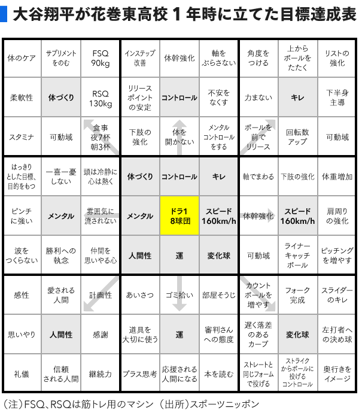

* ダニング＝クルーガー効果（松木さん）

  新しいこと、難しいことを深く学ぶにつれ、理解できないことが増えていく。あきらめずにやった先に専門家への道が開けてくる

* Planned Happenstance（高橋さん）

  * キャリアの8割は偶然の出来事によって形成される
  * 偶然の出来事を利用してキャリア形成に役立てる
  * 自ら偶然の出来事を引き寄せるよう働きかけ、積極的にキャリア形成の機会を創出する
  * 好奇心・持続性・柔軟性・楽観性・冒険心

* Mandal-art(大谷選手高校時代に作った)

  

  