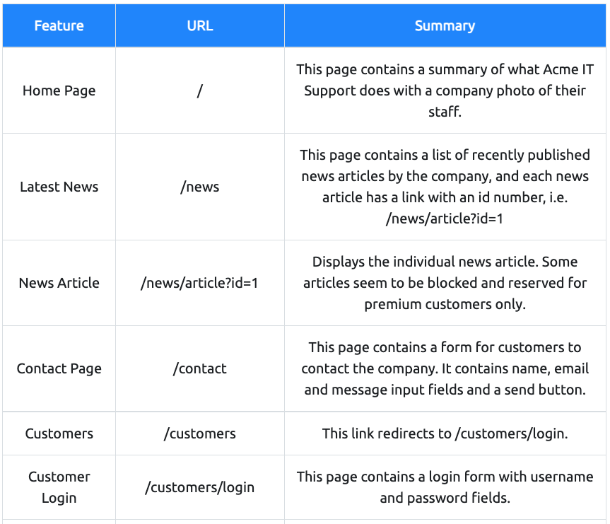

# Walking An Application

- View Source - Use your browser to view the human-readable source code of a website.
- Inspector - Learn how to inspect page elements and make changes to view usually blocked content.
- Debugger - Inspect and control the flow of a page's JavaScript
- Network - See all the network requests a page makes.

## Exploring The Website

websiteの脆弱性は、ユーザとのやり取りが発生する箇所に存在していることが多い。  

webサイトの把握をするために、ここのページや領域機能などを表に纏めると良い。

## Viewing The Page Source

### How do I view the Page Source?
- While viewing a website, you can right-click on the page, and you'll see an option on the menu that says View Page Source.
- Most browsers support putting view-source: in front of the URL for example, view-source:https://www.google.com/
- In your browser menu, you'll find an option to view the page source. This option can sometimes be in submenus such as developer tools or more tools.