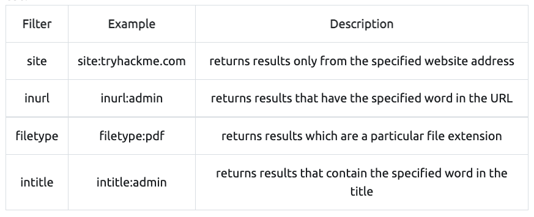

# Content Discovery

'https://tryhackme.com/room/contentdiscovery'

This content could be, for example, pages or portals intended for staff usage, older versions of the website, backup files, configuration files, administration panels, etc.  

There are three main ways of discovering content on a website which we'll cover. **Manually**, **Automated** and **OSINT (Open-Source Intelligence)**.  

## Task2 Manual Discovery - Robots.txt

- [robots.txtの概要](https://developers.google.com/search/docs/advanced/robots/intro?hl=ja)

'https://www.google.com/robots.txt'
と試しに打ってみたらあった。  

pene対象のサイトに対してrobots.txtを探してみることで有益な情報が手に入るのかも？？

## Task3 Manual Discovery - Favicon

Favicon  

The favicon is a small icon displayed in the browser's address bar or tab used for branding a website.  

frameworkのfaviconが開発者によって変更されていない場合、調査のきっかけになる場合がある。

- [OWASP favicon database](https://wiki.owasp.org/index.php/OWASP_favicon_database)

以下のような形でfaviconをダウンロードして、ハッシュ値を出力する。
```bash
$ curl https://static-labs.tryhackme.cloud/sites/favicon/images/favicon.ico | md5sum
```

出力されたハッシュ値をfaviconデータベースで検索すると利用しているフレームワークがわかる。
- [OWASP favicon database](https://wiki.owasp.org/index.php/OWASP_favicon_database)

## Task4 Manual Discovery -Sitemap.xml

the sitemap.xml file gives a list of every file the website owner wishes to be listed on a search engine  

'http://<ドメイン>/sitemap.xml'  
でアクセスできるか試してみること。

'https://www.google.com/sitemap.xml' でサイトマップが表示された。

## Task5 Manual Discovery -HTTP Headers

 HTTPヘッダーからもサーバーで利用しているアプリケーションの情報やバージョンを知ることが
 できそこから脆弱性の有無を判断することができる。

 ```bash
 curl http://<ドメイン名> -v
 ```
 -v : 出力を詳細に出すオプション(verbose)

## Task6 Manual Discovery -Framework Stack

favicon以外にもクライアントのソースからフレームワークの情報を見つけられることがある。

## Task7 OSINT -Google Hacking /Dorking

**Google Hacking / Dorking**

Google hacking / Dorking utilizes Google's advanced search engine features, which allow you to pick out custom content. 



More information about google hacking can be found here: 'https://en.wikipedia.org/wiki/Google_hacking'

## Task8 OSINT - Wappalyzer

Wappalyzer (https://www.wappalyzer.com/) is an online tool and browser extension that helps identify what technologies a website uses, such as frameworks, Content Management Systems (CMS), payment processors and much more, and it can even find version numbers as well.

## Task9 OSINT - Wayback Machine

The Wayback Machine (https://archive.org/web/) is a historical archive of websites that dates back to the late 90s. You can search a domain name, and it will show you all the times the service scraped the web page and saved the contents. This service can help uncover old pages that may still be active on the current website.

## Task10 OSINT - GitHub

## Task11 S3 Buckets

S3 Buckets are a storage service provided by Amazon AWS, allowing people to save files and even static website content in the cloud accessible over HTTP and HTTPS.  

The format of the S3 buckets is http(s)://{name}.s3.amazonaws.com where {name} is decided by the owner, such as **tryhackme-assets.s3.amazonaws.com.**  

S3 Bucketのパーミッションが間違っており、意図せずファイルにアクセスできることがある。

## Automated Discovery

ツールを使ってコンテンツを自動取得する仕組みを作る。

wordlist: いろいろなバリエーションが記載された言葉のリスト。password Listやよく利用されるファイル名やディレクトリ名
などの情報を記載しておき、数千、数百のリクエストを自動的に送る。

GitHubにサンプルが記載されている。これすごい。
'https://github.com/danielmiessler/SecLists'

自動化ツール（本ページで紹介されていたもの）：

- ffuf
- dirb : HTTPステータスが200となるURLを教えてくれた。
- gobuster : HTTPステータス302とかも出るし、ログファイルなども表示してくれる。

コマンドサンプル  

```bash
ffuf -w /usr/share/wordlists/SecLists/Discovery/Web-Content/common.txt -u http://10.10.114.225/FUZZ
```

```bash
dirb http://10.10.114.225/ /usr/share/wordlists/SecLists/Discovery/Web-Content/common.txt
```

```bash
gobuster dir --url http://10.10.114.225/ -w /usr/share/wordlists/SecLists/Discovery/Web-Content/common.txt
```