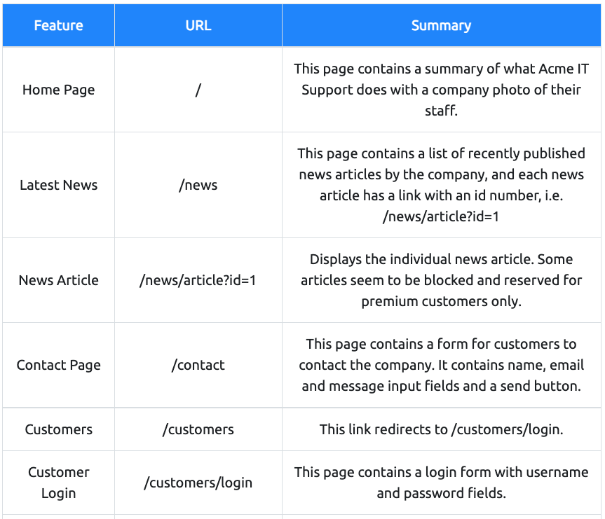
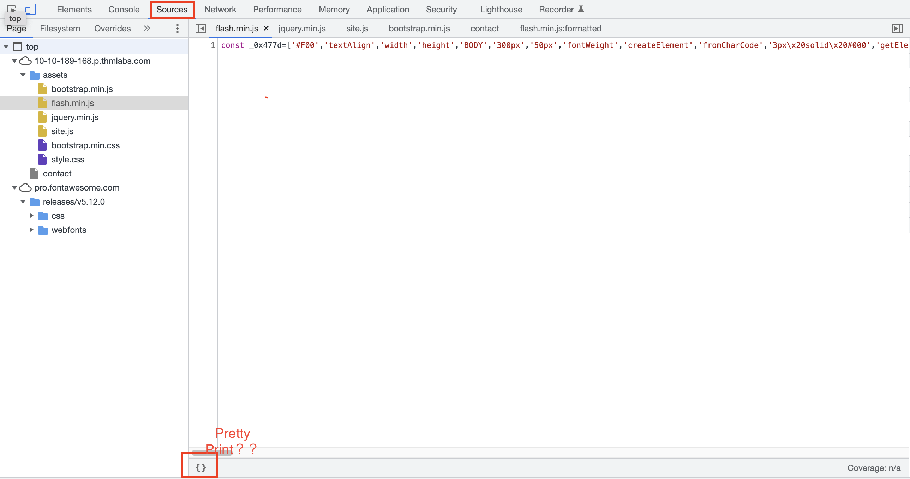

# Walking An Application

- View Source - Use your browser to view the human-readable source code of a website.
- Inspector - Learn how to inspect page elements and make changes to view usually blocked content.
- Debugger - Inspect and control the flow of a page's JavaScript
- Network - See all the network requests a page makes.

## Exploring The Website

websiteの脆弱性は、ユーザとのやり取りが発生する箇所に存在していることが多い。  

webサイトの把握をするために、ここのページや領域機能などを表に纏めると良い。

## Task3 Viewing The Page Source

### How do I view the Page Source?

- While viewing a website, you can right-click on the page, and you'll see an option on the menu that says View Page Source.
- Most browsers support putting view-source: in front of the URL for example, view-source:https://www.google.com/
- In your browser menu, you'll find an option to view the page source. This option can sometimes be in submenus such as developer tools or more tools.

クライアント側のソースでも以下のことが確認できる。

- jsやcssが格納されているディレクトリに対する制限がかかっているか？ディレクトリが一覧表示できるようになっていないか
- <! />で記載されたコメント内にヒント情報がないか
- 画面に表示されない隠しリンク等が存在していないか
- フレームワークのバージョンが記載されている場合に脆弱性の適用がされる場合がないか

## Task4 Developer Tools -Inspector

対象の画面で右クリックして、検証ボタンを押すこと。

あまりないとは思うが、例えばある画面の上部に表示された画面のinline-blok:の値を"none"に設定
してあげたりすることで、下の画面が見え有益な情報が得られたり...ということも考えられる。

## Task5 Developer Tools - Debugger

- Firefox,Safari: Debugger
- GoogleChrome: Sources

SourceからJavaScriptのコードを見ることができるが、容量を小さくする、かつ、内容をわかりづらく  
するために、１行で表示されてしまう。  
"Pretty Print"機能で少し見やすくできる。

## Task6 Developer Tools - Network

- network使うときは一度綺麗にしてから。（Chromだと🚫のアイコンクリック）

