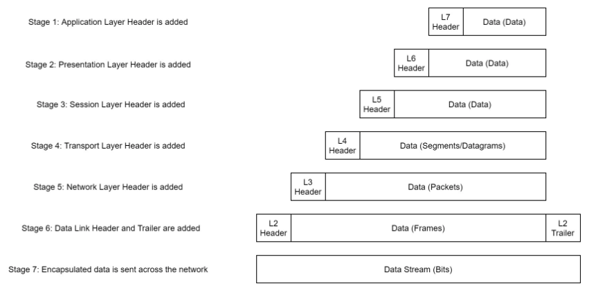
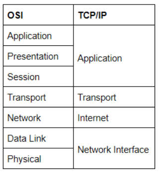

# Introductory Networking

## Task1

* OSI参照モデル
* TCP/IP
* 上記モデルを実践的に見る
* ネットワーキングツールの紹介

## Task2 The OSI Model: An Overview

OSI (Open Systems Interconnection)

### Layer6 - presentation

translates the data into a standardised format, as well as handling any encryption, compression or other transformations to the data. With this complete, the data is passed down to the session layer.

### Layer5 - session

* リモートホストとの接続および接続の維持を実施する
* 同時に複数の接続を確立する

### Layer4 - Transport

* データをどのように送るかを選択する
* TCP：信頼性あり
* UDP：信頼性なし。speed重視
* データを分割する（TCPではセグメント、UDPではデータグラムと呼ぶ）

### Layer3 - Network

* IPaddress制御

### Layer2 - Data Link

* Macアドレス制御
* データを受け取った際に、packetsが壊れていないかを確認する
* 伝送に適した形に、データをフォーマットする

### Layer１ - Physical

* バイナリデータを電磁波や光に変換
* データを送り受け取る

## Task3 Encapsulation

* 最初のヘッダをみることでどのLayerかを判断できる(各パケットの名称を覚えること)



## Task4 The TCP/IP Model



### 3-way-handshake

* コネクション確立の仕組み
* SYN(synchronise)
* SYN-SYN/ACK-ACK

### History

* 歴史的にはTCP/IPの方がお兄さん。その後ISOにてOSI参照モデルが作られた。

## Task5 ping

* ICMP protcol
* -v verbose
* -i interval
* -4 ipv4only

## Task6 TraceRoute

* windows
  
  ```cmd
  tracert
  ```

* -i
  インターフェースを特定する

* -t
  TCP/SYNリクエストを特定する

## Task7 WHOIS

誰がdomain nameを登録したかの情報を取得できる。
registararの情報も取得可能

-[web whois](https://www.whois.com/whois/)

## Task8 dig

```bash
dig <domain> @<dns-server-ip>
```

* TTL : cacheしておく時間. 157なら2分37秒後に消える
* 最初にlocal cacheを調べてなければ、recursiveサーバー（キャッシュサーバー？？）に問い合わせる
* Authoritative name serversが実際にドメインを管理するところ

## Task 9 Further Reading

* 知識をより深めるためにもCCNAの試験を取得したほうがいいよ！

