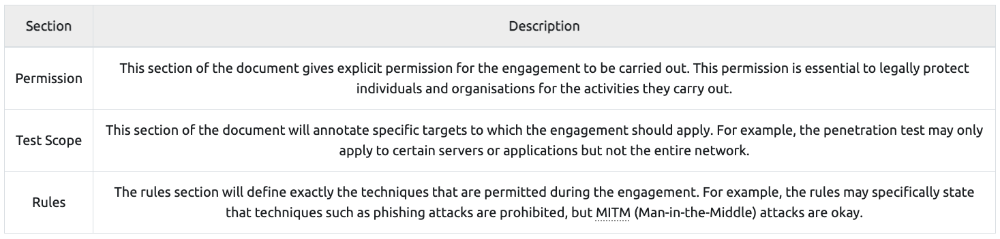
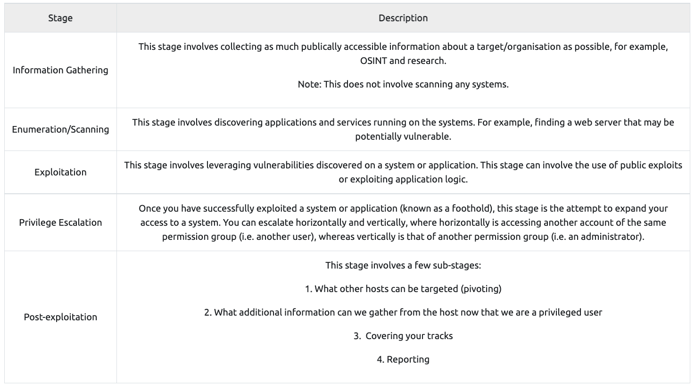
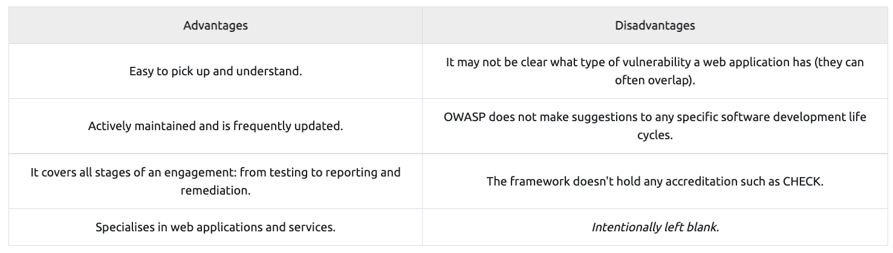
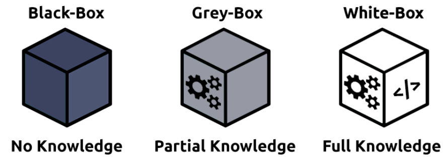

# Pentesting Fundamentals

'https://tryhackme.com/room/pentestingfundamentals'

## Task2 Penetration Testing Ethics

### Hat Category

  

### Rules of Engagement(ROE)

penetration testing実施前の誓約事項をドキュメントにまとめたもの。

(https://sansorg.egnyte.com/dl/bF4I3yCcnt/?)

## Task3 Penetration Testing Methodologies

#### OSSTMM

- [The Open Source Security Testing Methodology Manual](https://www.isecom.org/OSSTMM.3.pdf)

The methodology focuses primarily on how these systems, applications communicate, so it includes a methodology for:  

1. Telecommunications (phones, VoIP, etc.)
2. Wired Networks
3. Wireless communications

#### OWASP

- [Open Web Application Security Project](https://owasp.org/)

- [OWASP Top Ten 2017](https://owasp.org/www-project-top-ten/2017/)

#### NIST Cybersecurity Framework 1.1

- [NIST Cybersecurity Framework](https://www.nist.gov/cyberframework)

used to improve an organisations cybersecurity standards and manage the risk of cyber threats. This framework is a bit of an honourable mention because of its popularity and detail.  

The framework provides guidelines on security controls & benchmarks for success for organisations from critical infrastructure (power plants, etc.) all through to commercial.  There is a limited section on a standard guideline for the methodology a penetration tester should take.  

#### NCSC CAF

- [Cyber Assessment Framework(CAF)](https://www.ncsc.gov.uk/collection/caf/caf-principles-and-guidance)

The Cyber Assessment Framework (CAF) is an extensive framework of fourteen principles used to assess the risk of various cyber threats and an organisation's defences against these.

The framework applies to organisations considered to perform "vitally important services and activities" such as critical infrastructure, banking, and the likes. The framework mainly focuses on and assesses the following topics:

- Data security
- System security
- Identity and access control
- Resiliency
- Monitoring
- Response and recovery planning

## Task4 Black box, White box, Grey box Penetration Testing

### Black-Box Testing
何の情報も与えられない。ハイレベルのテスト処理。
ボタンや入力項目を一般ユーザ同様操作したりする。めちゃくちゃinformation gatheringとenumerationに時間がかかる。

### Grey-Box Testing
中間。ある程度の情報は与えられる

### White-Box Testing
ソフトウェアディベロッパーによって行われる。システムの構成や機能を知っているメンバーで行う。

