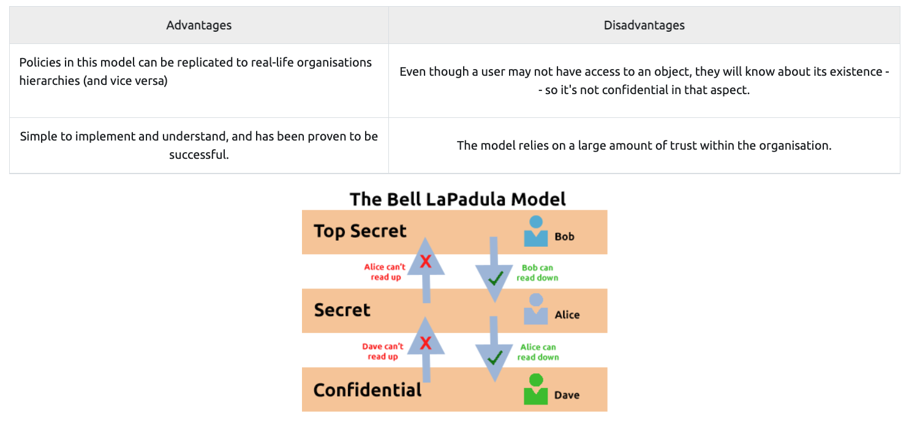

# Principles of Security

'https://tryhackme.com/room/principlesofsecurity'

## Task2 CIA Triad

CIA triadは情報セキュリティモデルである。セキュリティポリシーの作成に使われる。
Confidentiality、Integrity、Availability（CIA）の３つの要素で構成される。

CIAは、継続的なサークルである。それぞれオーバラップしており、どれか一つが欠けても
セキュリティポリシーはほぼ確実に機能しなくなる。  

### Confidentiality

This element is the protection of data from unauthorized accesss and misuse.

### Integrity
データの一貫性。デジタル証明書やハッシュ証明などは一貫性の担保に寄与してくれる。

### Availability
権利のある人がきちんとアクセスできること。  

## Task3 Principles of Privileges

2つのファクターで決まる。  

- The individual's role/function within the organisation  
- The sensitivity of the information being stored on the system  

PIM(Privileged Identity Management):組織内のユーザのロールを変更管理する。新しくロールを定義する場合もここ。
PAM(Privileged Access Management):システムが持っているロールの特権を管理する。

大前提は、必要最低限の特権やアクセスコントールを与えるべきであるということ。　　

## Task4 Security Models Continued

### The Bell-La Padula Model

confidentialityを達成するために利用されるモデル.Militaryとかで利用される。

### Biba Model

integrityの方が優先される場合に使われるモデル。ソフトウェア開発などで利用される。

## Task5 Threat Modelling & Incident Response

### STRIDE

