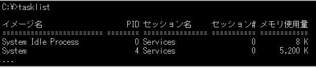

# C言語とWindows APIによるプログラミングの基礎知識

## WinAPIとは

* Windows OSに処理を依頼するためのインターフェース

* WindowsAPIを理解しておけばWindowsAPPを作れるようになる。

* APIリファレンス

  Microsoft Docs https://docs.microsoft.com/ja-jp/windows/win32/api/

### Windows APIの型とマクロ

Windows APIは標準的なC言語の型ではなく、マクロを用いている

* 右クリック→定義をここに表示

* GetLastError Function
  * 何をする関数か：Retrieves the calling thread's last-error code value.The last-error code is maintained on a per-thread basis. Multiple threads do not overwrite each other's last-error code.
  * パラメータ：なし
  * 戻り値：thread's last-error code

## WinAPIと文字コード

* 文字列を引数にとるWindows API: サフィックスにAまたはWが存在する

  * 例）CreateFileA, CreateFileW

    * A:引数をマルチバイト文字列（日本語ならSJIS）で渡す

    * W:引数をワイド文字列（Unicode）で渡す

      ※ワイド文字列：16bit(2byte)で文字列を表す

      ※マルチバイト文字列：2byte以上で文字列を表現する

    * 2種類のAPIが存在する理由

      * Windows 内部で使われる文字コードが変更されたため
        * Win9xより前: マルチバイト文字
        * Win9x以降: ワイド文字

  * 現在Visual Studioでは、サフィックスがないAPIはワイド文字版API と
    してビルドされる

    * 例）CreateFile はCreateFileW と同義
    * ※引数とAPIの文字コードが不一致だと、正しく実行できず文字化けする
    * ※Win API以外にライブラリ関数も文字コードに応じて使い分ける必要がある
      * printfとwprintf

### 文字コードと文字変数の型

| 文字セット                              | 文字変数の型 |
| --------------------------------------- | ------------ |
| マルチバイト文字<br/>（日本語ならSJIS） | char         |
| ワイド文字<br/>（Unicode）              | wchar_t      |

※C言語では、wchar_t は予約語ではなく、typedefによるエイリアスである。Windowsでは2バイトのUTF-16であり、（基本的には）1文字で2バイト使用する。
wchar_t str[10] は20バイトであり、終端のNULLを含めて10文字の文字列を格納できる。

* ワイド文字を使ったプログラム

  ```c
  int main() {
      wchar_t str[] = L"Hello World";
      wprintf(L"%s¥n", str);
  }
  ```

  変数の型にはwchar_t を使う文字列リテラルは""の外（左）にL を記述

  printf関数ではなく、wprintf関数を使う

* **デバックモードで文字の種類を注意深く確認すること**(型を間違えるとprintfがうまくできないので色々始まらない)

  

* TCHAR

  ソースコード上の文字変数の型、Windows API, ライブラリ関数の対応文字セットを切り替える仕組み

  * 単一のソースコードからマルチバイト文字とUnicode それぞれに対
    応したプログラムをビルドするためにtchar.h で定義されるマクロ群

  * マクロの動作は、プロジェクトのプロパティ> 全般> 文字セットで
    設定する

    * 既定値はUnicode (#define _UNICODE)

  * マクロTCHAR はUnicode ならwchar_t, マルチバイトならchar に置換

  * 例) _tprintf がprintf かwprintf を決定する

  * _T, _TEXT マクロはマルチバイトなら何もせず、Unicode ならL"文字列"に変換

    * L"文字列"は、文字列をUnicode に変換

    ```c
    int main() {
        TCHAR str[] = _T("Hello World");
        _tprintf(_T("%s¥n"), str);
    }
    ```

* 参考VC++で扱う文字列型

  https://docs.microsoft.com/en-us/windows/win32/winprog/windows-data-types

  https://blog.systemjp.net/entry/20090519/p3

### ロケール設定

* 地域化する際に行う各種設定
  使用する言語、日付や時刻の表示、通貨単位などを設定すること

* **ワイド文字を使う場合**、ロケールを指定しないと、コンソールなどの環境
  に合わせた正しい文字コードにならず、文字化けする。

* OS のロケールに合わせる場合、コード内でsetlocale に空文字列を指定
  指定する文字列の組み合わせは、言語_国.コードページ
  • 日本語版Windows の場合、コンソールやファイルはCP932
  （SJISの拡張）なので、"Japanese_Japan.932"と指定

* wchar_tとロケール設定

  ```c
  int main(){
      wchar_t *a=L"wchar_t型で日本語を表示";
      wprintf(L"%s¥n", a);
      setlocale(LC_ALL, "Japanese");
      wprintf(L"%s¥n", a);
      return 0;
  }
  ```

  

## WinAPI紹介

### ファイル操作API

* <windows.h>をinclude

* ハンドル

  オブジェクト（ファイルとかプロセスとかウィンドウとか）に割り当てられる識別子
  ハンドルを指定することで各種オブジェクトを操作する

  

### Windows Sockets API

* プラグマディレクティブ

  ホストPCまたはOSに固有のコンパイラ機能を指定できる

  ```c
  #pragma token-string
  ```

  記述する位置は、たいていの機能においてソースの一番上

  

* socketを利用するために

  ```c
  #include <winsock2.h>
  #pragma comment (lib, "Ws2_32.lib")
  int main(){
  …
  }
  ```

* 追加ライブラリはVisual Studio の「追加の依存ファイル」から設定すること
  も可能(プロジェクトを右クリックして、プロパティを開く)
  プロパティの「構成プロパティ> リンカー> 入力> 追加の依存ファイル」

  


* NW通信を行うためのAPI（https://docs.microsoft.com/en-us/windows/win32/winsock/windows-sockets-startpage-
  2)

  

* ソケットとは

  * ソケットはIPアドレス, ポート番号の組み合わせで表現
  * ソケットの裏側で動いている複雑な通信プロトコルを意識せずに通信できる
  * ソケット通信では、TCP/UDPのいずれかを利用して通信

* ソケット通信の流れ(TCP)

  

* サンプルコード記載時参考にしたサイト

  http://onishi-lab.jp/programming/tcp_win.html

### マルチスレッドAPI


## WinAPI プログラミング演習

課題1 ： dir /bコマンドの実装

* system関数とか使ってしまうと意味ないのでそれはＮＧ

* ①仕様検討

  | No.  | 入力 | 処理・出力                                                   |
  | ---- | ---- | ------------------------------------------------------------ |
  | 1    | なし | dirコマンドの実行時のカレントディレクトリを取得<br/>（C:¥Users¥nflabs-16のディレクトリ） |
  | 2    | なし | カレントディレクトリ内のファイル/ディレクトリ<br/>情報を取得し、出力<br/>・名前 |

* ②API検討

  カレントディレクトリの取得：https://s-kita.hatenablog.com/entry/20100130/1264811612

  カレントディレクトリ内のファイル/ディレクトリ：https://stackoverflow.com/questions/41404711/how-to-list-files-in-a-directory-using-the-windows-api

  


課題２ ： tasklist /mコマンドの実装

tasklistは、**ローカルまたはリモートで実行中のプロセスの一覧を表示するコマンド**





* 仕様検討

  | No.  | 入力 | 処理・出力                            |
  | ---- | ---- | ------------------------------------- |
  |      | なし | タイトル行を出力する                  |
  |      | なし | イメージ名・PID・モジュールを出力する |

* 調査

  * EnumProcesses（MS公式）

    https://docs.microsoft.com/ja-jp/windows/win32/psapi/enumerating-all-processes

  *  参考になりそうなサンプルサイト（イメージ名の取得なし）

    https://blog.goo.ne.jp/masaki_goo_2006/e/9e9f82fe965dda84e8794f1ba7e64718

  * 分割してソースコード記載した関数

    http://nienie.com/~masapico/sample_index.html

  * WTSとは

    https://www.ibm.com/docs/ja/personal-communications/14.0?topic=sseq5y-14-0-0-com-ibm-pcomm-doc-books-html-admin-guide12-htm

### 課題3：「nc -l -p "待ち受けポート番号」　と　「nc "IPアドレス"  "port番号"」


* 仕様検討

  | No.  | 入力                                       | 出力                                          |
  | ---- | ------------------------------------------ | --------------------------------------------- |
  |      | サーバー側クライアント側どちらで起動するか | 入力に応じたプログラムを起動する              |
  |      | (サーバー側)待ち受けポート番号             | ポート番号でbindしてlistenする                |
  |      | (クライアント側)IPアドレスと接続ポート番号 | なし                                          |
  |      | (サーバー/クライアント)通信内容を入力する  | 入力側からsendし、<br />受信側からreceiveする |

  

* 調査

  

* 実装検討


### 課題４：netstat -aofコマンドの実装

netstat -aofの出力

netstat：TCPの通信状態を調査するコマンド


* 仕様検討

  | No.  | 入力 | 出力                                                         |
  | ---- | ---- | ------------------------------------------------------------ |
  |      | なし | プロセスIDの出力<br />プロセスに紐づくローカルアドレス、<br />リモートアドレスの出力<br />TCPの状態の出力 |

* ライブラリ調査

  https://codezine.jp/article/detail/101

  * iphlpapi.dll
    * GetExtendedTcpTable
    * 

* 実装検討