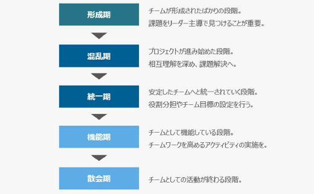

# チームビルディング

* チームとは共通の目的や達成のために集まったメンバー同士が協力している組織のこと
* チームビルディングとは、**個々人のスキルや能力・経験を最大限に発揮**し、目標達成を目指すための取り組みのこと
* チームワークとの違い。チームワークは１人だけでは達成できないような目標を成し遂げるためのもの。
* モチベーションコントロールが大事
* 注意点
  * 強制的な目標にしない
  * すべてをメンバー任せにしない
  * チーム編成に気を配る
* ポイント
  * 明確なチーム目標の設定
  * メンバーの役割の明確化
  * 多様な価値観の容認

* タックマンモデル

  

* 
