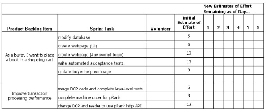

# アジャイル開発

## スクラム

スクラムガイド読みづらいけど、かみ砕いて理解すると有用。

https://scrumguides.org/docs/scrumguide/v2020/2020-Scrum-Guide-Japanese.pdf

スクラムガイド（日本語版）
https://scrumguides.org/docs/scrumguide/v2020/2020-Scrum-Guide-Japanese.pdf

* アジャイル開発手法の1つ

  * 不確実性が高い開発（顧客の要求が不明確など）の
    開発・提供・保守に向いているフレームワーク

  * アジャイルで最も利用されている手法

* スクラムガイドでは、複雑な問題に対応する適応型のソリューショ
  ンを通じて、人々、チーム、組織が価値を生み出すための軽量級フ
  レームワークと定義されている
* 「経験主義」と「リーン思考」に基づく
  * 経験主義:実際の「経験」に基づいて知識が獲得できるという考え方
  * リーン思考:ムダを最小限に抑えつつ、顧客価値を最大化する考え方 

* **予測可能性を最適化してリスクを制御する**ために、イテレーティブ（反復的）でインクリメンタル（漸進的）なアプローチを採用している

###　スクラムの三本柱

* 透明性
  * チームのプロセスや作業が、作業を実行する人とその作業を受け取る
    人に見える化されていること
  * 透明性によって検査が可能になる
* 検査
  * 作成物/進捗が合意された目標に向かっているかを絶えず確認すること
  * 検査によって適応が可能になる
* 適応
  * プロセスのいずれかの側面が許容範囲を逸脱していたり、成果となる
    プロダクトが受け入れられなかったりしたときは、できるだけ早期に
    プロセスやチームを調整すること

### スクラムの価値基準

* 確約（Commitment）: ゴールを達成し、お互いにサポートすることを確約する
* 集中（Focus）: ゴールに向けて可能な限り進捗できるように、スプリントの作業に集中する
* 公開（Openness）: スクラムチームとステークホルダーは、作業や課題を公開する
* 尊敬（Respect）: お互いに能力のある独立した個人として尊敬し、一緒に働く人たちからも同じように尊敬される
* 勇気（Courage）: 正しいことをする勇気や困難な問題に取り組む勇気を持つ

## スクラムチーム

* 自己管理されており、機能横断的である
* 作業を成し遂げるための最善策を、チーム外からの指示ではなく、自分たちで選択する。
* スクラムチームは通常、敏捷性を維持する十分な小ささと、スプリント内で作業を完了させるための十分な大きさの観点から、10人以下の人数で構成される。

* 開発者
  * インクリメントの作成に関わる作業の責任を持つ
* プロダクトオーナー
  * プロダクトの価値を最大化することと効果的なプロダクトバックログ
    管理に結果に責任を持つ
* スクラムマスター
  * スクラムを確立させることに責任を持つ

※プロダクトオーナーとスクラムマスターの兼任はよくない

### 開発者（開発者も積極的にコメントする。リーダーになってもいい。できる人がリーダーをやればいい。そいうチームを目指せばいい）

* 各スプリントにおいて、インクリメントの作成に関わる作業に責任を持つ
* 主な役割
  * スプリントの計画（スプリントバックログ）を作成する
  * 完成の定義を忠実に守ることにより品質を作り込む
  * スプリントゴールに向けて毎日計画を適応させる
  * 専門家としてお互いに責任を持つ
* 備考
  * 仕様策定、UIデザイン、設計、コーディング、品質活動など、開発に
    必要な活動は全て担う
  * 開発作業を自ら計画・管理し、実行する（自己管理）
  * 開発者チーム外に頼らず作業を完結できる（機能横断的）

### プロダクトオーナー

* プロダクトの価値を最大化することと効果的なプロダクト
  バックログ管理に結果に責任を持つ

* 役割

  * プロダクトゴールを策定し、明示的に伝える

  * プロダクトバックログアイテムを作成し、明確に伝える
  * プロダクトバックログアイテムを並び替える
  * プロダクトバックログに透明性があり、見える化され、理解されるようにする

* 備考

  * 上記の役割を他の人に委任することができる
    * ただし、委任した場合も責任はプロダクトオーナーにある
  * 必ず一人の人間である（委員会ではいけない）

### スクラムマスター

* スクラムを確立させることに責任を持つ

* 役割
  * チーム・組織へスクラムの導入を指導・トレーニング・コーチする
  * スクラムチームがインクリメントの作成に集中できるよう支援する
  * スクラムチームの進捗を妨げる障害物を排除するように働きかける
  * スクラムイベントの開催を支援する
  * 効果的なプロダクトゴールの定義とプロダクトバックログ管理の方法
    の検討、プロダクト計画の策定を支援する
  * ステークホルダーとのコラボレーションを促進する
  * ステークホルダーとスクラムチームの間の障壁を取り除く
* 備考
  * スクラムマスターは権限を持たず、指示・命令もしない
    * プロジェクト管理者とは異なる。
  * チームのプロセスに可視化と振り返りのみをもたらし、障害に対して
    チームの自律的な選択を促す

## スクラムイベント

* スクラムガイドより、スクラムでは、スプリントと呼ばれる
短い期間の中で繰り返し開発を行う
* スプリントでは以下に挙げるスクラムイベントを実施する
  * スプリントプランニング
    * スプリントで実行する作業の計画を立てる
  * デイリースクラム
    * スプリントゴールに対する進捗を検査し、1日の作業計画を立てる
  * スプリントレビュー
    * スプリントで何が達成され、自分たちの環境で何が変化したかについて
      レビューする
  * スプリントレトロスペクティブ
    * 今回のスプリントがどのように進んだかを検査し、次のスプリントで改善
      することを決める
  * リファインメント
    * PBIについて中身の見直し、大きい項目の分割等を行う

※複雑さを低減するために、同じ時間と場所で開催されることが望ましい

## スプリント

* 期間は1か月以内の決まった⾧さとする
  * スプリントの期間を短くすることで、検査と適応の学習サイクルを多
  く生み出し、予測可能性を高くして、コストと労力のリスクを最小限
  にできる
* スプリントは、スプリントプランニング・デイリースクラ
  ム・スプリントレビュー・スプリントレトロスペクティブを
  含む、プロダクトゴールを達成するために必要なすべての作
  業で構成される
* スプリントが終了したら、すぐに次のスプリントが開始する

※進捗の見通しを立てるために、バーンダウン、バーンアップ、累積フローなど、さまざまなプラクティスが存在する。

## スプリントプランニング

* スプリントで実行する作業の計画を立てる

* プロダクトバックログのどの項目を実現するかを決める
  * プロダクトオーナーは、プロダクトの価値と有用性を今回の
  スプリントでどのように高めるか提案する
  * スクラムチーム全体は、実現する項目についてなぜ価値があるかにつ
  いて検討し、スプリントゴールを定義する
  * 開発者は、プロダクトオーナーとの話し合いを通じて、今回のスプリ
  ントでどのプロダクトバックログアイテムを実現するか選択する
* 選択した項目を作業レベルに分割（タスクを洗い出す）する
  * 開発者は、選択したプロダクトバックログアイテムごとに、完成の
    定義を満たすインクリメントを作成するために必要な作業を計画する
  * 作業計画は、プロダクトバックログアイテムを1日以内の小さな作業
    アイテムに分解して行うことが多い

## デイリースクラム

* スプリントゴールに対する進捗を検査し、1日で作業実行可能な計画を作成する
* 15分間のタイムボックス
* スプリント期間中は毎日、同じ時間・場所で開催する
* スプリントゴールの進捗に焦点をあて、1日の実行可能な計画を作成する
* やり方は各スクラムチームに任されている
* 手順の一例: 昨日やったこと、今日行うこと、発見した障害を共有する
* スプリントで行う作業を調整できるのは、必ずしもデイリースクラムのときだけでなく、1日を通じて実施できる

<注意点>
* 議論の場にしない。
* ゴールが達成できそうかを確認する。
* スプリント計画の調整はデイリースクラムに限らず頻繁に行う。

## スプリントレビュー

* スプリントの成果を検査し、今後のプロセスを決定する
* スクラムチーム全体として作業の結果を提示する
* プロダクトゴールに対する進捗について話し合う
* スプリントで成したこと、自分たちの環境で変化したことをレビューする
* レビューした内容に基づき、次のスプリントでやるべきことを決める
* 新たな機会に見合うように、プロダクトバックログを調整する
* ワーキングセッションであり、スクラムチームはスプリントレビューをプレゼンテーションだけに限定しないようにする

* スプリントが1か月の場合、スプリントレビューのタイムボックスは最大で4
  時間である。
  スプリントの期間が短ければスプリントレビューの時間も短くなり、スプリ
  ントが1週間の場合は1時間程度が目安になる。

## スプリントレトロスペクティブ

* スプリントの進め方を検査し、以降のスプリントへ向けた改善案を決める
* スプリント中に上手くいったこと、発生した問題、その問題がどのように解決されたか（解決されなかったか）話し合う
* 自分たちの効果の改善に最も役立つ変更を特定し、できるだけ早く対処する
* 次のスプリントのスプリントバックログへの追加もできる
* スプリントレトロスペクティブをもってスプリントは終了する

※スプリントが1か月の場合、スプリントレトロスペクティブのタイムボックス
は最大3時間である。スプリントの期間が短ければスプリントレトロスペクティブの時間も短くなり、スプリントが1週間の場合は45分～1時間程度が目安になる。

## リファインメント

* スクラムイベントには含まれていないが、継続的に実施する
  プロセス
* プロダクトバックログアイテム（PBI）に対して、詳細の追加、見積もり、並び替え、分割をする
* 上にあるPBIほど明確で詳細	
  * 明確で詳細であれば見積もりも正確になる
* PBIは1スプリントで完成できるように細分化する
  * 1スプリントで完成できそうなPBIは「準備完了」の状態とみなせる

## スクラムの作成物

* スクラムガイドより、スクラムで定義された作成物は、全員が
  共通理解を得るために必要な情報の透明性を最大化するように
  設計されている
* 各作成物には、「確約（コミットメント）」が含まれる
* プロダクトバックログ
  * プロダクトゴールと優先順位がつけられたプロダクトを作成するにあ
    たっての要求事項のリスト（プロダクトの改善に必要なものの一覧）
  * プロダクトオーナーが管理する
  * プロダクトバックログの1つ1つの項目のことを、プロダクトバックログアイ
    テム（PBI）と呼ぶ。
* スプリントバックログ
  * スプリントゴールとスプリントで達成するプロダクトバックログアイ
    テムのリストと作業計画
  * 開発者が管理する
  * プロダクトバックログの1つ1つの項目のことを、プロダクトバックログアイ
    テム（PBI）と呼ぶ。
* インクリメント
  * 完成の定義を満たした動作するプロダクト

## プロダクトバックログアイテムの見積もり

* 絶対見積もりではなく、相対見積もりを利用する
* フィボナッチ数列のカードによるプランニングポーカーやTシャツサイズ見積もりが一般的に使われる
* 正確に見積もることが大切なのではなく、見積もりを通して成果物に対する認識を合わせることが重要

### スプリントバックログ

* そのスプリントで選択したいくつかのPBIとインクリメントを届けるための実行可能な計画
* PBIではなくSBI単位でタスクを割り当てていく

## インクリメント

* 完成の定義を満たしており、動作して評価可能なプロダクト

* これまでのすべてのインクリメントに今回のスプリントで作成
  したインクリメントを追加する
* すべてのインクリメントが常に連携して機能する（動く）状態
  になければならない
  * そのため、徹底的に検証する必要がある
* スプリントでは、複数のインクリメントを作成可能である
* インクリメントをまとめたものをスプリントレビューで提示する
  * ただし、スプリントレビュー以前にそのスプリントのインクリメントをステークホルダーにデリバリーすることもある
  * スプリントレビューをリリースの関門にはしない
* 「完成の定義」を満たさない限り、インクリメントの一部とみなすことができない