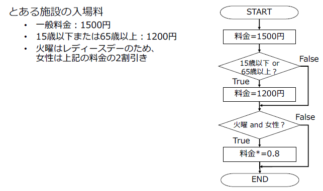
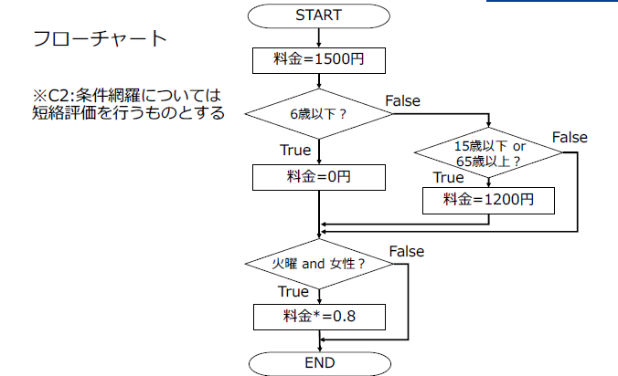
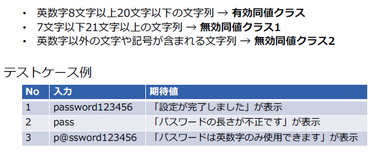
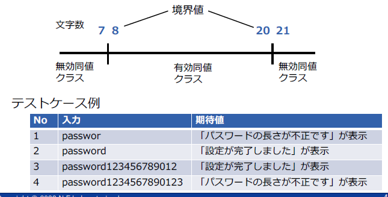
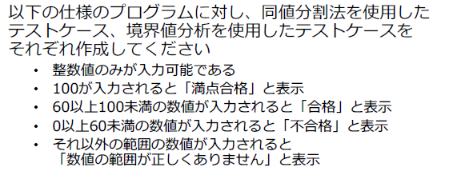
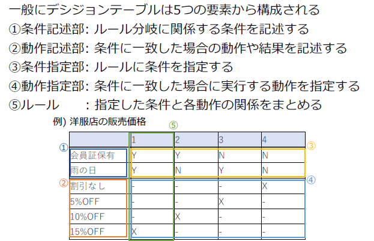

# ソフトウェアテスト

## テストの7原則

1. テストは欠陥があることは示せるが、欠陥がないことは
  示せない
2. 全数テストは不可能
3. 早期テストで時間とコストを節約
4. 欠陥の偏在
5. 殺虫剤のパラドックスにご用心
6. テストは状況次第
7. 「バグ0」の落とし穴

## ソフトウェアの品質

ISO/IEC25010では以下８項目を定めている(https://iso25000.com/index.php/en/)

| 品質特性     | 概要                                             |
| ------------ | ------------------------------------------------ |
| 機能適合性   | 要求されたニーズを満たす度合い                   |
| 性能効率性   | 使用する資源に関する性能の度合い                 |
| 互換性       | 他のシステム等と情報交換できる度合い             |
| 使用性       | 利用者がシステムを利用できる度合い               |
| 信頼性       | 機能を実行できる度合い                           |
| セキュリティ | 権限に応じて情報及びデータを保護する度合い       |
| 保守性       | 修正における有効性や効率性の度合い               |
| 移植性       | 別環境にシステムを移す際の有効性や効率性の度合い |

## ホワイトボックステスト

### カバレッジ

↑↑↑↑↑↑↑テストケース小

* 命令網羅(C0)：すべての命令を最低一度は通る

* 分岐網羅(C1):全ての分岐において、真と偽の分岐をそれぞれ最低1回は実行する

* 条件網羅(C2):全ての条件において、真、偽となる条件を最低1回は実行する

* 複合条件網羅(MCC):全ての条件において、可能な結果の組み合わせを網羅する

↓↓↓↓↓↓↓テストケース大

#### 演習

命令網羅(C0)：年齢=65歳、曜日=火曜日、性別=女性

分岐網羅(C1)：

* 年齢=65歳、曜日=火曜日、性別=女性
* 年齢=64歳、曜日=水曜日、性別=女性

条件網羅(C2):　※複数条件については短絡評価を行うものとする

| No   | 15歳以下 | 65歳以上 | 火曜 | 女性 |
| ---- | -------- | -------- | ---- | ---- |
| ①    | T        | -        | T    | T    |
| ②    | F        | T        | T    | F    |
| ③    | F        | F        | F    | -    |

* 年齢=14歳、曜日=火曜日、性別=女性　→　960円	(どっちも適用)
* 年齢=65歳、曜日=水曜日、性別=女性　→　1200円（最初のみ適用）
* 年齢=15歳、曜日=水曜日、性別=男性　→　1500円（どっちも適用しない）

複合条件網羅(MCC)：

* 年齢=14歳、曜日=火曜日、性別=女性　→　960円	(どっちも適用)
* 年齢=65歳、曜日=水曜日、性別=女性　→　1200円（最初のみ適用）
* 年齢=64歳、曜日=火曜日、性別=女性　→　1200円（後ろの条件のみ適用）
* 年齢=15歳、曜日=水曜日、性別=男性　→　1500円（どっちも適用しない）

命令網羅(C0)：

* 年齢=6歳、曜日=火曜、性別=女性 → 0
* 年齢=7歳、曜日=火曜、性別=女性 → 960

分岐網羅(C1)：

| No.  | 6歳以下 | 15歳以下 or 65歳以上 | 火曜 and 女性 |
| ---- | ------- | -------------------- | ------------- |
| ①    | T       | F                    | T             |
| ②    | F       | T                    | F             |
| ③    | F       | F                    | F             |

① 年齢=5歳、曜日=火曜、性別=女性 → 0
② 年齢=14歳、曜日=水曜、性別=女性 → 1200
③ 年齢=64歳、曜日=水曜、性別=女性 → 1500

条件網羅(C2)：

| No.  | 6歳以下 | 15歳以下 | 65歳以上 | 火曜 | 女性 |
| ---- | ------- | -------- | -------- | ---- | ---- |
| ①    | T       | -        | -        | T    | T    |
| ②    | F       | T        | F        | F    | T    |
| ③    | F       | F        | T        | T    | F    |
| ④    | F       | F        | F        | F    | F    |

① 年齢=5歳、曜日=火曜、性別=女性 → 0
② 年齢=14歳、曜日=水曜、性別=女性 → 1200
③ 年齢=66歳、曜日=火曜、性別=男性 → 1200
④ 年齢=64歳、曜日=水曜、性別=男性 → 1500

複合条件網羅(MCC)：

| No.  | 6歳以下 | 15歳以下or65歳以上 | 火曜 and 女性 |
| ---- | ------- | ------------------ | ------------- |
| ①    | T       | F                  | T             |
| ②    | F       | T                  | T             |
| ③    | F       | T                  | F             |
| ④    | F       | F                  | F             |

① 年齢=5歳、曜日=火曜、性別=女性 → 0
② 年齢=14歳、曜日=火曜、性別=女性 → 960
③ 年齢=66歳、曜日=火曜、性別=男性 → 1200
④ 年齢=64歳、曜日=水曜、性別=男性 → 1500

## ブラックボックステスト

全数テストは不可能

​	↓	↓	↓	↓	↓

* 同値分割法

  同じ動作をする条件の集まり（同値クラス）ごとにテストを行う技法

  

* 境界値分割法

  

■同値分割

| 値   | 期待値                                 |
| ---- | -------------------------------------- |
| 0.1  | バリデーションチェックでエラー         |
| 101  | 「数値の範囲が正しくありません」と表示 |
| 100  | 「満点合格」と表示                     |
| 99   | 「合格」と表示                         |
| 59   | 「不合格」と表示                       |

■境界値分析

| 入力値 | 期待値                                 |
| ------ | -------------------------------------- |
| 0.1    | バリデーションチェックでエラー         |
| 101    | 「数値の範囲が正しくありません」と表示 |
| 100    | 「満点合格」と表示                     |
| 99     | 「合格」と表示                         |
| 61     | 「合格」と表示                         |
| 60     | 「合格」と表示                         |
| 59     | 「不合格」と表示                       |
| 1      | 「不合格」と表示                       |
| 0      | 「不合格」と表示                       |
| -1     | 「数値の範囲が正しくありません」と表示 |

## ディシジョンテーブル

