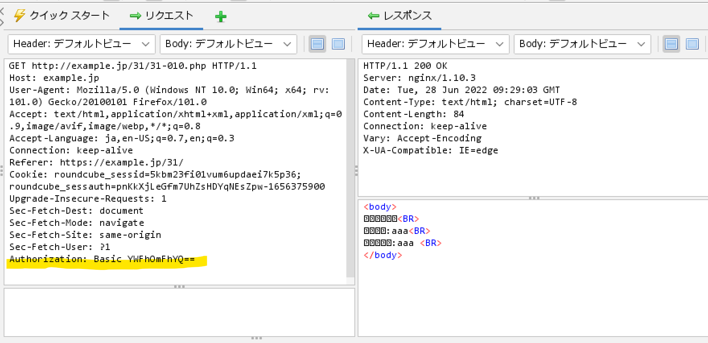
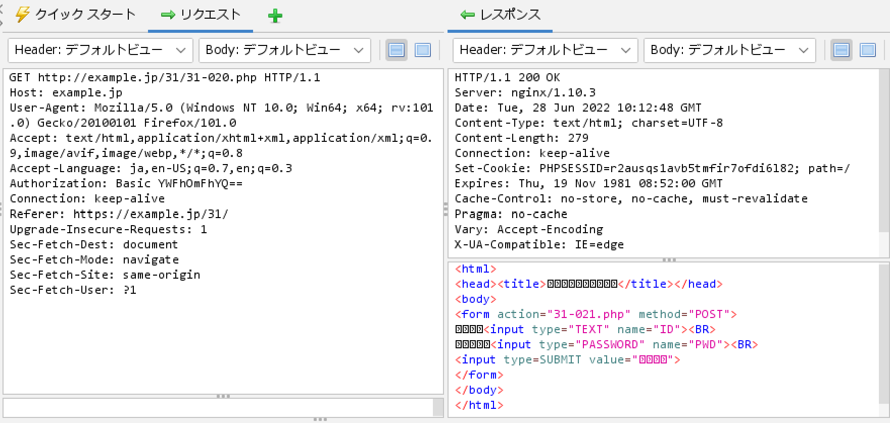
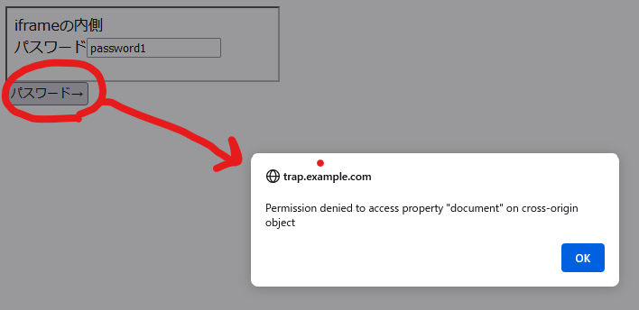
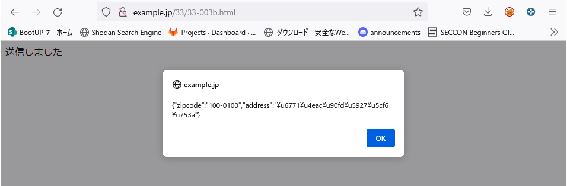
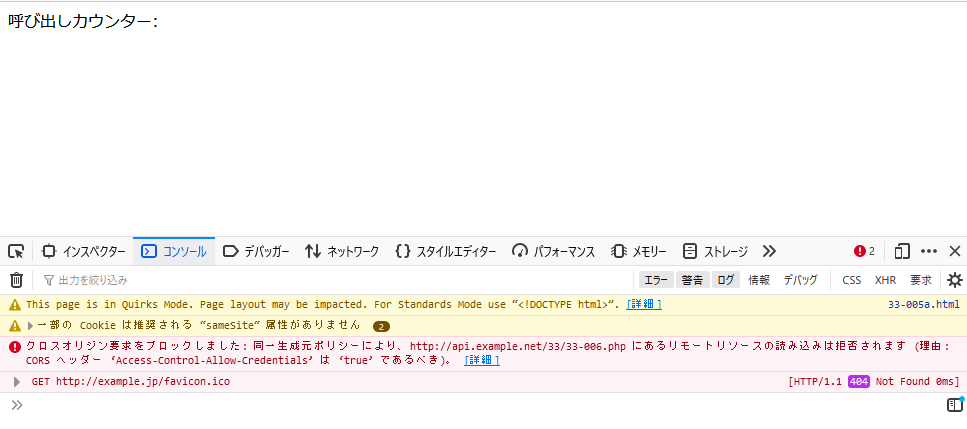

# **Webセキュリティの基礎**

## 3-1 HTTPとセッション管理

* レスポンス

    * ステータスライン

        HTTP/1.1 200 OK

        * ステータスコード

            |ステータスコード|概要|
            ----|----
            |1xx|処理が継続している|
            |2xx|正常終了|
            |3xx|リダイレクト|
            |4xx|クライアントエラー|
            |5xx|サーバーエラー|

        * レスポンスヘッダ

            * 改行のみの行が現れるまで続く
            * Content-Length：ボディのバイト数
            * Content-Type：MIMEタイプというリソースの種類を指定する。HTMLの場合は、text/htmlである。

            |MIMEタイプ|意味|
            ----|----
            |text/plain|テキスト|
            |text/html|HTML文書|
            |application/xml|XML文書|
            |text/css|CSS|
            |image/gif|GIF画像|
            |image/jpeg|JPEG画像|
            |image/png|PNG画像|
            |application/pdf|PDF文書|

* リクエスト

    * POSTメソッド

    * メッセージボディ

        * POSTメソッドによるリクエストメッセージにはボディという部分がある。レスポンスメッセージの場合同様、ヘッダとボディは空行で区切る。POSTにより送信される値に関するヘッダがContent-LengthとContent-Type。
        
            * Content-Length：ボディのバイト数
            * Content-Type：送信する値のMIMEタイプ。HTMLのform要素で指定することができる。指定がない場合は[application/x-www-from-urlencoded]となる「名前=値」の組を「＆」でつないだデータ形式で返すというしてい。名前と値はパーセントエンコードされる。

            * パーセントエンコーディング
                パーセントエンコーディングは対象の文字をバイト単位で「%xx」という形式であらわす。xxはバイトの16進数表記。パーセントエンコーディングの規約では、**スペースは%20となるが「application/x-www-form-urlencoded」の場合はスペースを特別扱いして「＋」に符号化することになっている。**「I'm a programmer」を符号化した場合は、「I%27m+a+programmer」となる。

            * Referer：リンク元のURLをあらわすヘッダ。

    * GETとPOSTの使い分け

        * 更新系の処理はPOST。GETは参照のみ
        * URLの長さには上限がある（ブラウザにより異なる)ため大量のデータを送る場合もPOST
        * 秘密情報を送る場合もPOSTを用いる

    * hiddenパラメータは書き換えできる

    * hiddenパラメータのメリット

        hiddenは利用者自身からは書き換えできるものの、情報漏洩や第三者からの書き換えに関しては堅牢。hiddenパラメータと比較する対象には、クッキーやセッション変数がある。クッキーやセッション変数の欠点として、セッションＩＤの固定化攻撃に弱いことがある。利用者自身によっても書き換えられては困る認証や認可に関する情報はセッション変数に保存すべきだが、それ以外の情報は、まずはhiddenパラメータに保存することを検討するとよい。

* ステートレスなHTTP認証

    * Basic認証

        * 認証が必要なページにリクエストがあると一旦「401 Unauthorized」を返却する。401を受けてブラウザはIDとパスワードの入力画面を表示し入力されたIDとパスワードを追加したリクエストを改めてサーバに送信する。

        * Webサーバーの設定で実現することが多いが、PHPの機能でプログラミングすること等も可能

            ```php
            <?php
                $user = @$_SERVER['PHP_AUTH_USER'];
                $pass = @$_SERVER['PHP_AUTH_PW'];
            
                if (! $user || $pass) {
                    header('HTTP/1.1 401 Unauthorized);
                    header('WWW-Authenticate: Basic realm="Basic Authentication Sample"');
                }
            ?>
            ```

            * [phpドキュメント](https://www.php.net/manual/ja/reserved.variables.server.php)

            * 認証に失敗した場合は、Basic認証の既定に従い以下のヘッダを出力
              
                ```
                HTTP/1.1 401 Unauthorized
                WWW-Authenticate: Basic realm="Basic Authentication Sample"
                ```
            
            * 画面でBasic認証でユーザＩＤとパスワードを入力すると、Authorizationヘッダが付与されてリクエスト送信される。

                

                * Basicの後ろの文字列はＩＤとパスワードをコロン「：」で区切ってつなげてBase64エンコードしたもの。

                * OWASP ZAPのEncoder機能で確認可能

                    ツール→エンコード/デコード/ハッシュ→値を入れてデコードを選択

                    
                
                * 一度Basic認証に成功すると、その後はhttp://example.jp/31/以下のディレクトリへのリクエストには、ブラウザが自動的にAuthorizationヘッダを付与してくれる。このため認証状態が保持されているように見えるが実際にはリクエストごとにIDとパスワードが送出されている。認証情報はどこにも保存されておらずステートレスということになる。ログアウトという概念もない。
                
                * webアプリケーションで用いられる認証手段には、Basic認証の他、HTMLフォームでIDとパスワードを入力させるフォーム認証、TLSクライアント証明書を用いるクライアント認証などがある。

* クッキーとセッション管理

    * 例えば認証情報を保持したい場合、HTTP認証を使わない場合は、サーバー側で認証状態を覚えておく必要があり、アプリケーションの状態を覚えておくことをセッション管理と呼ぶ。

    * セッション管理をHTTPで実現する目的でcookieが導入された。

    * クッキーはサーバー側からブラウザに対して、「名前＝変数」の組を覚えておくように指示するもの。

* セッション（Cookieの発行）

    * セッションIDの発行
        ```php
        <?PHP
            session_start():    //セッション開始
        ?>
        <html>
            省略
        </html>
        ```
        
        

* 初回のみレスポンスでSet-Cookieが発行される。以降は同一のURLにリクエストしたとしてもサーバーからSet-Cookieはされず（Cookieが有効期間内であれば)リクエストから常にPHPSESSIDが送付されることになる。

* セッション変数$_SESSION['id']への保存
          

    ```php
    <?PHP
        session_start():    //セッション開始
        $id = @$_POST['ID'];
        $pwd = $_POST['PWD'];
        $_SESSION['ID'] = $id; //セッションへの値の登録
    ?>
    <html>
        省略
    </html>
    ```

        * セッション変数の利用

    ```php
    <?PHP
        session_start():    //セッション開始
        $id = $_SESSION['ID'] ; //セッション変数の取得
        if ($id == '') {
            die('ログインしてください')
        }
    <html>
        省略
    </html>
    ```

* クッキーによるセッション管理

    * クッキーが保持できる値の個数や文字列長には制限がある
    * クッキーの値は利用者本人から参照・変更できるので、秘密情報の格納には向かない

    クッキーには「整理番号」としてのセッションＩＤを格納しておき、実際の値はサーバー側で管理する方法が広く用いられる（クッキーによるセッション管理）ＰＨＰなど主要なアプリケーション開発ツールには、セッション管理のための仕組みがある。

    * セッションＩＤを推測されてしまうと・・・

        * すでに推測されたセッションＩＤで認証が済んでしまっている場合、悪用につながる。そのためセッションＩＤは連番ではだめで十分な桁数の乱数を用いる。以下セッションＩＤに求められる要件

            * 要件1：第三者がセッションＩＤを推測できないこと
            * 要件2：第三者からセッションＩＤを強制されないこと
              
                * セッションＩＤ固定化攻撃（P68の例がわかりやすいので確認すること）→またＩＤ固定化攻撃の対策としては、認証時に新たにセッションＩＤを払い出しすることである。

            * 要件3：第三者にセッションＩＤが漏洩しないこと

                * 漏洩の原因

                    * クッキー発行の際の属性に不備がある
                    * ネットワーク的にセッションIDが盗聴される(8.3節)
                    * XSSなどのアプリケーションの脆弱性
                    * phpやブラウザなのでプラットフォームの脆弱性
                    * セッションIDをURLに保持する場合はrefererから

            * セッションＩＤは自作せず、Ｗｅｂアプリケーション開発ツール(PHP, Tomcat, .NETなど)で提供されるセッションＩＤを利用するべき。

    * セッションIDをネットワーク盗聴から保護するにはTLS（Transport Layer Security)による暗号化が有効であるが、クッキーを発行する際の属性指定に注意が必要

        * cookieを発行する際の主な属性

            |属性|意味|
            ----|----
            |Domain|ブラウザがcookie値を送信するサーバーのドメイン|
            |Path|ブラウザがクッキー値を送信するURLのディレクトリ|
            |Expires|クッキー値の有効期限。指定しない場合はブラウザの終了まで|
            |Secure|HTTPSの場合のみクッキーを送信|
            |HttpOnly|この属性が指定されたクッキーはJavaScriptからアクセスできない※XSS対策|

            * domain属性を不用意に設定すると脆弱性の原因になる。通常は設定しないものと覚える。

        * SameSite属性

            * CSRF脆弱性対策を目的として機能追加された。
            * Strict,Lax,Noneのいづれかを指定可能
            * SameSite=Laxをしていしたクッキーは、他サイトからPOSTメソッドなどで遷移した場合は送信されなくなる

                ```php
                session.cookier_samesite = Lax
                ```

## 3-2 受動敵攻撃と同一オリジンポリシー

* 能動的攻撃：攻撃者がWebサーバーに対して直接攻撃すること。代表例としてはＳＱＬインジェクションがある

* 受動的攻撃：Webサイトの利用者に罠を仕掛けることにより、罠を閲覧したユーザを通してアプリケーションを攻撃する手法

    * 単純な受動的攻撃：罠サイトに利用者を誘導する（悪意のあるHTMLを送る）いわゆる怪しいサイトを閲覧してマルウェアに感染する場合
    * 正規サイトを悪用する受動的攻撃

        【流れ】
        * 攻撃者はあらかじめ正規サイトを攻撃してコンテンツに仕掛けを仕込む
        * 利用者が仕掛けを含むコンテンツを閲覧する

        【手法】
        * FTPなどのパスワードを入手してコンテンツを書き換える(8l1節参照)
        * Webサーバーの脆弱性をついた攻撃によりコンテンツを書き換える(8.1節参照)
        * SQLインジェクション攻撃によりコンテンツを書き換える(4.4節参照)
        * SNSなど利用者が投稿できるサイト機能のクロスサイトスクリプティング脆弱性を悪用する

* サイトをまたがった受動的攻撃

    【流れ】
    * ①利用者が罠サイトを閲覧
    * ②罠サイトから仕掛けを含むHTMLをダウンロードする
    * ③HTMLの仕掛けが発動して正規サイトに攻撃のリクエストを送信する
    * ④正規サイトからJavaScriptなどの仕掛けを含むレスポンスが返る

        * ③のリクエストでWebアプリケーションを攻撃するタイプがCSRF.④のレスポンスによりブラウザを介して攻撃するタイプがXSS,HTTPヘッダインジェクションである。

## ブラウザはどのように受動的攻撃を防ぐか

* Webサイトでの対策だけではブラウザに脆弱性があった場合に安全を確保することができない

* ブラウザのサンドボックス

    * サンドボックスの中ではプログラムができることに制限がある

        * JavaScriptのサンドボックスの機能制限

            * ローカルファイルへのアクセスの禁止
            * プリンタなどの資源の利用禁止(画面表示は可能)
            * ネットワークアクセスの制限（同一オリジンポリシ）

    * 同一オリジンポリシー

        * JavaScriptなどのクライアントスクリプトからサイトをまたがったアクセスを禁止するセキュリティ上の制限。ブラウザのサンドボックスに用意された制限の１つ。
        * trap.example.com/32/32-900htmlを取得する
        
        ```html
        <html><head><title>フレーム間の読み出し実験</title></head>
                <body>
                <iframe name="iframe1" src="http://example.jp/32/32-002.html" width="300" height="80">
                </iframe><br>
                <input type="button" onclick="go()" value="パスワード→">
                <script>
                function go() {
                try {
                var x = iframe1.document.form1.passwd.value;
                document.getElementById('out').textContent = x;
                } catch (e) {
                alert(e.message);
                }
                }
                </script>
                <span id="out"></span>
                            </body></html>
        ```
        
        

        * htmlを送ったサーバーと取得しに行くhtmlの値が別ドメインのものとなるため同一オリジンポリシーに違反しエラーとなる

   * 同一オリジンとみなされる条件

        * URLのホストが一致
        * スキーム（プロトコル）が一致
        * ポート番号が一致

            * javascript以外のクロスドメインアクセス（クロスドメインが許可されるもの）

                * frame要素とiframe要素
                * img要素
                * script要素
        * JSONP(JSON with padding)の脆弱性があり(4.6.7項)
                * css
                    * form要素のaction属性

## CORS(Cross-Origin Resource Sharing)

サイト間でのデータをやり取りしたいというニーズ。XMLHttpRequestなどいくつかの局面についてサイトを越えてデータをやり取りできる仕様として策定

### シンプルなリクエスト

```html
<html>
    <head></head>
    <body>
        <script>
          var req = new XMLHttpRequest();
          req.open('GET', 'http://api.example.net/33/33-002.php');
          req.onreadystatechange = function() {
              if (req.readyState == 4 && req.status == 200) {
                alert(req.responseText);
              }
          };
          req.send(null);
        </script>
        送信しました
	</body>
</html>
```

```php
<?php
    header('Content-Type: application/json');
	echo json_encode(['zipcode' => '100-0100', 'address' => '東京都大島町']);
```


- リクエストは送信されるものの、レスポンスを表示する際にエラーとなる。


- #### Access-Control-Allow-Origin

  クロスオリジンからの読み出しを許可するための仕掛けで、情報の**提供元**がHTTPレスポンスヘッダとして出力する。

  

  - 修正後のPHP

```php
<?php
    header('Content-Type: application/json');
	header('Access-Control-Allow-Origin: http://example.jp');
	echo json_encode(['zipcode' => '100-0100', 'address' => '東京都大島町']);
```


- シンプルなリクエストの要件
  - メソッドは下記のうちいづれか
    - GET
    - HEAD
    - POST
  - XMLHttpRequestオブジェクトのsetRequestHeaderメソッドで設定するヘッダはいかに限る
    - Accept
    - Accept-Language
    - Content-Language
    - Content-Type
  - Content-Typeヘッダは以下のいづれかであること
    - application/x-www-form-urlencoded
    - multipart/form-data
    - text/plain

### プリフライトリクエスト

クロスオリジンアクセスにおいて「シンプルなリクエスト」の条件を満たさない場合、ブラウザはプリフライトリクエスト(pre-flight request)というHTTPリクエストを送信する。

```html
<html><head></head><body>
<script>
  var req = new XMLHttpRequest();
  req.open('POST', 'http://api.example.net/33/33-004.php');
  req.setRequestHeader('content-type', 'application/json');
  data = '{"zipcode" : "100-0100"}';
  req.onreadystatechange = function() {
      if (req.readyState == 4 && req.status == 200) {
        alert(req.responseText);
      }
  };
  req.send(data);
</script>
送信しました

</body></html>
```

```php
<?php
    header('Content-Type: application/json');
	header('Access-Control-Allow-Origin: http://example.jp');
	echo json_encode(['zipcode' => '100-0100', 'address' => '東京都大島町']);
```


- プリフライトリクエストのパケット

  ```http
  OPTIONS /33/33-004.php HTTP/1.1
  Host: api.example.net
  User-Agent: Mozilla/5.0 (Windows NT 10.0; Win64; x64; rv:102.0) Gecko/20100101 Firefox/102.0
  Accept: */*
  Accept-Language: ja,en-US;q=0.7,en;q=0.3
  Accept-Encoding: gzip, deflate
  Access-Control-Request-Method: POST
  Access-Control-Request-Headers: content-type
  Referer: http://example.jp/
  Origin: http://example.jp
  Connection: keep-alive
  ```

  - これを受け取ったAPIは特定のヘッダに応答する必要がある。

    | 要求の種類           | リクエスト                    | レスポンス                   |
    | -------------------- | ----------------------------- | ---------------------------- |
    | メソッドに対する許可 | Access-Control-Request-Method | Access-Control-Allow-Method  |
    | ヘッダに対する許可   | Access-Control-Request-header | Access-Control-Allow-Headers |
    | オリジンに対する許可 | Origin                        | Access-Control-Allow-Origin  |

  - htmlとphpを以下書き換えする
  
    - 33-003b.html
  
    ```html
    <body>
    <script>
      var req = new XMLHttpRequest();
      req.open('POST', 'http://api.example.net/33/33-004b.php');
      req.setRequestHeader('content-type', 'application/json');
      data = '{"zipcode" : "100-0100"}';
      req.onreadystatechange = function() {
          if (req.readyState == 4 && req.status == 200) {
            alert(req.responseText);
          }
      };
      req.send(data);
    </script>
    送信しました
    </body>
    ```
  
    * 33-004b.php
  
    ```php
    <?php
      if ($_SERVER['REQUEST_METHOD'] === "OPTIONS") {
        if ($_SERVER['HTTP_ORIGIN'] == "http://example.jp") {
          header('Access-Control-Allow-Origin: http://example.jp');
          header('Access-Control-Allow-Methods: POST, GET, OPTIONS');
          header('Access-Control-Allow-Headers: Content-Type');
          header('Access-Control-Max-Age: 10');
          header("Content-Length: 0");
          header("Content-Type: text/plain");
        } else {
          header("HTTP/1.1 403 Access Forbidden");
          header("Content-Type: text/plain");
          echo "このリクエストは継続できません";
        }
      } elseif ($_SERVER['REQUEST_METHOD'] === "POST") {
        header('Content-Type: application/json');
        header('Access-Control-Allow-Origin: http://example.jp');
        header('Access-Control-Max-Age: 10');
        echo json_encode(['zipcode' => '100-0100', 'address' => '東京都 大島町']);
      } else {
        die('Invalid Request');
      }
    ```
  
    
  
    * 別ドメインからの値取得ができた。（http://api.example.net/33/33-004b.php)からレスポンスした値がブラウザで表示できている。

## 認証情報を含むリクエスト

* デフォルトでは、クロスオリジンに対するリクエストには、HTTP認証やクッキーなどの認証に用いられるリクエストヘッダは自動的に送信されない。XMLHttpRequestのプロパティwithCredentialsをtrueにセットする必要がある。

  * withCredentialsを用いない場合

    33-006.php

    ```php
    <?php
      session_start();
      header('Content-Type: application/json');
      header('Access-Control-Allow-Origin: http://example.jp');
      if (empty($_SESSION['counter'])) {
        $_SESSION['counter'] = 1;
      } else {
        $_SESSION['counter']++;
      }
      echo json_encode(array('count' => $_SESSION['counter']));
    ```

    * [PHP_array()マニュアル](https://www.php.net/manual/ja/language.types.array.php)

    33-005.html

    ```html
    <body>
    <script>
      var req = new XMLHttpRequest();
      req.open('GET', 'http://api.example.net/33/33-006.php');
      req.onreadystatechange = function() {
          if (req.readyState == 4 && req.status == 200) {
             var span = document.getElementById('counter');
            span.textContent = req.responseText;
          }
      };
      req.send(null);
    </script>
    呼び出しカウンター:<span id="counter"></span>
    </body>
    ```

    * リクエストにクッキーはセットされない

      ```http
      GET /33/33-006.php HTTP/1.1
      Host: api.example.net
      User-Agent: Mozilla/5.0 (Windows NT 10.0; Win64; x64; rv:102.0) Gecko/20100101 Firefox/102.0
      Accept: */*
      Accept-Language: ja,en-US;q=0.7,en;q=0.3
      Accept-Encoding: gzip, deflate
      Origin: http://example.jp
      Connection: keep-alive
      Referer: http://example.jp/
      ```

    * レスポンスにはset-cookieはあるが、ブラウザにはクッキーはセットされない。

      ```http
      HTTP/1.1 200 OK
      Server: nginx/1.10.3
      Date: Wed, 06 Jul 2022 12:29:40 GMT
      Content-Type: application/json
      Content-Length: 11
      Connection: keep-alive
      Set-Cookie: PHPSESSID=3jf265nvfun32us4kf2g8ljos0; path=/
      Expires: Thu, 19 Nov 1981 08:52:00 GMT
      Cache-Control: no-store, no-cache, must-revalidate
      Pragma: no-cache
      Access-Control-Allow-Origin: http://example.jp
      X-UA-Compatible: IE=edge
      
      {"count":1}
      ```

    * 33-005.htmlをリロードする

      ```http
      GET /33/33-006.php HTTP/1.1
      Host: api.example.net
      User-Agent: Mozilla/5.0 (Windows NT 10.0; Win64; x64; rv:102.0) Gecko/20100101 Firefox/102.0
      Accept: */*
      Accept-Language: ja,en-US;q=0.7,en;q=0.3
      Accept-Encoding: gzip, deflate
      Origin: http://example.jp
      Connection: keep-alive
      Referer: http://example.jp/
      ```

      cookieはなく、かつカウントは1のままである。

  * withCredentialsプロパティをセットした場合

    33-005a.html

    ```html
    <body>
    <script>
      var req = new XMLHttpRequest();
      req.open('GET', 'http://api.example.net/33/33-006.php');
      // withCredentials:true
      req.withCredentials = true;
      req.onreadystatechange = function() {
          if (req.readyState == 4 && req.status == 200) {
             var span = document.getElementById('counter');
            span.textContent = req.responseText;
          }
      };
      req.send(null);
    </script>
    呼び出しカウンター:<span id="counter"></span>
    </body>
    ```

    これを実行すると、クッキーは送信されるがエラーとなる。

    ```http
    GET /33/33-005a.html HTTP/1.1
    Host: example.jp
    User-Agent: Mozilla/5.0 (Windows NT 10.0; Win64; x64; rv:102.0) Gecko/20100101 Firefox/102.0
    Accept: text/html,application/xhtml+xml,application/xml;q=0.9,image/avif,image/webp,*/*;q=0.8
    Accept-Language: ja,en-US;q=0.7,en;q=0.3
    Accept-Encoding: gzip, deflate
    Connection: keep-alive
    Referer: http://example.jp/33/
    Cookie: PHPSESSID=r2ausqs1avb5tmfir7ofdi6l82
    Upgrade-Insecure-Requests: 1
    ```

    

    withCredentialsプロパティをtrueにしたリクエストに対しては、Access-Control-Allow-Credentials：trueというレスポンスヘッダを返す必要がある。

    33-006b.php(差分のみ)

    ```http
    GET /33/33-005b.html HTTP/1.1
    Host: example.jp
    User-Agent: Mozilla/5.0 (Windows NT 10.0; Win64; x64; rv:102.0) Gecko/20100101 Firefox/102.0
    Accept: text/html,application/xhtml+xml,application/xml;q=0.9,image/avif,image/webp,*/*;q=0.8
    Accept-Language: ja,en-US;q=0.7,en;q=0.3
    Accept-Encoding: gzip, deflate
    Connection: keep-alive
    Referer: http://example.jp/33/
    Cookie: PHPSESSID=r2ausqs1avb5tmfir7ofdi6l82
    Upgrade-Insecure-Requests: 1
    ```

    ```http
    HTTP/1.1 200 OK
    Server: nginx/1.10.3
    Date: Wed, 06 Jul 2022 12:42:10 GMT
    Content-Type: application/json
    Content-Length: 11
    Connection: keep-alive
    Expires: Thu, 19 Nov 1981 08:52:00 GMT
    Cache-Control: no-store, no-cache, must-revalidate
    Pragma: no-cache
    Access-Control-Allow-Origin: http://example.jp
    Access-Control-Allow-Credentials: true
    X-UA-Compatible: IE=edge
    
    {"count":2}
    ```

### まとめ

クッキーなど認証用のヘッダを伴うクロスオリジンリクエストは、下記の両方を満たす必要がある。

* XMLHttpRequestオブジェクトのwithCredentialsプロパティをtrueにする
* レスポンスヘッダとしてAccess-Control-Allow-Credentials:trueを返す

CORS(Cross-Origin Resource Sharing)は同一オリジンポリシーと巧妙に互換性を保ちつつ、安全性を保ってクロスオリジンアクセスを実現した優れた仕様。複数のオリジンにまたがるリソースを取り扱うWebアプリケーションの開発を行うためには、CORSの仕様を正しく理解することが出発点となる。
