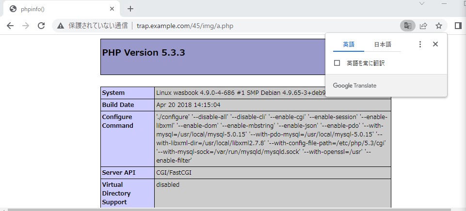
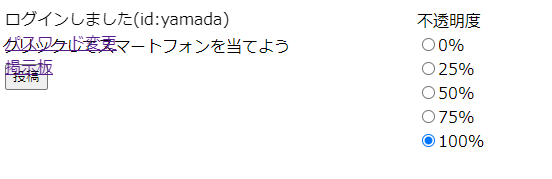

# 4.5 「重要な処理」の際に混入する脆弱性

* ログインした利用者のアカウントにより、取り消しできない重要な処理
  * クレジットカードでの決済
  * 口座からのメール送信
  * パスワードやアドレスの変更

## 4.5.1 CSRF(クロスサイト・リクエストフォージェリー)

利用者の意図したリクエストであることを確認しないことで、「重要な処理」が実行されてしまう脆弱性

* 利用者の赤運jンとで物品購入される
* 利用者の退会処理
* 利用者のアカウントによるSNSや問い合わせフォームなどへの書き込み
* 利用者のパスワードやメールアドレスの変更

#### 発生個所

* 以下のいずれかのサイト上の「重要な処理」が行われるページ
  * クッキーのみでセッション管理が行われているサイト
  * HTTP認証、TLSクライアント証明書のみで利用者の識別が行われているサイト
* 影響を受けるページ
  * CSRF脆弱性のあるページのみ

### 攻撃手法と影響

#### 入力-実行パターンのCSRF攻撃

* 45-001.php[ダミーのログインスクリプト]

```php
<?php // ログインしたことにする確認用のスクリプト
  session_start();
  $id = filter_input(INPUT_GET, 'id');
  if (empty($id)) $id = 'yamada';
  $_SESSION['id'] = $id;
?><body>
ログインしました(id:<?php echo
  htmlspecialchars($id, ENT_NOQUOTES, 'UTF-8'); ?>)<br>
<a href="45-002.php">パスワード変更</a><br>
<a href="45-010.php">掲示板</a>
</body>
```

* 45-002.php[パスワード入力の画面]

```php
<?php
  session_start();
  // ログイン確認…省略
?>
<body>
<form action="45-003.php" method="POST">
新パスワード<input name="pwd" type="password"><BR>
<input type=submit value="パスワード変更">
</form>
</body>
```

* 45-003.php[パスワード変更実行]

```php
<?php
  function ex($s) { // XSS対策用のHTMLエスケープと表示関数
    echo htmlspecialchars($s, ENT_COMPAT, 'UTF-8');
  }
  session_start();
  $id = @$_SESSION['id']; // ユーザIDの取り出し
  // ログイン確認…省略
  $pwd = filter_input(INPUT_POST, 'pwd');   // パスワードの取得
  // パスワード変更処理　ユーザ$idのパスワードを$pwdに変更する
?>
<body>
<?php ex($id); ?>さんのパスワードを<?php ex($pwd); ?>に変更しました
</body>
```

上記は、以下の条件を満たすことでパスワード変更ができる

* POSTメソッドで45-003.phpがリクエストされること
* ログイン状態であること
* POSTパラメータpwdとしてパスワードが指定されていること

上記の条件を満たしたリクエストを送信する攻撃がCSRF攻撃。

45-900.html

```html
<body onload="document.forms[0].submit()">
<form action="http://example.jp/45/45-003.php" method="POST">
<input type="hidden" name="pwd" value="cracked">
</form>
</body>
```

* onload = document.forms[0].submit()

  →ドキュメントの一番最初のformsをsubmitするという指示。このHTMLが呼ばれると即座に45-003.phpが実行される

* 45-901.html(iframeを利用)

  ```html
  <body>
  激安商品情報（カムフラージュ用コンテンツ）<br>
  <iframe height="100" src="45-900.html"></iframe>
  </body>
  ```

  

#### 確認画面がある場合のCSRF

* hiddenパラメータでパラメータ受け渡ししている場合

* セッション変数によりパラメータ受け渡ししている場合

  ２段階でiframeを用意し攻撃する。POSTリクエストと実行

#### ファイルアップロードフォームでのCSRF

* 45-004.php( 管理者機能を想定したファイルアップロードフォーム )

  ```php
  <?php
    session_start();
    // ログイン確認…省略
  ?>
  <body>
  <body>
  <form action="45-005.php" method="post" enctype="multipart/form-data">
  ファイル：<input type="file" name="imgfile" size="20"><br>
  <input type="submit" value="アップロード">
  </form>
  </body>
  ```

* 45-005.php(ファイルを受け取り画像として表示する)

  ```php
  <?php
    function ex($s) { // XSS対策用のHTMLエスケープと表示関数
      echo htmlspecialchars($s, ENT_COMPAT, 'UTF-8');
    }
    session_start();
    $id = @$_SESSION['id']; // ユーザIDの取り出し
    // ログイン確認…省略
    $tmpfile = $_FILES["imgfile"]["tmp_name"];
    $tofile = $_FILES["imgfile"]["name"];
    if (! is_uploaded_file($tmpfile)) {
      die('ファイルがアップロードされていません');
    // 画像を img ディレクトリに移動
    } else  if (! move_uploaded_file($tmpfile, "img/$tofile")) {
      die('ファイルをアップロードできません');
    }
    $imgurl = 'img/' . urlencode($tofile);
  ?><body>
  ID:<?php ex($id); ?><br>以下の画像をアップロードしました<br>
  <a href="<?php ex($imgurl); ?>">"></a>
  </body>
  ```

以下と同じリクエストをXMLHttpRequestによりクロスオリジンで送信する。

```http
POST /45/45-005.php HTTP/1.1
Accept: text/html,application/xhtml+xml,application/xml;q=0.9,image/avif,image/webp,image/apng,*/*;q=0.8,application/signed-exchange;v=b3;q=0.9
Accept-Encoding: gzip, deflate
Accept-Language: ja,en-US;q=0.9,en;q=0.8
Cache-Control: max-age=0
Connection: keep-alive
Content-Length: 276428
Content-Type: multipart/form-data; boundary=----WebKitFormBoundaryeudyOvO2BhcJwBVm
Cookie: PHPSESSID=n9f7di7slnidtqr399m6seivk3
Host: example.jp
Origin: http://example.jp
Referer: http://example.jp/45/45-004.php
Upgrade-Insecure-Requests: 1
User-Agent: Mozilla/5.0 (Windows NT 10.0; Win64; x64) AppleWebKit/537.36 (KHTML, like Gecko) Chrome/103.0.0.0 Safari/537.36
```

* 45-902.html[罠サイトに設置]

  ```html
  <body>
  <script>
    // 以下は送信するHTTPリクエストボディの中身
    // \n\ は改行(\n) と 継続行(行末の\)を示す
    data = '\
  ----BNDRY\n\
  Content-Disposition: form-data; name="imgfile"; filename="a.php"\n\
  Content-Type: text/plain\n\
  \n\
  <?php phpinfo();\n\
  \n\
  ----BNDRY--\n\
  ';
  
    var req = new XMLHttpRequest();
    req.open('POST', 'http://example.jp/45/45-005.php');
    req.setRequestHeader('Content-Type', 'multipart/form-data; boundary=--BNDRY');
    req.withCredentials = true;	//　クッキーの送信を許可
    req.send(data);
  </script>
  </body>
  ```

  罠サイトの上記htmlを参照するとリクエストが成功し、/img/a.phpがアップロードされる。そのままの画面で/img/a.phpをブラウザで実行するとphp.iniの情報が見える。

  

### 脆弱性が生まれる原因

1. form要素のaction属性にはどのドメインのURLでも指定できる
2. クッキーに保管されたセッションIは、対象サイトに自動的に送信される

CSRF攻撃と正常系のリクエストの差分はRefererヘッダ。
またクッキー以外にも、自動的に送信されるパラメータを使ってセッション管理しているサイトには、CSRF脆弱性の可能性がある。具体的には、HTTP認証やTLSクライアント認証を利用しているサイトもCSRF攻撃による影響の可能性がある。

### 対策

* CSRF対策の必要なページを区別する
* 正規利用者の意図したリクエストを確認できるよう実装する

#### CSRF対策の必要なページを区別する

開発プロセスの中では以下のようにする

* 要件定義工程で機能一覧を作成し、CSRF対策の必要な機能にマークする
* 基本設計工程で画面遷移図を作成し、CSRF対策の必要なページにマークする
* 開発工程でCSRF対策を作りこむ

#### 正規利用者の意図したリクエストであることを確認する

正規利用者の意図したリクエスト＝対象のアプリケーションの画面上で正規利用者が自ら「実行」ボタンを押した結果のリクエスト

判定方法は以下3種類

* 秘密情報（トークン）の埋め込み
* パスワード再入力
* Refererのチェック

#### 秘密情報(トークン)の埋め込み

CSRF攻撃が必要なページ（登録画面、注文確定画面など）に対して、第三者が知りえない日罪情報を要求するようにすれば、不正なリクエストを送信させられても、アプリで判別することができる。秘密情報のことをトークンと呼ぶ。

##### PHPで利用できる暗号論的疑似乱数生成器（トークンを作るもの）

PHPで用意されているもの

* /dev/urandomからの読み込み（Windows以外で利用可能）
* openssl_random_pseudo_bytes(PHP5.3以降)
* random_bytes(PHP7.0以降)

```php
// /dev/urandomから取得
$token1 = bin2hex(file_get_contents('/dev/urandom', false, NULL, 0, 24));

// openssl_random_pseudo_bytes版
$token2 = bin2hex(openssl_random_pseudo_bytes(24));

// random_bytes版
$token3 = bin2hex(random_bytes(24));
```

* トークンの埋め込みとチェックの実装例（トークンはセッション変数に記憶）
* 45-002a.php

```php
<?php
  session_start();
  // ログイン確認…省略
  if (empty($_SESSION['token'])) { // トークンが空なら生成
    $token = bin2hex(openssl_random_pseudo_bytes(24));
    $_SESSION['token'] = $token;
  } else {  // トークンがもともとあればそれを使う
    $token = $_SESSION['token'];
  }
?><body>
<form action="45-003a.php" method="POST">
新パスワード<input name="pwd" type="password"><BR>
<input type=submit value="パスワード変更">
<input type="hidden" name="token" value="<?php echo htmlspecialchars($token, ENT_COMPAT, 'UTF-8'); ?>">
</form>
</body>
```

* 45-003a.php

```php
<?php
  function ex($s) { // XSS対策用のHTMLエスケープと表示関数
    echo htmlspecialchars($s, ENT_COMPAT, 'UTF-8');
  }
  session_start();
  $id = @$_SESSION['id']; // ユーザIDの取り出し
  // ログイン確認…省略
  $p_token = filter_input(INPUT_POST, 'token');
  $s_token = @$_SESSION['token'];
  if (empty($p_token) || $p_token !== $s_token) {
    die('正規の画面からご使用ください'); // 適当なエラーメッセージを表示する
  }
  $pwd = filter_input(INPUT_POST, 'pwd');   // パスワードの取得
  // パスワード変更処理　ユーザ$idのパスワードを$pwdに変更する
?>
<body>
<?php ex($id); ?>さんのパスワードを<?php ex($pwd); ?>に変更しました
</body>
```

### パスワードの再入力

### Refererのチェック

* Refererが送信されないように設定している利用者は、そのページを実行できなくなるという欠点がある。

* Refererチェック例

  ```php
  if (preg_match('/Ahttp:\/\/example\.jp\/45\/45-002\.php/',
  					@$_SERVER['HTTP_REFERER']) !== 1) {
  	die('正規の画面から実行してください');	// 適当なエラーメッセージを表示
  }
  ```

  利点としてはプログラミングの量が最も少なくて済むこと。

  ほかの対策方法が2画面にまたがって処理を追加しなければならないのに対して、Refererのチェックは「重要な処理」の実行ページの追加のみで済むため

### 対策の比較

|                    | トークンの埋め込み                                     | パスワード再入力                                       | Referer確認                                            |
| ------------------ | ------------------------------------------------------ | ------------------------------------------------------ | ------------------------------------------------------ |
| 開発工数           | 中                                                     | 中                                                     | 小                                                     |
| 利用者への影響     | なし                                                   | パスワードの入力の手間が増える                         | Refererをオフにしている利用者が使えなくなる            |
| 推奨する利用シーン | もっとも一般な対策方法であり、あらゆる場面で利用を推奨 | なりすまし対策や、確認を強く求めるような要件がある画面 | 利用者の環境を限定できる既存アプリケーションのCSRF対策 |

* CSRF攻撃への保険的対策
  * 登録済みのメールアドレスに処理通知メールを送信する


## 4.5.2 クリックジャッキング

ifram要素とCSSを巧妙に利用することで、透明にした攻撃対象ページと罠サイトを重ね合わせ、利用者が気づかないうちに攻撃対象サイトでのクリックを誘導する攻撃手法

クリックジャッキングでは、利用者にボタンなどをクリックさせることで「重要な処理」を実行させることはできますが、その結果の画面内容を攻撃者が知ることはできない。

### 攻撃手法と影響

攻撃対象のボタンや画面をiframに重ねる。攻撃対象のボタンや画面の透明度を100%にすることでiframeのみが表示される。（opacityを1にすると透明度100%)

```html
<html>
<head>
<meta charset="UTF-8">
<title></title>
</head>
<body>
<body style="background-color: #FFFFFF">
 <br>
<form action="" method="post">
<textarea cols="40" name="msg" style="opacity:0;"></textarea><br>
<input type="submit" value="投稿">
</form>
</body>
<div style="position: absolute; top:35; left:5; z-index:0;">クリックしてスマートフォンを当てよう</div>
<iframe id="wana" style="position: absolute; top:0; left:0; z-index:5; opacity:0.5;" width=400 height=150 frameborder="0" src="http://example.jp/45/45-010.php?intent=wasbook%E5%B0%8F%E5%AD%A6%E6%A0%A1%E3%82%92%E8%A5%B2%E6%92%83%E3%81%97%E3%81%BE%E3%81%99"></iframe>
<div style="position: absolute; top:10; left:420;">
不透明度<br>
<form name=form1>
<input type=radio name=opacity onClick="chgOpacity(0)"   >0%<br>
<input type=radio name=opacity onClick="chgOpacity(0.25)">25%<br>
<input type=radio name=opacity onClick="chgOpacity(0.5)" >50%<br>
<input type=radio name=opacity onClick="chgOpacity(0.75)">75%<br>
<input type=radio name=opacity onClick="chgOpacity(1)"   >100%<br>
</form>
</div>
<script>
var wana = document.getElementById('wana');
wana.style.opacity = "0.0";

function chgOpacity(opacity){
  var wana = document.getElementById('wana');
  wana.style.opacity = opacity;
}
</script>
</body>
</html>
```



### 脆弱性が生まれる原因

HTMLの使用を巧妙に悪用した攻撃。

### 対策

クリックジャッキングの対策は、アプリケーション単体では困難なためブラウザ側の支援が必要となる。このため、frameおよびiframeでの参照を制限するX-Frame-Optionsという仕様が米Microsoft社から提唱され、現在では主要ブラウザ(IE,Firefox,Google Chrome, Safari, Opera)の最新版で採用されている。

DENY（拒否）/SAMEORIGIN（同一生成もとに限り許可）のいづれかを設定する。

* PHPでの指定

  ```php
  header('X-Frame-Options: SAMEORIGIN');
  ```

* webサーバー全体での設定(Apache)

  ```conf
  Header always append X-Frame-Options SAMEORIGIN
  ```

### 保険的対策

CSRFと同様


