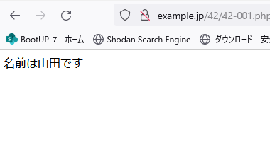
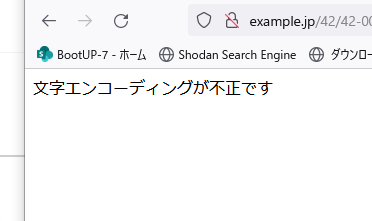
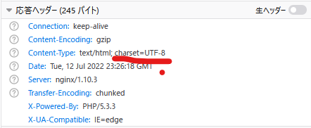
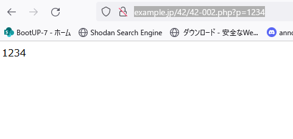
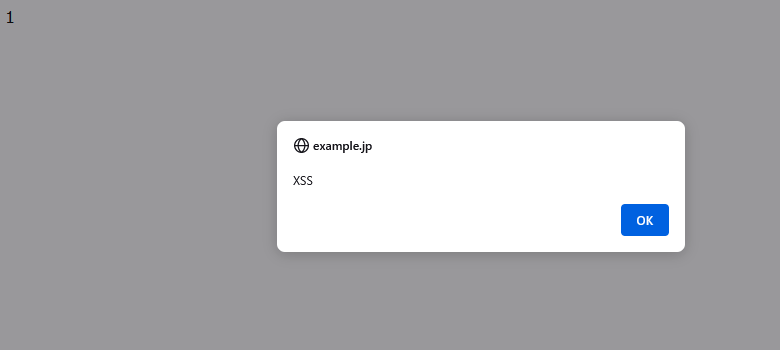

# Webアプリケーションの機能別にみるセキュリティバグ

### 脆弱性はどこで発生するのか

* 脆弱性には処理に起因するものと出力に起因するものがある
  * 出力に起因する脆弱性例
    * HTMLの出力（クロスサイト・スクリプティング）
    * HTTPヘッダの出力（HTTPヘッダ・インジェクション）
    * SQL文の呼び出し（発行）（SQLインジェクション）
    * シェルコマンドの呼び出し（OSコマンド・インジェクション）
    * メールヘッダおよび本文の出力（メールヘッダ・インジェクション）

* 入力に起因する脆弱性はない
* 出力に起因する脆弱性には「インジェクション」という単語が付くものが多い

### インジェクション系脆弱性とは

## 入力処理とセキュリティ

### Webアプリケーションの入力では何をするか

入力処理

1. 文字エンコーディングの妥当性検証
2. 文字エンコーディングの変換（必要な場合のみ）
3. 入力値（パラメータ文字列）の妥当性検証

※1. は文字コードを使った攻撃手法への対応

### 文字エンコーディングの検証

* phpの場合

  ```c
  bool mb_check_encoding(string $var, string $encoding)
  ```

### 文字エンコーディングの変換


| 言語    | 自動変換             | スクリプトに記述    |
| ------- | -------------------- | ------------------- |
| PHP     | php.iniなど          | mb_convert_encoding |
| Perl    | ×                    | Encode::decode      |
| Java    | setCharacterEncoding | Stringクラス        |
| ASP.NET | Web.config           | ×                   |

### 文字エンコーディングのチェックと変換の例

```php
<?php
  $name = isset($_GET['name']) ? $_GET['name'] : '';
  // 文字エンコーディング（Shift_JIS）のチェック
  if (! mb_check_encoding($name, 'Shift_JIS')) {
    die('文字エンコーディングが不正です');
  }
 // 文字エンコーディングの変換（Shift_JIS→UTF-8）
  $name = mb_convert_encoding($name, 'UTF-8', 'Shift_JIS');
?>
<body>
名前は<?php echo htmlspecialchars($name, ENT_NOQUOTES, 'UTF-8'); ?>です
</body>
```

* mb_convert_encoding(<変換前文字列>, <変換後文字エンコーディング>, <変換前文字エンコーディング> )

* http://example.jp/42/42-001.php?name=%8ER%93cでアクセスした場合
  

* http://example.jp/42/42-001.php?name=%82%21でアクセスした場合
  

  * Shift_JISでは2バイト文字の2バイト目は0x40以上でなければならないため（%21が不正)

  

### 入力値の検証

#### 入力値検証の目的

* 入力値の間違いを早期に発見して再入力を促すことによりユーザビリティを向上
* データの不整合を防ぎシステムの信頼性向上

#### 入力値検証とセキュリティ

* 入力値検証がセキュリティの役に立つ
  * SQLインジェクション対策が漏れていたパラメータがあるが、英数字のみ許可していたので実害には至らない
  * PHPのバイナリセーフでない関数を使っているが、入力段階で制御文字をチェックしているので実害にならない

#### バイナリセーフという考え方とヌルバイト攻撃

バイナリセーフ：入力値がどんなバイト列であっても正しく扱えること。典型的には値ゼロのバイト(ヌルバイト、PHPでは\0と表記)が現れても正しく処理できることを指す。**C言語やwindowsのAPIでは、ヌルバイトを文字列の終端としてそれ以降を切り詰めてしまう**関数があり、このような関数をバイナリセーフではない関数という。

* 42-002.php

```php
<body>
<?php
  $p = $_GET['p'];
  if (ereg('^[0-9]+$', $p) === FALSE) {
    die('整数値を入力してください');
  }
  echo $p;
?>
</body>
```

* ​	http://example.jp/42/42-002.php?p=1234の場合

  

* http://example.jp/42/42-002.php?p=1%00%3Cscript%3Ealert(%27XSS%27)%3C/script%3E



→00%で1のみ出力された後後続のスクリプトが実行されてしまう。

バイナリセーフではない関数を使わずに開発することは、現実的には困難なため、アプリケーションの入り口でチェックし、ヌルバイトであればエラーにする対応が必要となる。

#### 入力値検証だけでは対策にならない

アプリケーションの仕様としてすべての文字を許容する場合は入力時点では何も防げないということになる

#### 制御文字のチェック

制御文字：ASCIIコード0x20未満及び0x7F(DELETE)の文字のこと

#### 文字数のチェック

すべての入力文字は最大文字数を仕様として定義すべき。SQLインジェクションの対策にもなる

#### 数値の最大値・最小値チェック

入力した数値に応じてメモリを確保するアプリケーションであれば、大きな数字を指定することでメモリ使用量が課題になる場合があり、DoS攻撃につながったりすることがある。

- 数字文字列としての文字種・文字数のチェック
- 文字列型から数値型への型変換
- 最小値、最大値の範囲にあることの確認

#### その他の注意点

* 入力項目が指定されていない（項目自体がない）ケース
* 配列形式で入力されているケース

```php
$foo = $_GET['foo'];
```

上記のような記述をしている場合以下エラーが発生する

"Undifined index: foo in /var/www/html/example.php"

このエラーを避けるために以下のようなプログラミングを記述できる。

```php
//PHP7.0より前
$foo = isset($_GET['foo']) ? $_GET['foo'] : null;

//PHP7.0以降
$foo = $_GET['foo'] ?? null;
```

クエリ文字列が以下のように指定された場合、入力値として配列が変える

```http
foo[]=bar&foo[a]=baz
```

以下の代入文と同じ結果となる

```php
$foo = $_GET['foo'];
$foo[0] = 'bar';
$foo['a'] = 'baz';
```

配列でない（**スカラー**)値を期待したプログラムに入力値として配列が指定されると、思わぬバグや脆弱性の原因になる可能性。

filter_input関数で回避できる

```php
$foo = filter_input(INPUT_GET, 'foo'); // &_GET['foo']の代わり
```

#### どのパラメータを検証するか

hiddenパラメータ、ラジオボタン、select要素およびクッキーにセッションID以外の値を入れているときはそれも対象。またRefereなどHTTPヘッダをアプリケーションが利用している場合も検証の対象となる。

#### PHPの正規表現関数

* ereg：スレッドセーフではないためPHP5.3以降で非推奨
* preg：UTF-8の場合日本語を扱える
* mb_ereg：さまざまな文字コードで日本語が扱える

#### 正規表現による入力値検証(1) 英数字1文字~5文字

```html
<?php
  $p = filter_input(INPUT_GET, 'p');
  if (preg_match('/\A[a-z0-9]{1,5}\z/ui', $p) !== 1) {
    die('1文字以上5文字以下の英数字を入力してください');
  }
?>
<body>
pは<?php echo htmlspecialchars($p, ENT_NOQUOTES, 'UTF-8'); ?>です
</body>
```

```php
'/\A[a-z0-9]{1,5}\z/ui'
```

* /：正規表現の始まり
* \A：文字列の先頭
* [a-z0-9]：英数字にマッチ
* {1, 5}：1文字～5文字（量指定子）
* \z：文字列の末尾
* /：正規表現の終わり
* u：u修飾子→UFT-8エンコーディングであることを示す
* i：i修飾子→大文字・小文字を区別しないでマッチングする場合に使用

##### mb_eregを使う場合

```php
<?php
  // mb_regex_encodingは内部エンコーディングが設定されている場合は省略可能
  mb_regex_encoding('UTF-8'); // プログラムの先頭で一度設定すればよい
  $p = filter_input(INPUT_GET, 'p');
  // === は型を区別する比較演算子
  if (mb_ereg('\A[a-zA-Z0-9]{1,5}\z', $p) === false) {
    die('1文字以上5文字以下の英数字を入力してください');
  }
?>
<body>
pは<?php echo htmlspecialchars($p, ENT_NOQUOTES, 'UTF-8'); ?>です
</body>
```

### 正規表現による入力値検証の例(2) 住所欄

```php
<?php
  $addr = filter_input(INPUT_GET, 'addr');
  if (preg_match('/\A[[:^cntrl:]]{1,30}\z/u', $addr) !== 1) {
    die('30文字以内で住所を入力してください（必須項目）。改行やタブなどの制御文 字は使用できません');
  }
?>
<body>
addrは<?php echo htmlspecialchars($addr, ENT_NOQUOTES, 'UTF-8'); ?>です
</body>
```

```php
'/\A[[:^cntrl:]]{1,30}\z/u'
```

* [[:^cntrl:]]：POSIX文字クラス。「制御文字以外という指定」

改行を許容する場合は以下のような記載をする。以下の例は、下位y豪、タブ以外の制御文字を禁止する例。

```php
preg_match('/\A[\r\n\t[:^cntrl:]]{1, 400}\z/u', $comment)
```

#### 入力値チェックのサンプルコード

```php
<?php
  // パラメータを取得し、文字エンコーディングチェックと変換
  // 入力値検証まで行う関数
  // $key : GETパラメータ名
  // $pattern : 入力値検証用正規表現文字列
  // $error : 入力値検証時のエラーメッセージ
  // 戻り値 : 取得したパラメータ（string）
  function getParam($key, $pattern, $error) {
    $val = filter_input(INPUT_GET, $key);
    // 文字エンコーディング（Shift_JIS）のチェック
    if (! mb_check_encoding($val, 'Shift_JIS')) {
      die('文字エンコーディングが不正です');
    }
    // 文字エンコーディングの変換（Shift_JIS→UTF-8）
    $val = mb_convert_encoding($val, 'UTF-8', 'Shift_JIS');
    if (preg_match($pattern, $val) !== 1) {
      die($error);
    }
    return $val;
  }
  // パラメータ取得関数の呼び出し
  $name = getParam('name', '/\A[[:^cntrl:]]{1,20}\z/u',
    '20文字以内で氏名を入力してください（必須項目）。制御文字は使用できません');
?>
<body>
名前は<?php echo htmlspecialchars($name, ENT_NOQUOTES, 'UTF-8'); ?>です
</body>
```

このような汎用プログラミングを用意しておくとプログラミングを省力化できる。
